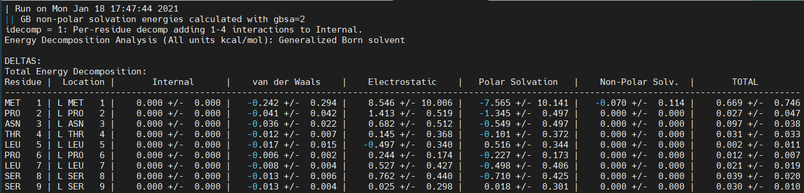

👏 Amber|蛋白蛋白体系MD以及MMPB/GBSA计算

---
[TOC]

---
## 组氨酸质子化
将蛋白蛋白复合物传到H++网站上进行预测，特别关注组氨酸的质子化状态，将相应的HIS改名称为HID, HIE和HIP。H++质子化配套的就是Amber力场。

## 将复合物拆分成两个蛋白文件PTEN和TFEB
在pymol或者其他软件中将复合物拆分成各自的单体pdb文件。

## tleap构建体系
```shell
tleap -s -f tleap.in
```
tleap.in内容如下：
```shell
source oldff/leaprc.ff14SB   # 加载蛋白力场，这个是比较新的蛋白力场
source leaprc.gaff    # 加载配体力场
loadAmberParams frcmod.ionsjc_tip3p  # 使用ff14SB力场的时候没有Cl-的参数，所以可以使用该命令将离子参数加载进来
PTEN=loadpdb PTEN.pdb
TFEB=loadpdb TFEB.pdb
list   # 看一下蛋白体系是否都加载进来了。
saveamberparm PTEN PTEN.prmtop PTEN.inpcrd
saveamberparm TFEB TFEB.prmtop TFEB.inpcrd
complex=combine {PTEN TFEB}
saveamberparm complex complex.prmtop complex.inpcrd
check complex  # 检查复合物是否正确
solvatebox complex TIP3PBOX 10.0 iso
charge complex    # 查看一下复合物所带的电荷，之后要中和。
# 计算电荷：residue*0.0187*浓度
addions complex Cl-/Na+ 13    # 使用氯离子或者钠离子中和电荷。
saveamberparm complex complex_solvated.prmtop complex_solvated.inpcrd
quit
```

## 检查建模成功与否
```shell
ambpdb -p complex_solvated.prmtop < complex_solvated.inpcrd > check.pdb
```

## em
em.in
```shell
minimise pten-tfeb
 &cntrl
  imin=1,maxcyc=1000,ncyc=500,     # imin=1表示进行能量最小化，最速下降法500步，然后共轭梯度法500步。
  cut=8.0,ntb=1,
  ntc=2,ntf=2,
  ntpr=100,
  ntr=1, restraintmask=':1-435',
  restraint_wt=2.0
 /
```
```shell
mpirun -np 20 sander.MPI -O -i min.in -o min.out -p complex_solvated.prmtop -c complex_solvated.inpcrd -r min.rst -ref complex_solvated.inpcrd -x min.crd
```

## heat
heat.in
```shell
heat
 &cntrl
  imin=0,irest=0,ntx=1,
  nstlim=100000,dt=0.002,   # 步数与步长。
  ntc=2,ntf=2,
  cut=8.0, ntb=1,
  ntpr=500, ntwx=500,
  ntt=3, gamma_ln=2.0,
  tempi=0.0, temp0=300.0, ig=-1,
  ntr=1, restraintmask=':1-435',
  restraint_wt=10.0,
  nmropt=1
 /
 &wt TYPE='TEMP0', istep1=0, istep2=100000,
  value1=0.1, value2=300.0, /
 &wt TYPE='END' /
```
```shell
pmemd.cuda -O -i heat.in -p complex_solvated.prmtop -c min.rst -o heat.out -r heat.rst -ref min.rst -x heat.crd
```

## density
density.in
```shell
density
 &cntrl
  imin=0,irest=1,ntx=5,
  nstlim=50000,dt=0.002,
  ntc=2,ntf=2,
  cut=4.0, ntb=2, ntp=1, taup=1.0,
  ntpr=500, ntwx=500,
  ntt=3, gamma_ln=2.0,
  temp0=300.0, ig=-1,
  ntr=1, restraintmask=':1-435',
  restraint_wt=2.0,
 /
```
```shell
pmemd.cuda -O -i density.in -p complex_solvated.prmtop -c heat.rst -o density.out -r density.rst -ref heat.rst -x density.crd
```

## MD
md.in
```shell
md
 &cntrl
  imin=0,irest=1,ntx=5,
  nstlim=2500000,dt=0.002,       # 步数与步长的
  ntc=2,ntf=2,
  cut=8.0, ntb=2, ntp=1, taup=2.0,
  ntpr=5000, ntwx=5000,   # NTPR = 100 (每100步写到输出文件一次), NTWX = 100 (每100步写出到轨迹文件一次), NTWR = 1000: Write to the output file (NTPR) every 100 steps (200 fs), to the trajectory file (NTWX) every 100 steps and write a restart file (NTWR), in case our job crashes and we want to restart it, every 1,000 steps.
  ntt=3, gamma_ln=2.0,
  temp0=300.0
 /
```
```shell
pmemd.cuda -O -i md.in -p complex_solvated.prmtop -c density.rst -o md.out -r md.rst -ref density.rst -x md.crd
```

## MMGBSA以及分解自由能计算
mmgbsa.in
```shell
&general
   startframe=2000, endframe=5000, interval=50,     # 从2000帧开始到5000帧结束，每隔50帧取一帧出来计算。
   keep_files=0, debug_printlevel=2
/
&gb
   igb=2, saltcon=0.1
/
&decomp     # 计算分解自由能
   idecomp=1, print_res='1-121; 122-435', csv_format=0,          # 两个蛋白分别的序号，这个要从prmtop, inpcrd生成的pdb文件中看。
/
```
```shell
MMPBSA.py -O -i mmpbsa.in -o FINAL_RESULTS_MMPBSA.dat -do FINAL_DECOMP_MMPBSA.dat -sp complex_solvated.prmtop -cp complex.prmtop -rp PTEN.prmtop -lp TFEB.prmtop -y md.crd
mpirun -np 20 MMPBSA.py.MPI -O -i mmpbsa.in -o FINAL_RESULTS_MMPBSA.dat -do FINAL_DECOMP_MMPBSA.dat -sp complex_solvated.prmtop -cp complex.prmtop -rp PTEN.prmtop -lp TFEB.prmtop -y md.crd
```

## 结果分析
FINAL_RESULTS_MMPBSA.dat文件中由MMGBSA的计算结果。
FINAL_DECOMP_MMPBSA.dat文件中是分解自由能计算结果的矩阵。使用下述python脚本来提取一定阈值以上的贡献最大的残基。
（1）输入文件格式如下所示：

（2）从文件中根据残基名字已经最后一列分解自由能数值提取分解自由能数值大于一定阈值的残基以及它的分解自由能数值。
（3）运行下述脚本：python py FINAL_DECOMP_MMPBSA.dat 1 (从FINAL_DECOMP_MMPBSA.dat文件中提取分解自由能绝对值大于1的残基以及具体数值)。
```python
import sys
import math

def decomp(file, cutoff):
    with open(file) as fl, open("result.txt", "w") as rt:
        for line in fl.readlines():
            line1 = line.rsplit("|", 1)[1].split("+")[0].strip()
            if abs(float(line1)) >= cutoff:
                line2 = line.split("|", 1)[0]
                rt.write(line2 + "," + line1 + "\n")
                
def main():
    file = str(sys.argv[1])
    cutoff = float(sys.argv[2])
    decomp(file, cutoff)
    
if __name__=="__main__":
    main()
```

## 丙氨酸扫描
（1）官网教程：http://ambermd.org/tutorials/advanced/tutorial3/py_script/section3.php
（2）应用场景：计算上探索蛋白口袋热点残基的方法通常就是将蛋白口袋一些残基突变成丙氨酸，然后看MMGBSA的变化情况。
（3）应用局限：尝试将残基突变成其他任意的氨基酸，有的会报错，突变成链较短的氨基酸一般能正确计算。丙氨酸扫描还是有较大的局限性。
（4）具体操作：
（4.1）选取野生复合物生成Amber的参数文件prmtop和inpcrd文件。
（4.2）选取突变(单残基突变)复合物生成Amber的参数文件prmtop和inpcrd文件。
（4.3）野生型和突变型的Amber参数文件生成的方式一定要一摸一样。力场一定要相同。
（4.4）将野生复合物的Amber参数文件跑MD。
（4.5）丙氨酸扫描：
mmgbsa.in
```shell
&general
   startframe=2000, endframe=5000, interval=50,
   keep_files=0, debug_printlevel=2
/
&gb
   igb=2, saltcon=0.1
/
&decomp
   idecomp=1, print_res='1-121; 122-435', csv_format=0,
/
&alanine_scanning
/
```
```shell
mpirun -np 20 MMPBSA.py.MPI -O -i mmgbsa.in -sp ras-raf_solvated.prmtop -cp rasraf.prmtop -rp ras.prmtop -lp raf.prmtop -y md.crd -mc rasraf_mutant.prmtop -mr ras_mutant.prmtop -o rt.txt -do decomp.txt  # -ml raf_mutant.prmtop (-mr:mutant receptor; -ml:mutant ligand)
```
（5）曾经遇到的错误：
WARNING: INCONSISTENCIES EXIST WITHIN INTERNAL POTENTIAL TERMS. THE VALIDITY OF THESE RESULTS ARE HIGHLY QUESTIONABLE
内部电势不一致。
原因：当时跑MD和后面突变后生成Amber参数文件使用的力场不一样。