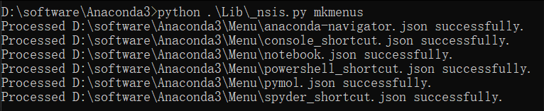
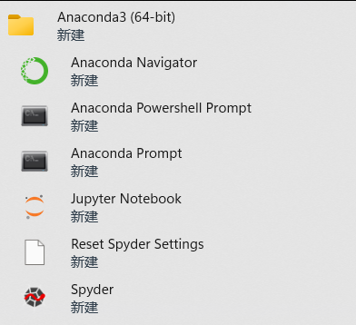

👏 Anaconda

---
[TOC]

---
### 1. 安装
#### 1.1 win10
（1）Windows系统如何把Anaconda添加入环境变量？
搜索打开编辑环境变量
将Anaconda路径加入环境变量即可，如下路径所示：
```text
C:\software\Anaconda\Scripts
```

#### 1.2 Linux
(1) 在https://repo.continuum.io/archive/下载需要的版本：
```shell
wget https://repo.anaconda.com/archive/Anaconda-1.4.0-Linux-x86_64.sh
```
(2) 运行sh文件
```shell
sh Anaconda-1.4.0-Linux-x86_64.sh
```
(3) 指定安装目录以及最后配置环境变量可以选择yes自动配置，或者选择no之后自己配置。      
自己配置方式如下：
```shell
echo 'export PATH="~/anaconda2/bin:$PATH"' >> ~/.bashrc
source ~/.bashrc
```
(4) conda的.bashrc内容如下所示：
```shell
# >>> conda initialize >>>
# !! Contents within this block are managed by 'conda init' !!
__conda_setup="$('/public/home/yqyang/software/Anaconda3-2022.05/bin/conda' 'shell.bash' 'hook' 2> /dev/null)"
if [ $? -eq 0 ]; then
    eval "$__conda_setup"
else
    if [ -f "/public/home/yqyang/software/Anaconda3-2022.05/etc/profile.d/conda.sh" ]; then
        . "/public/home/yqyang/software/Anaconda3-2022.05/etc/profile.d/conda.sh"
    else
        export PATH="/public/home/yqyang/software/Anaconda3-2022.05/bin:$PATH"
    fi
fi
unset __conda_setup
# <<< conda initialize <<<
```

---
### 2. 命令
#### 2.1 conda clean
```shell
conda clean -a       # 删除索引缓存、锁定文件、未使用过的包和tar包
```
#### 2.2 conda create
```shell
conda create --name python37 python=3.7       # 创建一个名为python37的环境，指定Python版本是3.7
```
#### 2.3 conda env list
```shell
conda env list      # 列出所有环境
```
#### 2.4 conda activate
```shell
conda activate pymol      # 激活Anaconda中的pymol环境
```
#### 2.5 conda deactivate
```shell
conda deactivate     # 退出环境
```
#### 2.6 conda remove
```shell
conda remove --name python37 --all      # 删除一个已有的环境
```
#### 2.7 conda config
```shell
conda config --show-sources        # 显示镜像源
conda config --add channels https://....     # 添加镜像源
# 添加镜像源的其他做法：修改当前目录下.condarc文件内容。vi ~/.condarc  
# 修改默认镜像做法：将.condarc文件内容的default一行删掉，就会按照顺序使用镜像源。

conda config --set show_channel_urls yes   # 设置搜索时显示通道地址  
```
#### 2.8 conda install
```shell
conda install --use-local pytorch-1.2.0-py3.5_cuda100_cudnn7_1.tar.bz2    # 本地安装离线包，需要先将包下载下来放在Anaconda3的pkgs文件夹下
```
#### 2.9 conda update
```shell
conda update conda
conda update anaconda
conda update pandas   #更新pandas包
conda update --all   #更新当前环境的所有包
```
#### 2.10 conda uninstall
```shell
conda uninstall pandas   #卸载pandas包
```
#### 2.11 conda list
```shell
conda list   # 列出环境下安装的所有包信息
```
#### 2.12 pip install
```shell
pip install numpy==1.9.5     # 安装指定版本的包
```

---
### 3. 应用案例
#### 3.1 一个脚本同时调用多个python环境
```shell
#!/bin/bash
source /home/data/yqyang/software/Anaconda3-202105/bin/activate
conda activate "环境1"
python script_1.py
conda deactivate

source /home/data/yqyang/software/Anaconda3-202105/bin/activate
conda activate "环境2"
python script_2.py
conda deactivate
```

#### 3.2 通过export进行多个conda环境间的切换
```shell
export PATH=/home/yqyang/software/Anaconda3-2022.05/envs/md/bin:$PATH
```

---
### 4. error和解决方案
#### 例1
conda由于某种原因什么都安装不了了，conda install之后一直出现如PPT中的错误：     

解决方案：     
```shell
conda clean -i
```
参考资料：https://blog.csdn.net/qingfengxiaosong/article/details/109864951      

#### 例2
CondaHTTPError: HTTP 000 CONNECTION FAILED for url <https://mirrors.tuna.tsi      
解决方案：找到C盘用户目录下文件.condarc，将其中的https全部换为http。      
参考资料：https://blog.csdn.net/zxmyoung/article/details/107726336   

#### 例3
Warning: 8 possible package resolutions (only showing differing packages):   
解决方案：   
```python
conda update --strict-channel-priority --all 
```
参考资料：https://blog.csdn.net/daixiangzi/article/details/107834369   

---
### 5. 在没有联网的服务器上配置conda环境
（1）需要另一台联网的环境配置相近的操作系统。
（2）在两台服务器上都安装同一版本Anaconda。
（3）在联网的服务器上进行所需环境的合理配置。
（4）将联网服务器上\${Anaconda}/envs/中的所需环境scp到没有联网服务器的${Anaconda}/envs/中即可。

---
### 6. 解决Windows中Anaconda安装后在开始菜单找不到的问题
**问题描述**
windows11，在一次更新之后在开始菜单中找不到Anaconda的文件夹并且相应的Anaconda Prompt、Jupyter、Spyder等都从开始菜单中消失。但是查看Anaconda的安装路径，软件源文件依旧完好的存在。那么需要重新生成图标文件。

**解决办法**
(1) 打开cmd。切换到Anaconda的安装路径。  
  

(2) 在开始菜单中中生成图标文件。  
```python
python .\Lib\_nsis.py mkmenus
```
  

(3) 此时打开开始菜单，即可看到Anaconda对应的图标文件。  
  

---
### 7. Jupyter相关
（1）Anaconda虚拟环境下使用jupyter需要在环境下安装ipykernel。
```python
conda install ipykernel
```