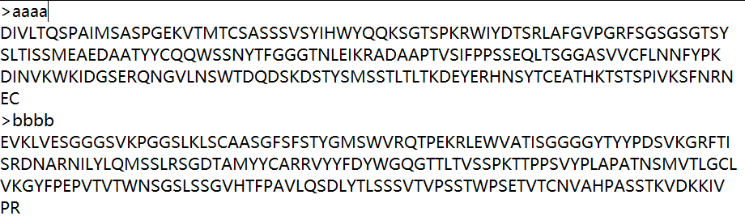

👏 BioPython

---
[TOC]

---
## 读取多序列fasta文件并合并序列
（1）输入数据格式
输入数据是多序列的fasta文件，如下图所示：  
  

（2）目的
目的是将输入的多序列文件的多条序列合并生成一条序列。  

（3）脚本
```python
>>> from Bio import SeqIO
>>> tmp = ""
>>> for fa in SeqIO.parse("5zud_ED_ab.fasta", "fasta"):
...     tmp += fa.seq
...
>>> print(tmp)
DIVLTQSPAIMSASPGEKVTMTCSASSSVSYIHWYQQKSGTSPKRWIYDTSRLAFGVPGRFSGSGSGTSYSLTISSMEAEDAATYYCQQWSSNYTFGGGTNLEIKRADAAPTVSIFPPSSEQLTSGGASVVCFLNNFYPKDINVKWKIDGSERQNGVLNSWTDQDSKDSTYSMSSTLTLTKDEYERHNSYTCEATHKTSTSPIVKSFNRNECEVKLVESGGGSVKPGGSLKLSCAASGFSFSTYGMSWVRQTPEKRLEWVATISGGGGYTYYPDSVKGRFTISRDNARNILYLQMSSLRSGDTAMYYCARRVYYFDYWGQGTTLTVSSPKTTPPSVYPLAPATNSMVTLGCLVKGYFPEPVTVTWNSGSLSSGVHTFPAVLQSDLYTLSSSVTVPSSTWPSETVTCNVAHPASSTKVDKKIVPR
```