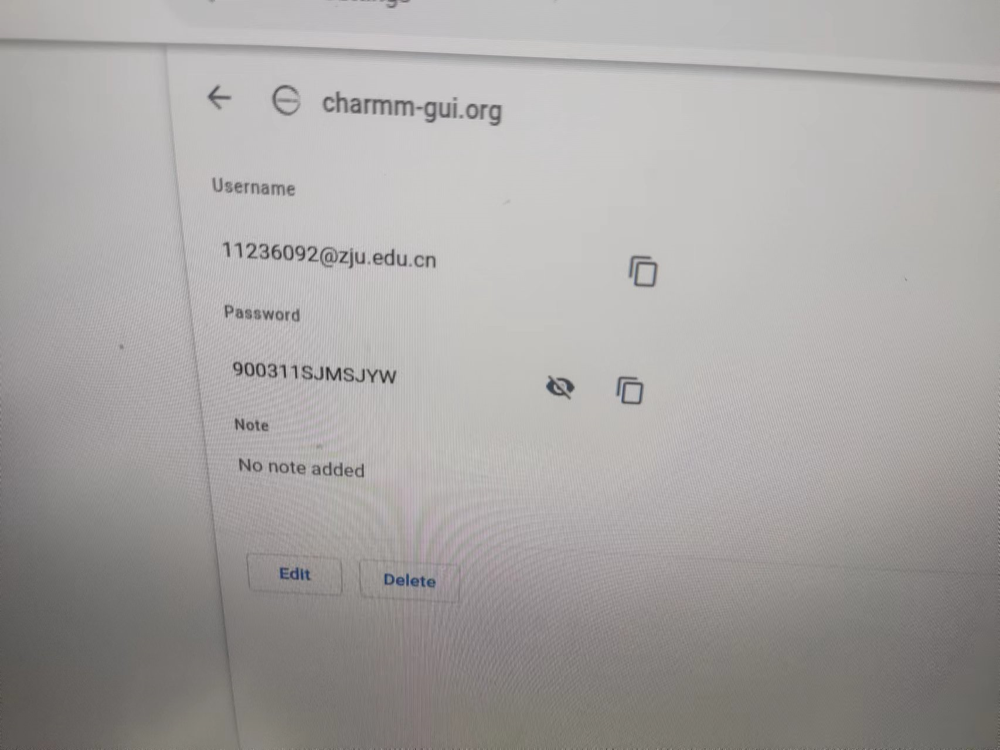
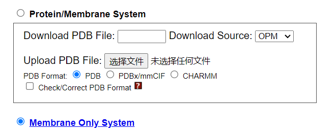

👏 CHARMM-GUI的使用

---
[TOC]

---
网址：https://www.charmm-gui.org/
账号：yanqyang@zju.edu.cn
密码：TYUQU#a5NlsC

**CHARMM-GUI参考文献：**
* [CHARMM-GUI: A Web-Based Graphical UserInterface for CHARMM](./CHARMM-GUI的使用/CHARMM‐GUI-A_web‐based_graphical_user_interface_for_CHARMM.pdf)

## Ligand Reader & Modeler
**简介：** 小分子建模。
（1）上传配体的mol2/pdb文件，此时界面会加载分子的结构，检查分子结构的正确性。
（2）

**参考资料：**
* [CHARMM-GUI Ligand Reader and Modeler for CHARMMForce Field Generation of Small Molecules](./CHARMM-GUI的使用/JComputChem-2017-Kim-CHARMM‐GUIligandreaderandmodelerforCHARMMforcefieldgenerationofsmallmolecules.pdf)

## Solution Builder
**简介：** 复合物体系建模。
备注：不太好用，使用这个生成过一次蛋白配体复合物的任务，但是失败了。

## Membrane Builder
**简介：** 搭建膜体系。 
### 构建纯膜 
（1）下方模块可以构建纯膜系统：  
  

### 构建膜蛋白
**当蛋白不是很大时，直接上传CHARMM-GUI进行建模处理即可：**   

**当蛋白很大时，计划先构建纯膜，然后手动将蛋白插进去，然后删掉重叠的分子，再平衡即可。**

## PDB Reader & Manipulator
**功能一：当有一个小分子，想看一下CHARMM力场里面有没有这个分子的完整力场，可以将pdb格式的小分子上传到这个模块里面进行匹配。**