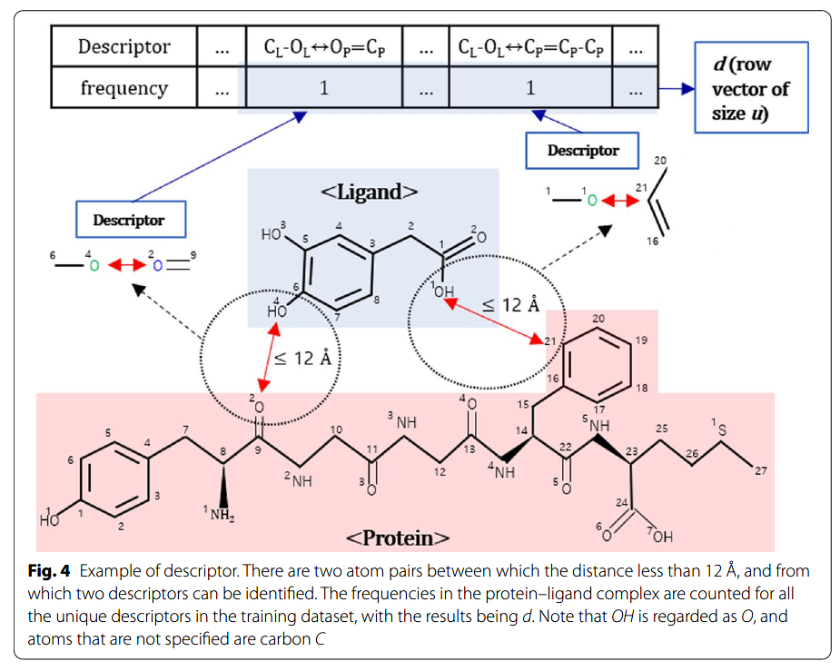
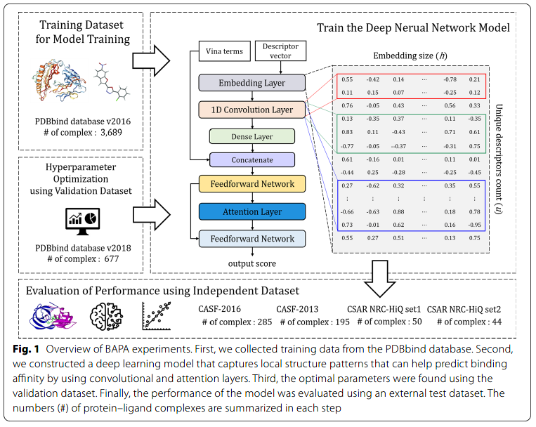
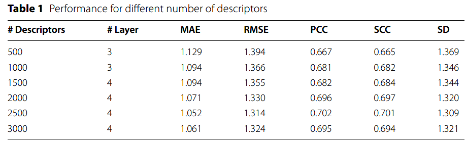
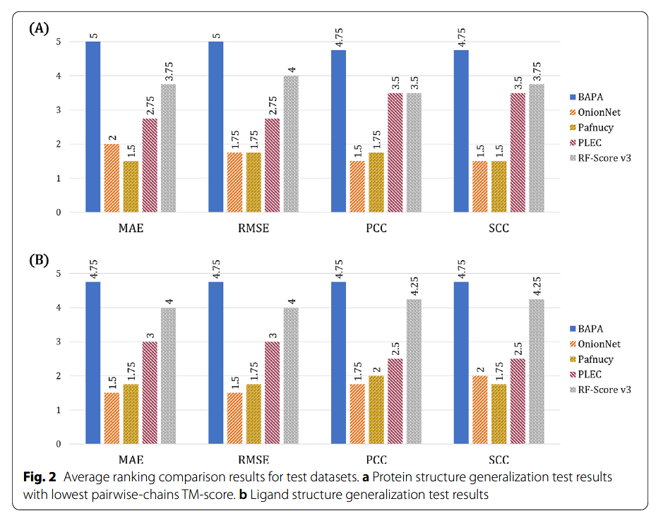
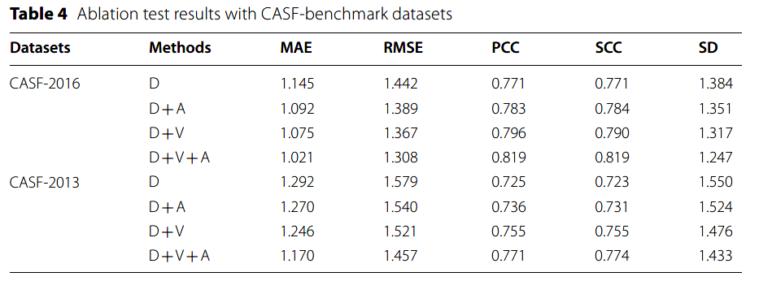
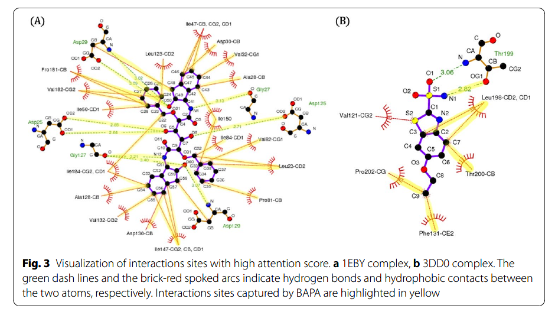

👏 DTA|应用基于分子间作用力的深度注意力机制预测蛋白配体复合物的结合亲和力

---
[TOC]

---
## 文章
Title: Binding affnity prediction for protein–ligand complex using deep attention mechanism based on intermolecular interactions  
文章链接：https://link.springer.com/article/10.1186/s12859-021-04466-0 [文献pdf](DTA应用基于分子间作用力的深度注意力机制预测蛋白配体复合物的结合亲和力/Seo-2021-Binding%20affinity%20prediction%20for%20prote.pdf) 
Github地址：https://github.com/Blue1993/BAPA  

---
## 方法
### 数据集构建
(1) 数据集质量对于打分函数非常重要。  
(2) 使用的是PDBbind精炼数据集。  
(3) 分辨率>=2.5。  
(4) pKi或者pKd分布在2-12之间。  
(5) 非共价。  
(6) 配体原子仅含有(C, N, O, F, P, S, Cl, Br, I)等9种元素。

### 结构相似性
(1) 计算测试集中每个蛋白与训练集中所有蛋白的最大和最小相似性。  
(2) 计算测试集中每个配体与训练集中所有配体的最大和最小Tc系数。  
(3) 蛋白结构相似性使用TM-align计算。  

### 定义描述符
  

### 基于Autodock Vina产生的附加特征
(1) Vina的分子间特征含有空间相互作用（gauss1, gauss2, repulsion），疏水和氢键项。
(2) 柔性项是可旋转键数目。  

### 模型架构
   

---
## 结果
### 模型评估指标
mean absolute error(MAE), root mean square error(RMSE), Pearson’s correlation coefficient(PCC), Spearman’s correlation coefficient(SCC), and standard deviation in regression(SD)  

### 描述符数量的选择
使用随机森林模型选择最佳的描述符数量。  
  

### benchmark数据集上预测性能的评估，与其他方法进行比较
  

### 模型泛化性能的评估
根据相似性组建与训练集相似性很低的外部测试集用于评测模型的泛化效果，并与其他方法进行比较。  
  

### 消融实验
  

### 注意力向量的分析
  

---
## 代码片段
(1) [get_descriptors_occurrence_count.py](./DTA应用基于分子间作用力的深度注意力机制预测蛋白配体复合物的结合亲和力/get_descriptors_occurrence_count.py)：获取一定距离范围内蛋白配体原子对的原子以及成键类型作为描述符，完全的文本处理方式，代码规范，非常值得借鉴。  

- read_ligand()：读取mol2格式的配体文件。获取配体原子类型列表，原子类型-原子ID字典，原子坐标列表，成键字典。  
- read_protein_file()：读取mol2格式的蛋白文件。获取蛋白原子类型列表，原子类型-原子ID字典，原子坐标列表，成键字典。  
- get_interaction()：根据配体原子类型-原子ID字典，原子坐标列表和蛋白原子类型-原子ID字典，原子坐标列表生成一定距离内蛋白-配体原子类型对-原子序号的字典。  
- r_radius_graph()：根据蛋白配体原子类型对-原子序号的字典、配体成键字典、配体原子类型列表、蛋白成键字典、蛋白原子类型列表获取蛋白配体原子类型对-蛋白配体一步临原子对字典。   