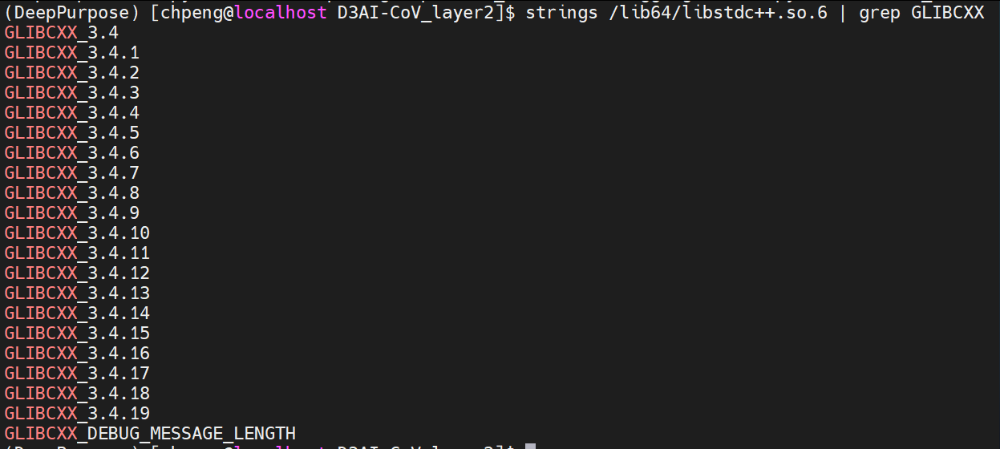

👏 Error|libstdc++.so.6 version GLIBCXX_3.4.21 not found

---
[TOC]

---
## 错误说明
在已正确安装GPU版pytorch的Conda环境下运行深度学习模型，最开始是正常运行。在某次新打开终端界面连接服务器之后，再次运行，出现以下错误。  
  

## 错误分析
(1) 首先查看/lib64/libstdc++.so.6这个文件中关于GLIBCXX的信息，确实没有GLIBCXX_3.4.21。  
```shell
strings /lib64/libstdc++.so.6 | grep GLIBCXX
```


(2) 察觉到这个软件包中应该使用的是Anaconda环境下的系统文件，但是这里使用的是Linux系统的文件，猜想可能是有人改了初始的环境变量。查看~/.bashrc文件，发现文件中多了下面一条命令。  
```shell
export LD_LIBRARY_PATH=/home/chpeng/.local/libevent-2.1.12/lib:$LD_LIBRARY_PATH
```

(3) 所以引起错误的原因是新打开终端之后，便自动初始化~/.bashrc文件的环境，使得没有使用Anaconda的环境，所以报错。  

## 解决方案
(1) 解决思路：将终端的环境变量修改成Anaconda下的环境变量即可。  
(2) 即新打开一个终端页面之后输入下述命令再跑模型即可：  
```shell
export LD_LIBRARY_PATH="/home/chpeng/anaconda3/lib:$LD_LIBRARY"
```