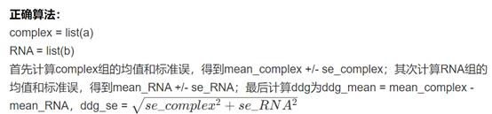

👏 FEP|FEP经验之谈

---
[TOC]

---
## Some Advices

（1）FEP的时候只把变的原子的电荷变一下就行，千万不要变的太多，最多再变一个和他相邻的原子的电荷，公共部分的片段最好保持一致，不要动。
（2）当做FEP的所有分子结构间很像，差别不大时就确定一个base进行突变ddg计算；当所有分子结构间差别极大，找不出公共base的话再考虑将其变成乙烷。
（3）在做小分子的FEP之前，通过跑MD聚类得到很多类别，在寻找拿哪一个作为FEP构象时非常重要。建议将最大类的所有结构均导入Maestro中看一下相互作用力，寻找最稳定的那一个结构作为进行FEP的构象。
（4）做FEP的时候，对于小分子。尽量变化端点的基团等，尽量不要变动中间的骨架连接位置。
（5）注意多体问题时的FEP计算 free 状态体系的选择。

## Some Test

## Some Questions
**1. 窗口和窗口时间的设置问题**
双拓扑文件决定了FEP起点和终点之间的“距离”。λ则是连通这段“距离”渐变的“工具”因子。
所以双拓扑的准备至关重要，因为蛋白残基已有固定的双拓扑参数文件，所以会好一些。对于小分子来讲，公共原子的匹配至关重要。
一般总时间足以让其平滑的走完这段距离就可以了，就体系论体系，不必过于固定。
对于小分子来讲，尽量变化端点的基团，中间的linker尽量不要去变化。

**2. 中间插入和消去原子的FEP准确做法**
尽量避免做这种体系的FEP，如果必须要做，一定要建立合理的双拓扑。或可以计算绝对结合自由能。

**3. L-AA -> D-AA**
这种一般要选择一个中间过渡态。先将L-AA变成甘氨酸，然后由甘氨酸变化到D-AA。最后的将ddG相加即可。

**4. 脯氨酸的FEP问题注意点**
目前NAMD中脯氨酸的变化就是把主链上的部分原子也全部消掉，然后再长出来新的。涉及到脯氨酸的FEP计算，能避免则避免。最后注意看MD轨迹。

**5. 减小FEP error的做法是什么**
将跑出来的FEP终态结构与MD的结构比对，合理的结构的数据才可信。

**6. Gromacs中FEP每个窗口应该独立跑还是接着上一个窗口跑**
都一样的，这个不是影响FEP计算的关键问题。

**7. Gromacs中A和B state的charge有改变影响有多大？为什么NAMD中不会影响？**
一般进行MD的时候，体系的总体电荷要为0，否则会影响PME的计算。不过ddG是bonded态减去free态，是个差值，会抵消一部分。对ddG的影响不太大。不过在做FEP的时候bonded态和free态的盒子大小要一致。

**8. 误差的计算方法**
以蛋白-RNA举例：
