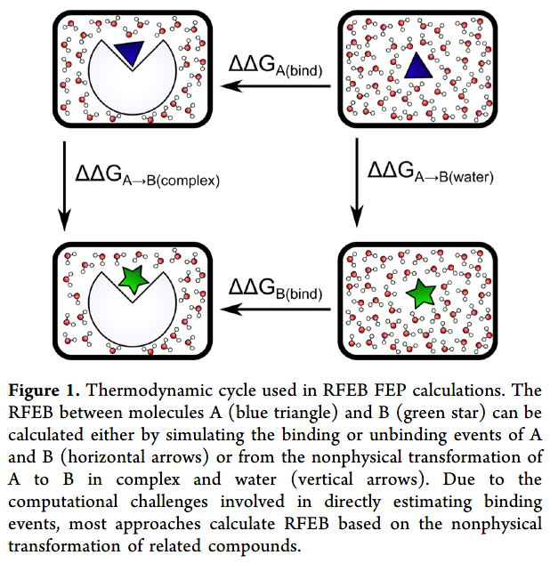
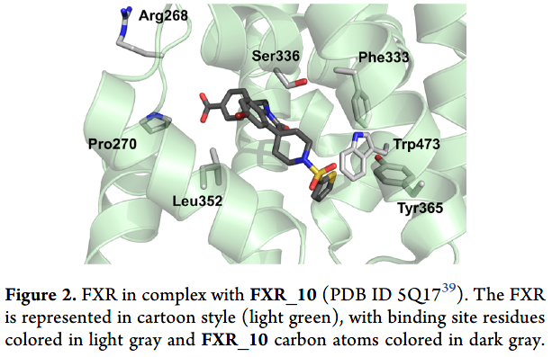
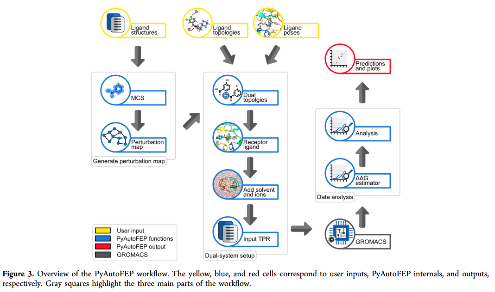
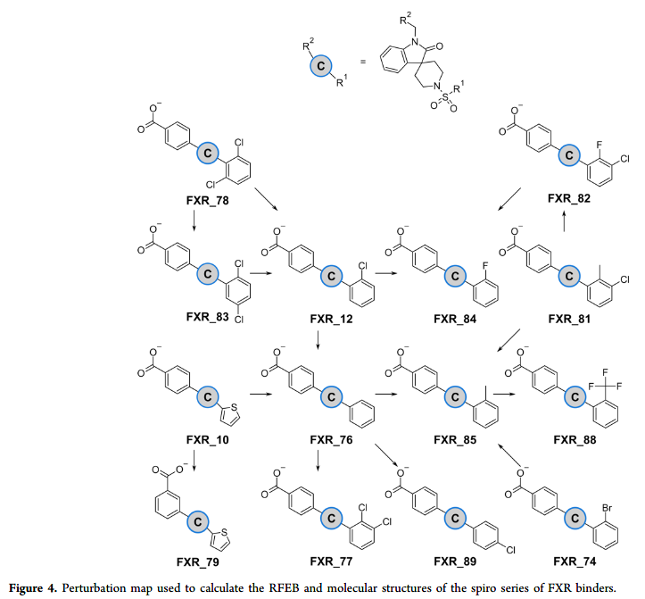
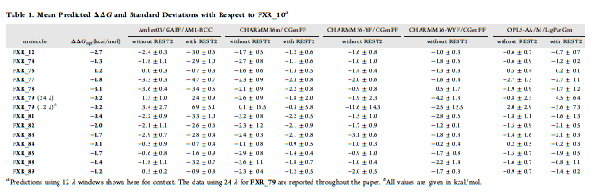
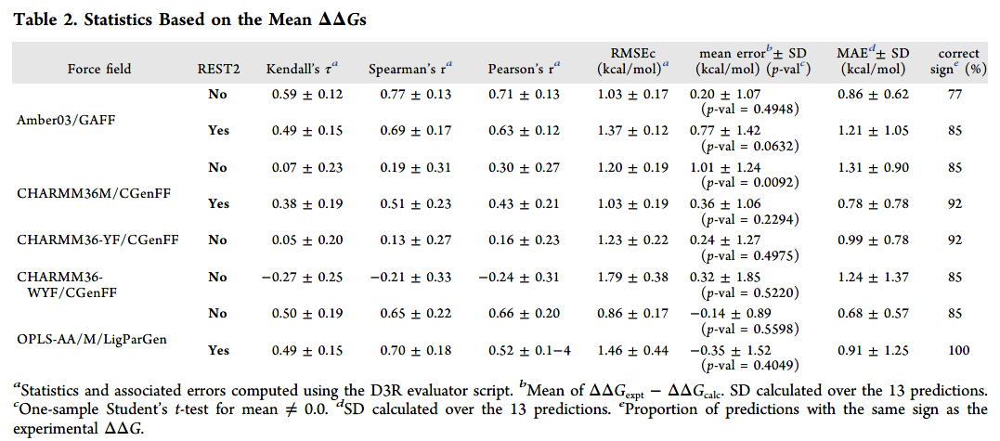
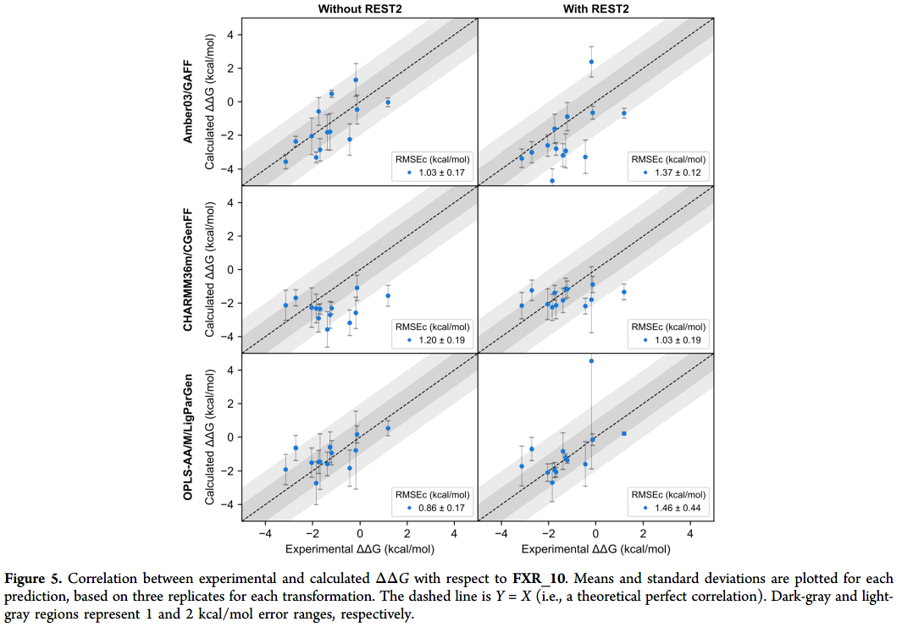

👏 FEP|基于Gromacs整合增强采样算法的FEP计算工具PyAutoFEP

---
[TOC]

---
## 摘要
&emsp;&emsp;自由能微扰（FEP）可以评估生物大分子和小分子间的相对结合自由能。本文中介绍了一个使用Python3写的开源FEP计算工具，该工具能够自动生成微扰映射、双拓扑、系统构建、分子动力学和结果分析。PyAutoFEP支持多种力场并且整合了REST和REST2等多种增强采样算法。最后文中使用实验数据对该程序进行了验证表明它是一个有用的先导化合物优化工具。  

## 研究背景
&emsp;&emsp;在过去几十年中，FEP已经成为药物发现领域中评估蛋白配体结合自由能最准确和最广泛使用的方法。使用FEP进行先导化合物优化经常需要几十甚至上百次扰动，手动实现不现实。尽管已经报道了一些FEP计算流程，但是目前FEP+是仅有的包含增强采样算法的程序并且它是不开源的。所以本文开发了集成增强采样算法并且开源的FEP计算程序PyAutoFEP。

&emsp;&emsp;FEP计算的基本原理如图1所示，由热力学循环可知，吉布斯自由能变化只与体系的始态和终态有关，所以如公式（1.1）和（1.2）所示。由于横向的$\Delta\Delta G_{A(bind)}$和$\Delta\Delta G_{B(bind)}$的体系间差异很大，难以计算，所以可以转变为计算$\Delta\Delta G_{A\rightarrow B(complex)}$和$\Delta\Delta G_{A\rightarrow B(water)}$。副本交换能够增强相空间的混合从而有效减少模拟时长，增强计算效率。PyAutoFEP实现了一种灵活的λ协议，使得电荷项和范德华项可以独立缩放，从而允许副本交换连接至终态并最大化实现相空间混合。  
$$
\Delta\Delta G_{A(bind)}+\Delta\Delta G_{A\rightarrow B(complex)}=\Delta\Delta G_{B(bind)}+\Delta\Delta G_{A\rightarrow B(water)}...(1.1)
$$
$$
\Delta\Delta G=\Delta\Delta G_{B(bind)}-\Delta\Delta G_{A(bind)}=\Delta\Delta G_{A\rightarrow B(complex)}-\Delta\Delta G_{A\rightarrow B(water)}...(1.2)
$$  
  

&emsp;&emsp;之后文章还使用FXR体系对PyAutoFEP进行测试。如图2所示，测试结果显示该程序计算效果良好并且还获得了预测配体蛋白的晶体结构。  
  

## 研究方法
### PyAutoFEP计算流程
&emsp;&emsp;如图3所示，PyAutoFEP主要包括微扰图生成器、双拓扑结构准备模块、动力学模拟和结果分析器四大部分。首先是微扰图的生成，PyAutoFEP读取用户输入的小分子文件并且使用最大公共子结构（MCS）确定分子对之间的公共核结构。该程序有两种公共子结构算法，分别是3D导向公共子结构（3D-guided MCS）和基于图的公共子结构（graph-based MCS）。大多数情况下使用graph-based MCS，当在微扰时需要反转不对称中心时需要使用3D-guided MCS。并且3D-guided MCS能够处理复杂的分子，例如糖和大环化合物。之后PyAutoFEP会根据微扰的总数目和分子间的距离对微扰图进行路径最小化使得计算更加有效。  
  

&emsp;&emsp;第二部分是生成双拓扑结构，构建体系，准备Gromacs动力学模拟的输入文件。首先需要Gromacs兼容的配体拓扑文件。然后对于每一个λ状态，PyAutoFEP根据扰动图生成带有扰动原子的电荷和范德华参数的配体双拓扑结构。λ缩放的电荷项和范德华项如公式（2.1）所示。其中$H$是总的哈密顿量，$H_0$是没有发生微扰区域的哈密顿量，$H_{coul,A}$和$H_{coul,B}$分别是状态A和状态B中的静电项，$H_{VdW,A}$和$H_{VdW,B}$分别是状态A和状态B中的范德华作用项。  
$$
H=H_0+\lambda_{coul,A}H_{coul,A}+\lambda_{VdW,A}H_{VdW,A}+\lambda_{coul,B}H_{coul,B}+\lambda_{VdW,B}H_{VdW,B}...(2.1)
$$

&emsp;&emsp;第三部分是进行分子动力学模拟。PyAutoFEP可以读取受体结构和配体姿势并且结合配体姿势和第二部分准备的双拓扑结构生成每个$\lambda$状态的受体-双配体复合物。之后进行溶剂化并选用采样方法进行模拟。  

&emsp;&emsp;在动力学模拟之后，最后则是计算$\Delta\Delta G$，绘制$\lambda$状态重叠图、收敛图和副本交换等图。还可以计算RMSD、RMSF、距离和溶剂化表面积等。  

### 在FXR体系中的FEP计算
&emsp;&emsp;FXR晶体结构、结合亲和力数据以及配体结构来自于D3R比赛的GC2数据集，一共14个结构。首先对蛋白和配体分别进行质子化，其次以晶体结构5Q17中的配体姿势为参考并使用graph-based MCS对其他配体进行叠合。每个配体产生500个姿势，使用RDKit的Shape Tanimoto算法选择最相似的姿势。最后产生微扰图如图4所示。  
  

&emsp;&emsp;接下来是构建体系进行分子动力学模拟。添加离子、溶剂化、能量最小化并使用NVE、NVT和NPT系综进行平衡。使用12$\lambda$窗口并使用缩放因子为0.5的REST2进行副本交换。

&emsp;&emsp;文中分别使用了5种蛋白配体力场组合进行FEP计算。第一种，对于Amber03/GAFF组合，配体分子使用GAFF力场和AM1-BCC电荷，受体使用Amber03力场，水盒子使用TIP3P。第二三四种，对于CHARMM36 variants，配体使用CGenFF力场，受体使用HARMM36m、CHARMM36-YF和CHARMM36-WYF力场，水盒子使用CHARMM修饰的TIP3P。第五种，对于OPLS-AA/M/LigParGen，配体使用LigParGen力场，受体使用OPLS-AA/M力场，水盒子使用CHARMM修饰的TIP3P。

### 数据分析
&emsp;&emsp;计算$\Delta\Delta G$、中心均方根误差（公式（2.2））、Spearman秩相关系数、皮尔森系数等指标并进行t-test等数据检验。  

## 研究结果
### PyAutoFEP计算结果
&emsp;&emsp;计算结果如表1、表2和图5所示。一般都是与实验值进行比较验证相关性。  
  
  
  

### PyAutoFEP用于先导化合物优化

## 参考资料
1. Martins L C, et al. PyAutoFEP: An Automated Free Energy Perturbation Workflow for GROMACS Integrating Enhanced Sampling Methods. J Chem Theory Comput. 2021, 17: 4262-4273. doi: 10.1021/acs.jctc.1c00194. [文献pdf](../File/FEP基于Gromacs整合增强采样算法的FEP计算工具PyAutoFEP/acs.jctc.1c00194.pdf) [附加材料](../File/FEP基于Gromacs整合增强采样算法的FEP计算工具PyAutoFEP/Supplementary.pdf)
2. PyAutoFEP的GitHub地址：https://github.com/lmmpf/PyAutoFEP  
3. PyAutoFEP使用手册：https://github.com/lmmpf/PyAutoFEP/blob/master/docs/Manual.pdf  [Manual.pdf](../File/FEP基于Gromacs整合增强采样算法的FEP计算工具PyAutoFEP/Manual.pdf)