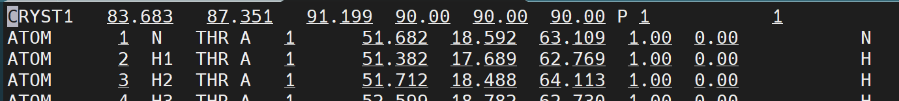
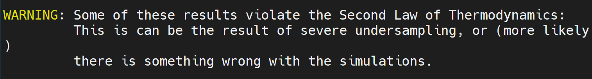
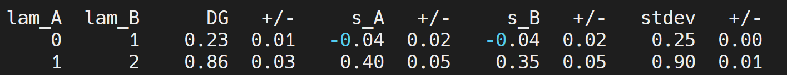
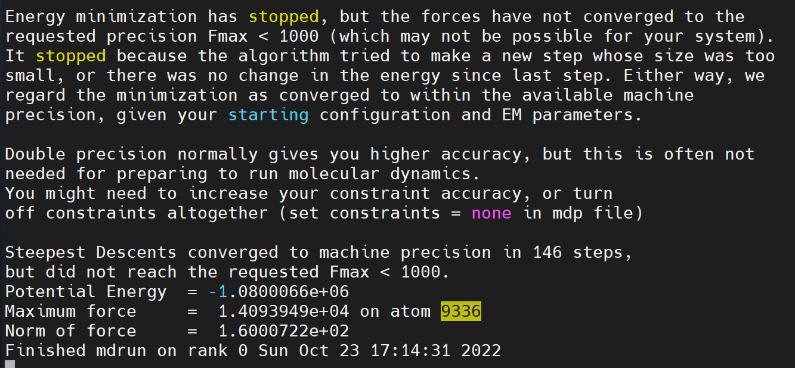
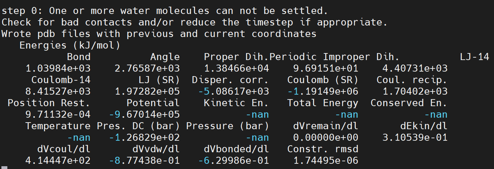

👏 FEP|蛋白和突变核酸的FEP计算流程-Gromacs版

---
[TOC]

---
## 流程
* bonded状态复合物体系steup
    * 使用set_system.o生成突变前gro和top
    * Gromacs动力学模拟relax溶剂（200ns）（拉住N端一个α碳原子）
    * 根据xtc文件将最后一帧构象转换为pdb, gro
    * 将pdb文件头部几行删除
    * 使用mutate_residue.o生成突变后的gro和top
    * 使用merge_topology.o根据突变前后的gro和top生成合并后的gro和top
    * 使用prepare_file.o生成mdp文件
    * run
* 将突变的单体也按上述流程跑一遍
* bonded-unbonded得到ddG
* 修改删除原子并进行可视化处理

## 蛋白和突变核酸的FEP计算流程byZD
### cpp文件
* [atommap.dat](./FEP蛋白和突变核酸的FEP计算流程/atommap.dat)
* [basic.h](./FEP蛋白和突变核酸的FEP计算流程/basic.h)
* [set_system.cpp](./FEP蛋白和突变核酸的FEP计算流程/set_system.cpp)
* [mutate_residue.cpp](./FEP蛋白和突变核酸的FEP计算流程/mutate_residue.cpp)
* [merge_topology.cpp](./FEP蛋白和突变核酸的FEP计算流程/merge_topology.cpp)
* [prepare_file.cpp](./FEP蛋白和突变核酸的FEP计算流程/prepare_file.cpp)
* [make_ndx.cpp](./FEP蛋白和突变核酸的FEP计算流程/make_ndx.cpp)
* [mdp-complex](./FEP蛋白和突变核酸的FEP计算流程/mdp-complex/)
* [mdp-Protein](./FEP蛋白和突变核酸的FEP计算流程/mdp-Protein/)
* [mdp-RNA](./FEP蛋白和突变核酸的FEP计算流程/mdp-RNA/)
编译cpp文件：
```shell
g++ set_system.cpp -o set_system.o
```

### 突变前prmtop和inpcrd文件建立
#### 手动tleap建立
**在手动tleap之前可以先直接在tleap中loadpdb一下，让tleap先检查一下pdb文件，根据报错信息先对pdb文件进行修改。**
（1）pdb4amber生成Amber可识别pdb文件。
```shell
pdb4amber -i cluster30_last_frame_chain.pdb -o cluster30_last_frame_amber.pdb -y --no-conect --noter
pdb4amber -i prod2_cluster30_chain.pdb -o complex.pdb -y --reduce --add-missing-atoms --no-conect
```
（2）tleap生成prmtop和inpcrd文件。
**若在构建过程中遇到原子类型错误，将残基与正确的残基相互比较手动纠正命名错误的原子名称。**
```shell
source leaprc.protein.ff14SB
source leaprc.DNA.OL15
source leaprc.RNA.OL3
source leaprc.water.tip3p
source leaprc.gaff2
loadamberparams frcmod.ionsjc_tip3p
mol = loadpdb cluster30_last_frame_amber.pdb
check mol # 检查结构正确性
solvatebox mol TIP3PBOX 12.0
charge mol
# 计算电荷：residue*0.0187*浓度
addions mol Na+ 58
addions mol MG 5  # 加镁离子
addIonsRand mol MG 3
addions mol Cl- 0 # 中和电荷
saveamberparm mol cluster30_30U_solvated.prmtop cluster30_30A_solvated.inpcrd
ambpdb -p *.prmtop < *.inpcrd > cluster30_30U_solvated_check.pdb # pymol中查看pdb检查正确性
```
（3） 将prmtop和inpcrd转换为gro, top和itp
**使用acpype或者parmed**
**可以在top的蛋白体系下面设置拉住蛋白N端的一个α碳原子以便后续的周期性处理**

#### set_system.o构建体系
**输入的pdb必须格式严格**
```shell
../set_system.o -i RNA_14A.pdb -o RNA_14A
```

### Gromacs动力学模拟relax溶剂（200ns）
**注意制作index.ndx时要注意RNA包括5端和3端，要将两者也加进去**
参考《Gromacs|Amber14sb力场下蛋白RNA复合物分子动力学模拟》

### 根据xtc文件将最后一帧（或聚类）构象转换为pdb, gro
```shell
echo 1 0|gmx trjconv -f prod1.xtc -s prod1.tpr -o prod1_out.xtc -pbc mol -center
gmx trjconv -s prod1.tpr -f prod1_out.xtc -o prod1_last.pdb -b 150000 -e 150000
gmx trjconv -s prod1.tpr -f prod1_out.xtc -o prod1_last.gro -b 150000 -e 150000
```

### 将prod1_last.pdb文件头部几行删除，将topol.top中的位置限制信息删除
删除后结果如下所示：

最后两行也要删掉。

### 使用mutate_residue.o生成突变后的gro和top
```shell
../mutate_residue.o -i complex_14A.pdb -o complex_14G -m B.14.AtoG -map ../atommap.dat
```
此时会生成complex_14G.gro和complex_14G.top文件。

### 使用merge_topology.o根据突变前后的gro和top
```shell
../merge_topology.o -map ../atommap.dat  -it1 complex_14A.top -ig1 complex_14A.gro -it2 complex_14G.top -ig2 complex_14G.gro -ot complex_14AtoG.top -og complex_14AtoG.gro
```

### 使用prepare_file.o生成mdp文件
```shell
../prepare_file.o -i ../mdp-complex/ -l ../mdp-complex/lambda.dat -o ./
```

### run
所有副本以及所有lambda都可以平行跑
一般窗口*窗口时间20ns左右，至少是10ns

### 数据处理
将所有run完成的dhdl.xvg放到一个文件夹中。然后：
```shell
gmx bar -f dhdl_lambda*.xvg -oi -o > fep.log
```
生成barint.xvg和bar.xvg。
fep.log文件中如果出现下图警告信息：

是由于下图中的0-1中的s_A和s_B出现负值，可将该步重新跑，跑至正值再计算。

最后需要的结果$\delta G$在fep.log的最后一行：
```text
total      0 -     17,   DG -223.35 +/-  1.25
```

**常用命令**
```shell
cd complex_fep
for i in `seq 1 5`;do cd dup${i};mkdir temp;cd temp;for a in `seq 0 17`;do cp ../lambda${a}/prod/dhdl.xvg dhdl_lambda${a}.xvg;done;gmx bar -f dhdl_lambda*.xvg -oi -o > fep.log;cd ../..;done
for i in `seq 1 5`;do tail -2 ./dup${i}/temp/fep.log|head -1|awk '{print $6}' >> ../complex_dg.dat;done
cd ../RNA_fep
for i in `seq 1 5`;do cd dup${i};mkdir temp;cd temp;for a in `seq 0 17`;do cp ../lambda${a}/prod/dhdl.xvg dhdl_lambda${a}.xvg;done;gmx bar -f dhdl_lambda*.xvg -oi -o > fep.log;cd ../..;done
for i in `seq 1 5`;do tail -2 ./dup${i}/temp/fep.log|head -1|awk '{print $6}' >> ../RNA_dg.dat;done
cd ..
```

### 按照上述的流程将突变的单体再跑一遍

### 本地自动文件准备shell脚本
```shell
# sh .sh 14 AtoG
#!/bin/bash
echo "1|12|18\nname 34 Protein_RNA\nq\n"

num=${1}
mutate=${2}
path=/home/yqyang/yqyang_zju/Aptamer/cluster30_FEP_MG
mut_before=`echo ${mutate}|awk -F "to" '{print $1}'`
mut_after=`echo ${mutate}|awk -F "to" '{print $2}'`
file_root=${num}${mut_before}${mut_after}
mkdir ${file_root}
cd ${file_root}
mkdir complex_fep;cd complex_fep
cp ${path}/complex_200ns/prod_last.pdb complex_${num}${mut_before}.pdb
cp ${path}/complex_200ns/prod_last.gro complex_${num}${mut_before}.gro
cp ${path}/complex_200ns/topol.top complex_${num}${mut_before}.top
~/yqyang_zju/fep_zhangd/mutate_residue.o -i complex_${num}${mut_before}.pdb -o complex_${num}${mut_after} -m A.${num}.${mut_before}to${mut_after} -map ~/yqyang_zju/fep_zhangd/atommap.dat
~/yqyang_zju/fep_zhangd/merge_topology.o -map ~/yqyang_zju/fep_zhangd/atommap.dat -it1 complex_${num}${mut_before}.top -ig1 complex_${num}${mut_before}.gro -it2 complex_${num}${mut_after}.top -ig2 complex_${num}${mut_after}.gro -ot complex_${num}${mut_before}to${mut_after}.top -og complex_${num}${mut_before}to${mut_after}.gro
~/yqyang_zju/fep_zhangd/prepare_file.o -i ~/yqyang_zju/fep_zhangd/mdp-complex/ -l ~/yqyang_zju/fep_zhangd/mdp-complex/lambdas.dat -o ./
echo "1|8|15\nname 37 Protein_RNA\nq\n"|gmx make_ndx -f complex_${num}${mut_before}to${mut_after}.gro -o fep.ndx
cp ${path}/complex_200ns/do-fep.sh .
sed -i "s/complex_14AC/complex_${num}${mut_before}${mut_after}/g" do-fep.sh
sed -i "s/complex_14AtoC/complex_${num}${mut_before}to${mut_after}/g" do-fep.sh

cd ..;mkdir RNA_fep;cd RNA_fep
cp ${path}/RNA_200ns/prod_last.pdb RNA_${num}${mut_before}.pdb
cp ${path}/RNA_200ns/prod_last.gro RNA_${num}${mut_before}.gro
cp ${path}/RNA_200ns/topol.top RNA_${num}${mut_before}.top
~/yqyang_zju/fep_zhangd/mutate_residue.o -i RNA_${num}${mut_before}.pdb -o RNA_${num}${mut_after} -m .${num}.${mut_before}to${mut_after} -map ~/yqyang_zju/fep_zhangd/atommap.dat
~/yqyang_zju/fep_zhangd/merge_topology.o -map ~/yqyang_zju/fep_zhangd/atommap.dat -it1 RNA_${num}${mut_before}.top -ig1 RNA_${num}${mut_before}.gro -it2 RNA_${num}${mut_after}.top -ig2 RNA_${num}${mut_after}.gro -ot RNA_${num}${mut_before}to${mut_after}.top -og RNA_${num}${mut_before}to${mut_after}.gro
~/yqyang_zju/fep_zhangd/prepare_file.o -i ~/yqyang_zju/fep_zhangd/mdp-RNA/ -l ~/yqyang_zju/fep_zhangd/mdp-RNA/lambdas.dat -o ./
echo "1|7\nq"|gmx make_ndx -f RNA_${num}${mut_before}to${mut_after}.gro -o fep.ndx
cp ${path}/RNA_200ns/do-fep.sh .
sed -i "s/RNA_14AC/RNA_${num}${mut_before}${mut_after}/g" do-fep.sh
sed -i "s/RNA_14AtoC/RNA_${num}${mut_before}to${mut_after}/g" do-fep.sh
cd ../
cp ${path}/do_all_fep.sh .
sed -i "s/14AC/${num}${mut_before}${mut_after}/g" do_all_fep.sh
```

### 一个ID同时提交多个job的shell脚本
```shell
file=$1
total_name=""
name_first=`head -1 ${file}`
rm temp.sh
for i in `cat ${file}`
do
total_name=${total_name}${i}
if [ "${i}" = "${name_first}" ]
then
cat ./${i}/do_all_fep.sh >> ${name_first}.sh
else
cat ./${i}/do_all_fep.sh >> temp.sh
sed -i "22i cd ../${i}" temp.sh
sed -i '1,20d' temp.sh
cat temp.sh >> ${name_first}.sh
rm temp.sh
fi
done
mv ${name_first}.sh ${total_name}.sh
sed -i "s/${name_first}/gmx/g" ${total_name}.sh
sed -i "22i cd ${name_first}" ${total_name}.sh
```

### 使用gromacs加水加离子准备200ns的MD体系，如何进行后续的FEP setup?
**FEP setup程序中都是用ambertools进行的，但是使用gromacs加的水以及离子的名称amber是不认识的，并且gromcs中加离子加水的顺序与amber也不同。所以首先需要对pdb文件中的离子以及水的名称进行替换，然后作为一个整体再通过ambertools处理再转换为新的pdb，gro和top文件即可正常进行FEP setup。**
**最好不要使用gromacs加水加离子，若要随机加离子可以使用ambertools中的addIonsRand命令。**

```shell
%s/SOL/WAT/g
%s/HW1/H1 /g
%s/HW2/H2 /g
%s/OW/ O/g
%s/CL/Cl-/g
%s/NA/Na+/g
```

## bonded-unbonded得到ddG
**获取均值与平均误差的脚本**
~~用法：将计算结果的两个列表输入下述脚本进行计算即可。~~
```python
# This is wrong.
import sys
from itertools import permutations
import numpy as np
import math

def compute(complex_fep, RNA_fep):
    all_combin = permutations([0, 1, 2, 3, 4], 5)
    # print(complex_fep)
    # print(type(complex_fep))
    complex_fep = np.array(complex_fep, dtype=np.float64)
    RNA_fep = np.array(RNA_fep, dtype=np.float64)
    se = 1000
    for item in list(all_combin):
        ddg = complex_fep - RNA_fep[list(item)]
        se_temp = np.std(ddg, ddof=0)/math.sqrt(len(ddg))
        if se_temp < se:
            se = se_temp
            final_combin = item
            final_ddg = ddg
    print("The last complex dg:", complex_fep)
    print("The last RNA dg:", RNA_fep[list(final_combin)])
    print("The last ddg:", final_ddg)
    print("The mean of ddg:", np.mean(final_ddg))
    print("The SE of ddg:", se)

def main():
    # complex_fep = list(sys.argv[1])
    # RNA_fep = list(sys.argv[2])
    complex_fep = [-223.35,-223.73,-222.38,-222.75,-221.16]
    RNA_fep = [-223.21,-222.92,-222.75,-221.29,-222.1]
    compute(complex_fep, RNA_fep)
    
if __name__=="__main__":
    main()  
```

**正确算法：**
complex = list(a)
RNA = list(b)
首先计算complex组的均值和标准误，得到mean_complex +/- se_complex；其次计算RNA组的均值和标准误，得到mean_RNA +/- se_RNA；最后计算ddg为ddg_mean = mean_complex - mean_RNA，ddg_se = $\sqrt{se\_complex^2+se\_RNA^2}$
计算脚本如下所示：

```python
import sys
import numpy as np
import math

def compute(complex_fep, RNA_fep):
    complex_fep = np.array(complex_fep, dtype=np.float64)
    RNA_fep = np.array(RNA_fep, dtype=np.float64)
    complex_mean = np.mean(complex_fep)
    RNA_mean = np.mean(RNA_fep)
    complex_se = np.std(complex_fep, ddof=1)
    RNA_se = np.std(RNA_fep, ddof=1)
    ddg_mean = complex_mean - RNA_mean
    ddg_se = math.sqrt(complex_se*complex_se + RNA_se*RNA_se)
    print("The mean of ddg (kJ/mol):", ddg_mean)
    print("The SE of ddg (kJ/mol):", ddg_se)
    print("The mean of ddg (kcal/mol):", ddg_mean/4.184)
    print("The SE of ddg (kcal/mol):", ddg_se/4.184)

def main():
    complex_fep = []
    with open("complex_dg.dat") as f:
        f1 = f.readlines()
    for i in f1:
        complex_fep.append(i.strip())
    RNA_fep = []
    with open("RNA_dg.dat") as f:
        f1 = f.readlines()
    for i in f1:
        RNA_fep.append(i.strip())
    compute(complex_fep, RNA_fep)
    
if __name__=="__main__":
    main()  
```

## 修改删除原子并进行可视化处理
**将跑完FEP后的lambda窗口下的轨迹进行可视化处理，因为由于双拓扑的原因，突变结构出现原子交叠，不好可视化。**
### 可视化pymol脚本
```python
import sys
from pymol import cmd
import os

atom_map = {
    "AtoG":[["H61","H62"],[[["N","O"],["N6","O6"]],[["H","N"],["H2","N2"]],[["H","H"],["DH21","H21"]],[["H","H"],["DH22","H22"]],[["H","H"],["DH1","H1"]]]],
    "GtoA":[["H1","H21","H22"],[[["N","H"],["N2","H2"]],[["O","N"],["O6","N6"]],[["H","H"],["DH61","H61"]],[["H","H"],["DH62","H62"]]]],
    "CtoG":[["C5","H5","C4","N4","H41","H42","N3","C2","O2"],[[["N","N"],["N1","N9"]],[["C","C"],["C6","C8"]],[["H","H"],["H6","H8"]],[["C","C"],["DC4","C4"]],[["C","C"],["DC5","C5"]],[["N","N"],["DN7","N7"]],[["N","N"],["DN3","N3"]],[["C","C"],["DC2","C2"]],[["N","N"],["DN1","N1"]],[["C","C"],["DC6","C6"]],[["O","O"],["DO6","O6"]],[["H","H"],["DH1","H1"]],[["N","N"],["DN2","N2"]],[["H","H"],["DH21","H21"]],[["H","H"],["DH22","H22"]]]],
    "CtoU":[["H41","H42"],[[["N","O"],["N4","O4"]],[["H","H"],["DH3","H3"]]]],
    }
# print(type(atom_map))
# print(atom_map)

def process(ref, traj, mutation):
    name_ = ref.split(".")[0]
    cmd.load(ref)
    cmd.load_traj(traj)
    num_states = cmd.count_states(name_)
    cmd.remove("sol")
    cmd.remove("inorganic")
    cmd.remove("resn Cl-")
    cmd.alter("polymer.nucleic","chain = 'A'")
    cmd.alter("polymer.protein","chain = 'B'")
    for i in atom_map[mutation][0]:
        cmd.remove("resn MUT and name %s"%(i))
    for i in atom_map[mutation][1]:
        cmd.alter("resn MUT and name %s"%(i[1][0]), "elem = '%s'"%(i[0][1]))
        cmd.alter("resn MUT and name %s"%(i[1][0]), "name = '%s'"%(i[1][1]))

    if not os.path.exists("./fep_out/"):
        os.makedirs("./fep_out/")
    
    for i in range(num_states):
        cmd.save(os.path.join("./fep_out/", "prod_" + str(i+1) + ".pdb"), name_, state=i+1)

def main():
    ref = sys.argv[1]
    traj = sys.argv[2]
    mutation = sys.argv[3]
    process(ref, traj, mutation)

if __name__ == "__main__":
    main()
```
### 脚本使用
```shell
python py ref.gro prod.xtc AtoG
```

## 文件整理
（1）最终结果留存脚本：
```shell
file=$1
mkdir ${file}
mkdir ./${file}/complex_file
for i in `seq 1 5`;do cp -r ./complex_fep/dup${i}/temp ./${file}/complex_file/temp_${i};done
mkdir ./${file}/RNA_file
for i in `seq 1 5`;do cp -r ./RNA_fep/dup${i}/temp ./${file}/RNA_file/temp_${i};done
cp do.py complex_dg.dat RNA_dg.dat ./${file}/
```
（2）轨迹文件留存脚本：
```shell
file=$1
mkdir ${file}
cp -r complex_fep ./${file}/
for a in `seq 1 5`;do for b in `seq 0 17`;do
rm -r ./${file}/complex_fep/dup${a}/lambda${b}/*.gro
rm -r ./${file}/complex_fep/dup${a}/lambda${b}/*.top
rm -r ./${file}/complex_fep/dup${a}/lambda${b}/*.ndx
rm -r ./${file}/complex_fep/dup${a}/lambda${b}/em
rm -r ./${file}/complex_fep/dup${a}/lambda${b}/nvt
rm -r ./${file}/complex_fep/dup${a}/lambda${b}/npt;done;done
for a in `seq 1 5`;do rm -r ./${file}/complex_fep/dup${a}/temp;done
cp -r RNA_fep ./${file}/
for a in `seq 1 5`;do for b in `seq 0 17`;do
rm -r ./${file}/RNA_fep/dup${a}/lambda${b}/*.gro
rm -r ./${file}/RNA_fep/dup${a}/lambda${b}/*.top
rm -r ./${file}/RNA_fep/dup${a}/lambda${b}/*.ndx
rm -r ./${file}/RNA_fep/dup${a}/lambda${b}/em
rm -r ./${file}/RNA_fep/dup${a}/lambda${b}/nvt
rm -r ./${file}/RNA_fep/dup${a}/lambda${b}/npt;done;done
for a in `seq 1 5`;do rm -r ./${file}/RNA_fep/dup${a}/temp;done
```

## error集锦
（1）使用2022.2版gromacs在跑上述流程时有的窗口min的时候会报如下错误：

致使nvt报错：

**解决办法：** 换成2021.5版本的gromacs进行跑的时候不会报错。

## Reverse FEP
### 从正向FEP最后一个lambda中选择构象进行反向FEP
（1）从lambda17中选择最后一帧pdb和gro文件。
```shell
gmx trjconv -f prod.xtc -s prod.tpr -o prod_out.xtc -pbc mol -center
gmx trjconv -s prod.tpr -f prod_out.xtc -o prod_last.pdb -b 1000 -e 1000
gmx trjconv -s prod.tpr -f prod_out.xtc -o prod_last.gro -b 1000 -e 1000
```
（2）修改生成的pdb以及gro文件并且将RNA_${num}${mut_after}.top文件复制过来。
修改原子名称以及重排原子编号。要与top文件的编号以及名称对应上。
（3）然后使用cpp文件准备即可。
（4）切记将pdb文件中的前几行以及最后几行信息删除，否则pdb4amber不能正确处理。
（5）准备命令如下：
```shell
/public/home/yqyang/file/fep_zhangd/mutate_residue.o -i RNA_34C.pdb -o RNA_34G -m .34.CtoG -map /public/home/yqyang/file/fep_zhangd/atommap.dat
/public/home/yqyang/file/fep_zhangd/merge_topology.o -map /public/home/yqyang/file/fep_zhangd/atommap.dat -it1 RNA_34C.top -ig1 RNA_34C.gro -it2 RNA_34G.top -ig2 RNA_34G.gro -ot RNA_34CtoG.top -og RNA_34CtoG.gro
/public/home/yqyang/file/fep_zhangd/prepare_file.o -i /public/home/yqyang/file/fep_zhangd/mdp-RNA/ -l /public/home/yqyang/file/fep_zhangd/mdp-RNA/lambdas.dat -o ./
gmx make_ndx -f RNA_34CtoG.gro -o fep.ndx
```