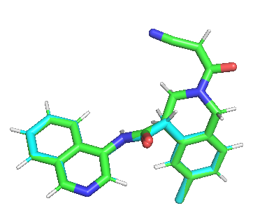
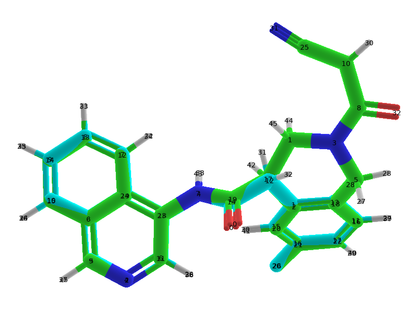

👏 FEP|蛋白和配体小分子的FEP计算流程-NAMD版

---
[TOC]

---
## 结构准备
一般进行FEP之前需要进行MD模拟，从MD中找到聚类结果中最大类的中心构象作为FEP计算的初始结构。从原始的MD轨迹中截取中心构象帧（保留溶剂和离子）保存为.pdb格式，作为初始结构。

## FEP前准备
（1）将初始结构在pymol中进行编辑以及拆分，将非配体部分单独保存为receptor.pdb文件。修饰A状态配体的双键以及三键保存为-A.mol2文件。编辑配体分子成为B状态分子保存为-B.mol2文件。
（2）将A状态和B状态的mol2文件分别上传charmmgui生成参数压缩文件。
（3）找出（2）压缩文件中A状态和B状态生成双拓扑的必要文件。A状态和B状态分别的（ligandrm.pdb，.rtf，.prm）（含有卤素原子的要注意孤对电子的处理）。
（4）使用FEPbuilder生成FEP所需的双拓扑文件。

## FEP双拓扑文件生成步骤及注意事项详解
（1）A和B状态的pdb，rtf和prm文件解析：
pdb：提供坐标。B状态是在A状态下编辑产生的，所以两者的公共部分坐标非常接近（可能由于chammgui处理时进行了优化，所以坐标数值不是完全一样的）。[com21_dup3_A.pdb](./FEP蛋白和配体小分子的FEP计算流程-NAMD版/com21_dup3_A.pdb) [com21_dup3_B.pdb](./FEP蛋白和配体小分子的FEP计算流程-NAMD版/com21_dup3_B.pdb)，结构如下图所示：

rtf：拓扑文件，提供原子类型，电荷，键类型和二面角等信息。[com21_dup3_A.rtf](./FEP蛋白和配体小分子的FEP计算流程-NAMD版/com21_dup3_A.rtf) [com21_dup3_B.rtf](./FEP蛋白和配体小分子的FEP计算流程-NAMD版/com21_dup3_B.rtf)
prm：力场文件。标准力场中没有的模板参数项在这里额外提供。[com21_dup3_A.prm](./FEP蛋白和配体小分子的FEP计算流程-NAMD版/com21_dup3_A.prm) [com21_dup3_B.prm](./FEP蛋白和配体小分子的FEP计算流程-NAMD版/com21_dup3_B.prm)

（2）受体receptor.pdb文件，其中含有离子，水，蛋白等。[receptor.pdb](./FEP蛋白和配体小分子的FEP计算流程-NAMD版/receptor.pdb)

（3）生成A和B状态的公共原子部分的对应关系。多种方式。
**pymol中查看并手动生成方式：**
这里的编号以pymol中的rank为例。rank从0开始计数。

则公共部分的对应关系则为：
```text
A,B
0,0
1,2
2,4
3,6
4,7
5,9
6,11
7,12
8,13
9,14
10,15
11,16
12,17
13,18
14,19
15,20
16,21
17,22
18,23
19,24
20,26
21,33
22,34
23,35
24,36
25,37
26,38
27,39
29,40
30,41
31,42
33,43
```

（4）查看（3）中对应的A和B状态的.rtf中的电荷以及原子类型是否一致。如果不一致则需将pairs从列表中移除。电荷来说一般情况下涉及到变动原子的相邻原子，其他都一样。原子类型则需要一一对应查看。查看后则更新对应关系为下所示：
```shell
A,B
0,0
# 1,2
2,4
3,6
4,7
5,9
6,11
7,12
8,13
9,14
10,15
11,16
# 12,17
# 13,18
# 14,19
15,20
16,21
17,22
18,23
19,24
20,26
21,33
22,34
23,35
24,36
25,37
26,38
27,39
29,40
30,41
# 31,42
33,43
```

（5）制作hybrid.pdb文件。制作方法为，将上述A状态pdb复制一份为hybrid.pdb，根据（4）中的公共原子对应行号将此时hybrid.pdb中公共原子原子名称后面加C。将A中除公共原子之外的剩余原子名称后面加A，并将对应的b-factor列改为-1。在A状态做完之后，删除TER，并增加内容，B中除公共原子之外的剩余原子名称后面加B，并将对应的b-factor列改为1。[hybrid.pdb](./FEP蛋白和配体小分子的FEP计算流程-NAMD版/hybrid.pdb)

（6）制作hybrid.rtf文件。制作方法为合并com21_dup3_A.rtf和com21_dup3_B.rtf两个文件。[hybrid.rtf](./FEP蛋白和配体小分子的FEP计算流程-NAMD版/hybrid.rtf)
- 分子名称RESI自定义修改
- 将三部分的原子全部放入hybrid.rtf文件中并修改原子的名称。第一部分是A和B状态的公共原子，在原来名称后面添加大写字母C。第二部分是A状态特有的原子，在原来名称后面添加大写字母A。第三部分是B状态特有的原子，在原来名称后面添加大写字母B。
- 修订hybrid.rtf文件中每个原子对应的电荷信息。公共原子的电荷信息使用A和B状态对应原子的电荷的平均值。为了使总电荷守恒，最后还需对多余的少量电荷进行微调。
- 修订hybrid.rtf文件中的键信息。合并A和B状态的键信息。将A和B状态中重复的键信息只保留一个。注意键对应的原子名称要用修改后的原子名称。
- 修订hybrid.rtf文件中的二面角信息。修改方式与键信息的修改方式一样。

（7）vmd中加载hybrid.pdb，hybrid.rtf以及蛋白，水，离子等信息并保存为complex.pdb和complex.psf。[complex.pdb](./FEP蛋白和配体小分子的FEP计算流程-NAMD版/complex.pdb) [complex.psf](./FEP蛋白和配体小分子的FEP计算流程-NAMD版/complex.psf)

（8）由vmd新生成的complex.pdb文件中的b-factor一列全都是1，未做成-1,0,1的双拓扑形式。根据之前的A和B状态的原子对应关系修改complex.pdb中的b-factor一列成为1,0，-1的形式complex-fep.pdb。  [complex-fep.pdb](./FEP蛋白和配体小分子的FEP计算流程-NAMD版/complex-fep.pdb)

（9）检查分子中是否含有三键以及lone pair，若有的话需要删除complex.psf中的三键二面角信息。以及修订lone pair信息生成complex-fep.psf。  [complex-fep.psf](./FEP蛋白和配体小分子的FEP计算流程-NAMD版/complex-fep.psf)

（10）根据A和B状态的prm文件生成hybrid.prm文件，这一步就是将两个prm文件直接合并即可。  [hybrid.prm](./FEP蛋白和配体小分子的FEP计算流程-NAMD版/hybrid.prm)

（11）至此，FEP所需的三个体系文件complex-fep.pdb，complex-fep.psf以及hybrid.prm已经准备完成。

（12）体系平衡。 [fep-com-equil.conf](./FEP蛋白和配体小分子的FEP计算流程-NAMD版/fep-com-equil.conf)

（13）FEP。 [fep-com-prod-forward.conf](./FEP蛋白和配体小分子的FEP计算流程-NAMD版/fep-com-prod-forward.conf)