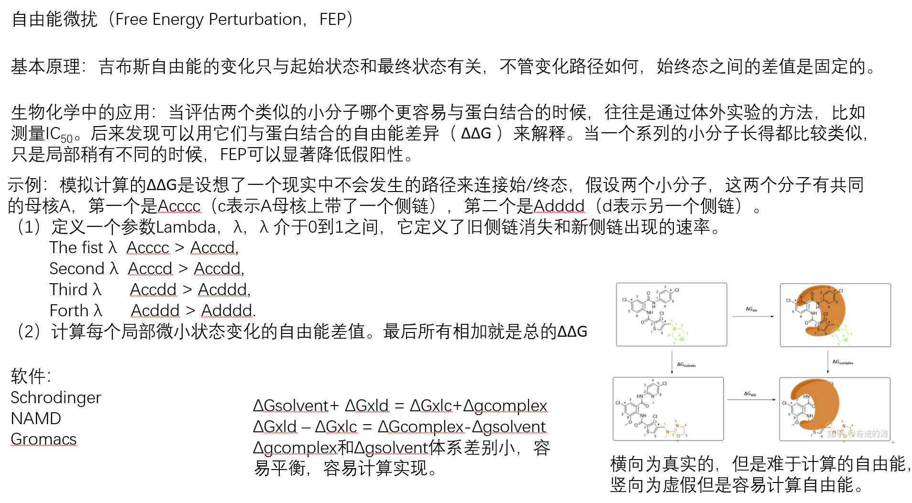
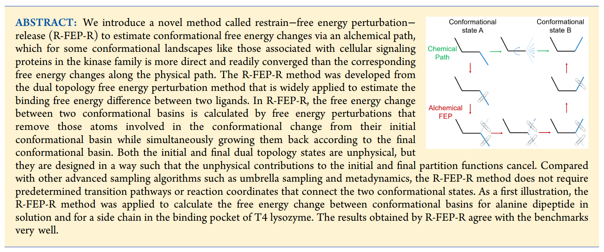
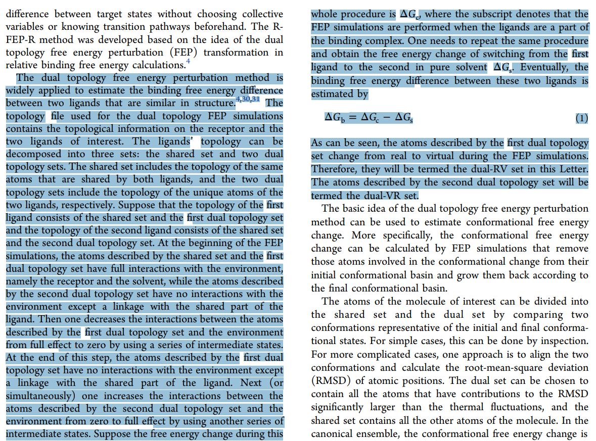

👏 FEP计算方法相关

---
[TOC]

---
## FEP的基本原理-热力学循环

* [Conformational Free Energy Changes via an Alchemical Path without Reaction Coordinates](https://pubs.acs.org/doi/10.1021/acs.jpclett.8b01851?ref=PDF)

**有关FEP的描述：**

具体实现：
（1）[How to implement dihedral restraints](https://gromacs.org-gmx-users.maillist.sys.kth.narkive.com/vjj7wrp9/gmx-users-how-to-implement-dihedral-restraints)
（2）[小分子绝对结合自用能计算 3](https://zhuanlan.zhihu.com/p/345733432)

必须加末尾

## FEP相关文献
* [Scientific Reports | An Improved Free Energy Perturbation FEP+ Sampling Protocol for Flexible Ligand-Binding Domains](FEP计算方法相关/s41598-019-53133-1.pdf)
* [JCTC | AMBER Free Energy Tools: A New Framework for the Design of Optimized Alchemical Transformation Pathways](FEP计算方法相关/acs.jctc.2c00725_merged_public.pdf)
* [ChemRxiv | Broadening the scope of binding free energy calculations using a Separated Topologies approach](FEP计算方法相关/broadening-the-scope-of-binding-free-energy-calculations-using-a-separated-topologies-approach_merged_public.pdf)

## Charmmgui && NAMD && FEP
* [JCIM | CHARMM-GUI Ligand Binder for Absolute Binding Free Energy Calculations and Its Application](FEP计算方法相关/ci300505n.pdf)
* [JCTC | CHARMM-GUI Free Energy Calculator for Absolute and Relative Ligand Solvation and Binding Free Energy Simulations](FEP计算方法相关/acs.jctc.0c00884_merged_public.pdf)