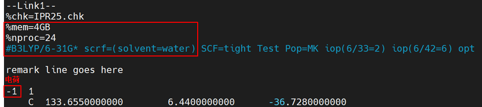

👏 Gromacs|AMBER/GAFF力场下蛋白配体复合物分子动力学模拟

---
[TOC]

---
## 说明
&emsp;&emsp;此次模拟是对虚拟筛选活性化合物对接复合物的动力学模拟，旨在对蛋白配体结合过程以及结合模式、运动状态等进行分析。初始文件为配体分子文件[IPR25.mol2](./GromacsAMBERGAFF力场下蛋白配体复合物分子动力学模拟/IPR25.mol2)、蛋白分子文件[PRL.pdb](./GromacsAMBERGAFF力场下蛋白配体复合物分子动力学模拟/PRL.pdb)。构建体系的思路是：（1）使用高斯计算配体RESP电荷。（2）使用AmberTools构建配体拓扑结构并转换为Gromacs格式。（3）使用Gromacs构建蛋白拓扑结构。（4）合并蛋白配体的Gromacs拓扑结构创建复合物拓扑结构。（5）min -> nvt -> npt -> md。  

## 构建配体拓扑文件
（1）检查配体结构合理性并进行配体加氢。加氢软件一般可选用Pymol、Maestro等，一定要检查加氢之后的结构合理性。在该示例中，IPR25结构特殊，N上少一个氢，Pymol无法对其进行加氢，所以这里使用Maestro对其进行加氢，在Maestro中选中缺少氢原子的氮，对该氮原子单独加氢保存为新的[IPR25-maestro.mol2](./GromacsAMBERGAFF力场下蛋白配体复合物分子动力学模拟/IPR25-maestro.mol2)。
（2）使用Ambertools的antechamber将配体文件处理成Gaussian的输入文件，以计算RESP电荷。首先生成量化计算需要的gjf文件。
```shell
antechamber -i IPR25-maestro.mol2 -fi mol2 -o IPR25.gjf -fo gcrt -pf y
```
（3）修改gjf文件。HF修改为B3LYP（基组）；增加scrf=(solvent=water)；%mem=4GB；%nproc=24参数；修改电荷数。修改后的文件如[IPR.gjf](./GromacsAMBERGAFF力场下蛋白配体复合物分子动力学模拟/IPR25.gjf)所示。修改示例如下图所示：  

（4）高斯计算RESP电荷。
```shell
g09 IPR25.gjf
```
（5）生成配体参数文件。
```shell
antechamber -i IPR25.log -fi gout -o IPR25.prep -fo prepi -c resp -pf y
parmchk2 -i IPR25.prep -f prepi -o IPR25.frcmod -a y
```
（6）再次使用antechamber获得含有RESP电荷的原子重新编号的mol2配体文件。生成[IPR25_resp.mol2](./GromacsAMBERGAFF力场下蛋白配体复合物分子动力学模拟/IPR25_resp.mol2)文件。
```shell
antechamber -i IPR25.log -fi gout -c resp -o IPR25_resp.mol2 -fo mol2 -pf y
```
（7）获得含有正确坐标信息和RESP电荷信息的mol2文件。因为初始的IPR25-maestro.mol2文件中含有正确的坐标信息，但是没有RESP电荷信息，IPR25_resp.mol2文件中含有RESP电荷信息，但是其坐标是通过量化计算优化后的坐标。所以需要将这两个文件进行合并。这里使用IPR25-maestro.mol2的坐标替换IPR25_resp.mol2的坐标。可使用脚本[inital-resp.py](./GromacsAMBERGAFF力场下蛋白配体复合物分子动力学模拟/inital-resp.py)生成。生成后放在pymol中检查正确性。  
```shell
python inital-resp.py IPR25-maestro.mol2 IPR25_resp.mol2
```
（8）tleap生成配体的prmtop和inpcrd文件。
```shell
tleap
>source leaprc.gaff
>loadamberparams IPR25.frcmod
>MOL = loadmol2 IPR25-RESP-inital.mol2
>check MOL
>list
>saveamberparm MOL IPR25.prmtop IPR25.inpcrd
>quit
```
使用下述命令将prmtop和inpcrd转成pdb查看结构合理性
```shell
ambpdb -p IPR25.prmtop < IPR25.inpcrd > IPR25-check.pdb
```
（9）利用acpype将prmtop和inpcrd转换为Gromacs可用的配体输入文件。此时，在文件夹中产生top文件和gro文件，本例中配体分子名称为MOL，所以生成的文件名为“MOL_GMX.top”和“MOL_GMX.gro”。MOL_GMX.top文件还需要做一下修改，将其中的[defaults]、[system]和[molecules]模块删除，另存为MOL_GMX.itp文件。
```shell
acpype -p ligand.prmtop -x ligand.inpcrd
```

## 构建蛋白质拓扑文件
（1）AlphaFold2建模补链或者使用maestro对缺失原子的残基进行修补。  
（2）H++进行加氢。
（3）特别关注检查组氨酸的质子化状态（HIS、HID、HIE、HIP）和二硫键等。
（4）使用pdb2gmx来生成蛋白质的拓扑文件，本例中我们选择AMBER99SB力场，即输入“5”，然后回车。  
```shell
gmx_mpi pdb2gmx -f PRL2.pdb -o PRL2.gro -water tip3p -ignh
```
（5）在文件中产生了PRL2.gro、topol.top以及posre.itp文件。topol.top里面包含了选择的力场的一些参数以及蛋白质的拓扑结构参数等；posre.itp为蛋白质的限制势文件。

## 创建复合物拓扑文件
（1）创建复合物拓扑文件即合并配体与蛋白的gro文件，将配体MOL_GMX.gro的内容添加到PRL2.gro的末尾，并修改第二行的原字数（原原子数目+配体分子原子数目的总原子数），另存为complex.gro文件。使用VMD查看complex.gro，检查结构是否合理。特别需要注意的是gro文件最后一定要有一个空行。可使用脚本[gro_merge.py](./GromacsAMBERGAFF力场下蛋白配体复合物分子动力学模拟/gro_merge.py)生成，生成后需要可视化检查gro文件的正确性。  
```shell
python gro_merge.py PRL2.gro MOL_GMX.gro
```
（2）使用genrestr来产生配体分子的限制势itp文件。终端提示选择组，这里选择system，输入“0”即可。其中-fc指定位置限制的力常数，单位为kJ/mol/nm2。
```shell
gmx genrestr -f MOL_GMX.gro -o posre_ligand.itp -fc 1000 1000 1000
```
（3）对拓扑文件topol.top文件的内容进行修改。在topol.top文件开头，找到如下内容所在行：
```text
; Include forcefield parameters
#include "amber99sb.ff/forcefield.itp"
```
在其后面添加一行，变为：
```text
; Include forcefield parameters
#include "amber99sb.ff/forcefield.itp"
#include "MOL_GMX.itp"
```
同时在文档最后的[ molecules ]下增加配体MOL的信息，如下：
```text
[ molecules ]
; Compound        #mols
Protein_chain_A     1
MOL                 1
```
我们还需要将配体限制势itp文件引入整体的拓扑文件topol.top中，找到如下内容所在行：
```text
; Include Position restraint file
#ifdef POSRES
#include "posre.itp"
#endif

; Include water topology
#include "amber99sb.ff/tip3p.itp"
```
需在Include water topology前面添加四行：
```text
; Ligand position restraints
#ifdef POSRES_LIG
#include "posre_ligand.itp"
#endif
```
即变为：
```text
; Include Position restraint file
#ifdef POSRES
#include "posre.itp"
#endif

; Ligand position restraints
#ifdef POSRES_LIG
#include "posre_ligand.itp"
#endif

; Include water topology
#include "amber99sb.ff/tip3p.itp"
```
这样拓扑文件就做好了。

## 定义盒子
使用editconf模块定义盒子大小，然后使用solvate将水填满整个盒子。输入以下命令，运行之后需要检查一下加水盒子之后的solv.gro文件。
```shell
gmx_mpi editconf -f complex.gro -o newbox.gro -bt cubic -d 1.0
gmx_mpi solvate -cp newbox.gro -p topol.top -o solv.gro
```

## 添加抗衡离子
为了保持体系稳定使其处于中性电荷状态，我们需要加入相反电荷达到目的。使用genion模块用离子替换掉部分水分子来实现，输入以下命令。终端提示选择组（Group）,选择15（SOL）并回车。完成之后进行可视化检查。[ions.mdp](./GromacsAMBERGAFF力场下蛋白配体复合物分子动力学模拟/ions.mdp)
```shell
gmx grompp -f ions.mdp -c solv.gro -p topol.top -o ions.tpr
gmx genion -s ions.tpr -o solv_ions.gro -p topol.top -pname NA -nname CL -neutral
```

## 能量最小化
在开始动力学模拟之前，应保证体系中的原子没有冲撞，就需要对体系进行能量最小化。输入以下命令：[em.mdp](./GromacsAMBERGAFF力场下蛋白配体复合物分子动力学模拟/em.mdp)
```shell
gmx grompp -f em.mdp -c solv_ions.gro -p topol.top -o em.tpr
gmx mdrun -v -deffnm em
```

## 平衡
（1）我们一般将蛋白和配体作为同一个控温组。进行温度耦合的组需要在.mdp文件中设置tc-grps=Protein Non-Protein，但是这里不包含小分子，需要通过分组来实现，其中包含蛋白质和配体MOL。我们可以使用gmx make_ndx模块来完成这个工作，只要提供完整体系的任意坐标文件即可. 在这里，我们使用em.gro，它是体系(能量最小化后)的输出结构。输入以下命令来产生索引文件：
```shell
gmx make_ndx -f em.gro -o index.ndx
```
此时，终端提示选择组别，其中1为蛋白，13为配体lzp,我们需要将蛋白和配体分为一组，因此选择1和13组：
```shell
> 1 | 13
> q
```
（2）现在我们可以设置tc_grps = Protein_MOL Water_and_ions来达到我们需要的Protein Non-Protein的效果了。
（3）接下来进行两步平衡，等温等容（NVT）和等温等压（NPT），依次输入以下命令：[nvt.mdp](./GromacsAMBERGAFF力场下蛋白配体复合物分子动力学模拟/nvt.mdp) [npt.mdp](./GromacsAMBERGAFF力场下蛋白配体复合物分子动力学模拟/npt.mdp)
```shell
gmx grompp -f nvt.mdp -c em.gro -r em.gro -p topol.top -n index.ndx -o nvt.tpr
gmx mdrun -deffnm nvt
gmx grompp -f npt.mdp -c nvt.gro -t nvt.cpt -r nvt.gro -p topol.top -n index.ndx -o npt.tpr
gmx mdrun -deffnm npt
```

## 分子动力学模拟
接下来就可以进行动力学模拟了，输入以下命令。动力学完成之后可查看轨迹。[md.mdp](./GromacsAMBERGAFF力场下蛋白配体复合物分子动力学模拟/md.mdp)
```shell
gmx grompp -f md.mdp -c npt.gro -t npt.cpt -p topol.top -n index.ndx -o md.tpr
gmx mdrun -deffnm md -nb gpu
```

## 参考资料
1. [AMBER+GAFF力场下蛋白-配体复合物的分子动力学模拟](https://mp.weixin.qq.com/s/AZDZBTSKWQseMX5QuElc3g)