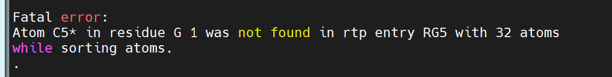

👏 Gromacs|Amber14sb力场下蛋白RNA复合物分子动力学模拟

---
[TOC]

---
## 体系构建前准备
（1）获得蛋白RNA复合物pdb文件。
（2）安装Amber14sb力场。

## 体系构建
### gmx构建体系
**注意：可能会出现的错误如下：**
**使用pdb2gmx生成拓扑文件时碱基摸板不匹配。**

这种错误的原因是pdb文件中的原子名称或者数目与gromacs的RNA摸板库中的摸板（力场文件夹下的rna.rtp文件）不一致。需要将名称改一致。
本人遇到的情况对应的解决方法如下：
解决1：将文件中的\*全部替换为'，并且将第一个核苷酸里面的磷酸去掉，即删去前三行或者是带磷原子的三行。
解决2：将文件中的\*全部替换为'，在使用pdb2gmx时使用-ter选项交互选择结构两端。

（1）生成拓扑文件
（2）加水盒子
（3）加入中和离子 [ions.mdp](./GromacsAmber14sb力场下蛋白RNA复合物分子动力学模拟/ions.mdp)
```shell
# sh do.sh object
file=$1
echo 1 |gmx pdb2gmx -f $file -o complex.gro -water tip3p -ignh
# gmx pdb2gmx -f cmp.pdb -ff amber19sb -water tip3p
gmx editconf -f complex.gro -o newbox.gro -bt cubic -d 1.0
gmx solvate -cp newbox.gro -cs spc216.gro -p topol.top -o solv.gro
gmx grompp -f ../ions.mdp -c solv.gro -p topol.top -o ions.tpr -maxwarn 2
echo 14|gmx genion -s ions.tpr -o solv_ions.gro -p topol.top -pname NA -nname CL -neutral -conc 0.15
echo q| gmx make_ndx -f solv_ions.gro -o ions.ndx  # 上述内容根据需要进行修改。
```

### AmberTools构建体系
（1）pdb4amber生成Amber可识别pdb文件。
```shell
pdb4amber -i cluster30_last_frame_chain.pdb -o cluster30_last_frame_amber.pdb -y --no-conect --noter
```
（2）

## em、nvt、npt、md
（1）动力学模拟所需的mdp文件如下所示：
[em.mdp](./GromacsAmber14sb力场下蛋白RNA复合物分子动力学模拟/em.mdp)
[nvt.mdp](./GromacsAmber14sb力场下蛋白RNA复合物分子动力学模拟/nvt.mdp)
[npt.mdp](./GromacsAmber14sb力场下蛋白RNA复合物分子动力学模拟/npt.mdp)
[prod.mdp](./GromacsAmber14sb力场下蛋白RNA复合物分子动力学模拟/prod.mdp)
（2）执行动力学模拟
[job.pbs](./GromacsAmber14sb力场下蛋白RNA复合物分子动力学模拟/job.pbs)
（3）批量提交pbs任务
[qsub.py](./GromacsAmber14sb力场下蛋白RNA复合物分子动力学模拟/qsub.py)
[job_params.txt](./GromacsAmber14sb力场下蛋白RNA复合物分子动力学模拟/job_params.txt)
（4）提交
将文件名称写入job_params.txt中，运行py脚本即可。
```shell
python qsub.py
```