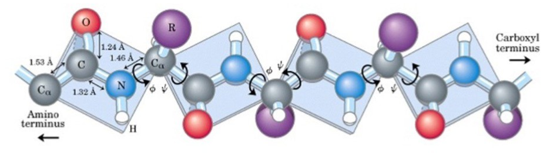
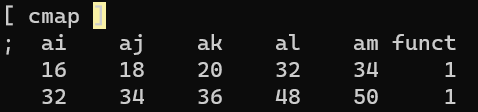
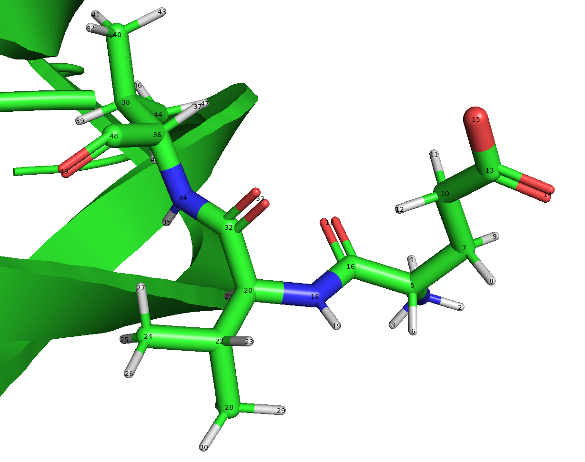

👏 Gromacs|Gromacs拓扑文件解读

---
[TOC]

---
**[参考文件](./GromacsGromacs拓扑文件解读/topol.top)**

（1）引入力场文件。gromacs将力场文件统一存放在$GMX/share/gromacs/top路径下。其中含有配体时还需要引入配体的拓扑文件。如本例中的MOL_GMX.itp。
> 1）若想引入新的力场，可将力场文件夹直接复制到该文件夹中即可。
> 2）如果想对力场参数进行修改，可将力场文件夹复制到当前的工作目录下并对力场文件修改，这样在调用的时候即会优先调用当前工作目录下的力场文件。
```cpp
; Include forcefield parameters
#include "amber99sb.ff/forcefield.itp"
#include "MOL_GMX.itp"
```

（2）蛋白/核酸分子的力场参数信息。
```cpp
[ moleculetype ]
; Name            nrexcl
Protein_chain_A     3

[ atoms ]
;   nr       type  resnr residue  atom   cgnr     charge       mass  typeB    chargeB      massB
; residue   1 MET rtp NMET q +1.0
     1         N3      1    MET      N      1     0.1592      14.01
     2          H      1    MET     H1      2     0.1984      1.008
     3          H      1    MET     H2      3     0.1984      1.008
     4          H      1    MET     H3      4     0.1984      1.008
......

[ bonds ]
;  ai    aj funct            c0            c1            c2            c3
    1     2     1
    1     3     1
    1     4     1
    1     5     1
    5     6     1
    5     7     1

[ pairs ]
;  ai    aj funct            c0            c1            c2            c3
    1     8     1
    1     9     1
    1    10     1
    1    19     1

[ angles ]
;  ai    aj    ak funct            c0            c1            c2            c3
    2     1     3     1
    2     1     4     1
    2     1     5     1
    3     1     4     1
    3     1     5     1

[ dihedrals ]
;  ai    aj    ak    al funct            c0            c1            c2            c3            c4            c5
    2     1     5     6     9
    2     1     5     7     9
    2     1     5    18     9
    3     1     5     6     9
    3     1     5     7     9

[ dihedrals ]
;  ai    aj    ak    al funct            c0            c1            c2            c3
    5    20    18    19     4
   18    22    20    21     4
   22    34    32    33     4
   24    29    27    28     4
```

（3）蛋白约束文件。受mdp参数文件调控。在mdp文件中添加参数define = -DPOSRES启用该约束信息。
```cpp
; Include Position restraint file
#ifdef POSRES
#include "posre.itp"
#endif
```

（4）配体约束文件。


## Charmm36 Topol
**[ cmap ]**
The basic form of the CMAP term implemented in GROMACS **is a function of the ϕ and ψ backbone torsion angles.** This term is defined in the rtp file by a [ cmap ] statement at the end of each residue supporting CMAP. The following five atom names define the two torsional angles. Atoms 1-4 define ϕ, and atoms 2-5 define ψ. The corresponding atom types are then matched to the correct CMAP type in the cmap.itp file that contains the correction maps.

**举个栗子：**



**[ atoms ]**
```text
;   nr       type  resnr residue  atom   cgnr     charge       mass  typeB    chargeB      massB
; residue  13 GLU rtp GLU  q  0.0
     1        NH3     13    GLU      N      1       -0.3     14.007
     2         HC     13    GLU     H1      2       0.33      1.008
     3         HC     13    GLU     H2      3       0.33      1.008
     4         HC     13    GLU     H3      4       0.33      1.008
     5        CT1     13    GLU     CA      5       0.21     12.011
     6        HB1     13    GLU     HA      5        0.1      1.008
     7       CT2A     13    GLU     CB      6      -0.18     12.011
     8        HA2     13    GLU    HB1      6       0.09      1.008
     9        HA2     13    GLU    HB2      6       0.09      1.008
    10        CT2     13    GLU     CG      7      -0.28     12.011
    11        HA2     13    GLU    HG1      7       0.09      1.008
    12        HA2     13    GLU    HG2      7       0.09      1.008
    13         CC     13    GLU     CD      7       0.62     12.011
    14         OC     13    GLU    OE1      7      -0.76    15.9994
    15         OC     13    GLU    OE2      7      -0.76    15.9994
    16          C     13    GLU      C      8       0.51     12.011
    17          O     13    GLU      O      8      -0.51    15.9994   ; qtot 0
```
这里的cgnr（Charge Group NumbeR）列：All atoms within the same charge group have the same number.

|列|数据|格式，对齐|说明|
|:----|:----|:----|:----|
|1-6|原子序号|整数，右对齐||
|7-17|原子类型|字符，右对齐||
|18-24|残基编号|整数，右对齐||
|25-31|残基名称|字符，右对齐||
|32-38|原子名称|字符，右对齐||
|39-45|电荷分组序号|整数，右对齐||
|46-56|电荷|浮点，右(11.2)||
|57-67|质量|浮点，右(11.4)||
|68-|注释|字符|||

|列|长度|格式|范围|Python|
|:----|:----|:----|:----|:----|
|1-6|6|{:>6d}|01-06|[:6]|
|7-17|11|{:>11s}|07-17|[6:17]|
|18-24|7|{:>7d}|18-24|[17:24]|
|25-31|7|{:>7s}|25-31|[24:31]|
|32-38|7|{:>7s}|32-38|[31:38]|
|39-45|7|{:>7d}|39-45|[38:45]|
|46-56|11|{:>11.2f}|46-56|[45:56]|
|57-67|11|{:>11.4f}|57-67|[56:67]|
|68-|||68-|[67:]|

## 参考资料
1. [Gromacs拓扑文件解读](https://mp.weixin.qq.com/s/DnHsMPFa0hOW_ySWUDGBsA)

## Topol样例
**qtot**
```text
; residue    9 PRO rtp PRO q 0.0
  106          N      9    PRO      N    106 -0.25480000  14.010000   ; qtot 0.745200
  107         CT      9    PRO     CD    107 0.01920000  12.010000   ; qtot 0.764400
  108         H1      9    PRO    HD2    108 0.03910000   1.008000   ; qtot 0.803500
  109         H1      9    PRO    HD3    109 0.03910000   1.008000   ; qtot 0.842600
  110         CT      9    PRO     CG    110 0.01890000  12.010000   ; qtot 0.861500
  111         HC      9    PRO    HG2    111 0.02130000   1.008000   ; qtot 0.882800
  112         HC      9    PRO    HG3    112 0.02130000   1.008000   ; qtot 0.904100
  113         CT      9    PRO     CB    113 -0.00700000  12.010000   ; qtot 0.897100
  114         HC      9    PRO    HB2    114 0.02530000   1.008000   ; qtot 0.922400
  115         HC      9    PRO    HB3    115 0.02530000   1.008000   ; qtot 0.947700
  116         CX      9    PRO     CA    116 -0.02660000  12.010000   ; qtot 0.921100
  117         H1      9    PRO     HA    117 0.06410000   1.008000   ; qtot 0.985200
  118          C      9    PRO      C    118 0.58960000  12.010000   ; qtot 1.574800
  119          O      9    PRO      O    119 -0.57480000  16.000000   ; qtot 1.000000
```
这里的qtot是总电荷的意思，这一行的qtot的前面所有行qtot的加和。这里只是提供信息提示，计算时是没有任何作用的。