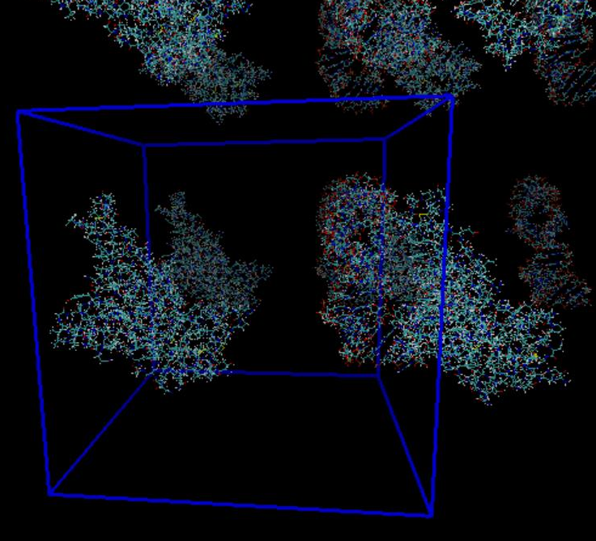

👏 Gromacs|Gromacs轨迹周期性边界条件处理

---
[TOC]

---
## 问题描述
在进行分子动力学模拟时通常使用周期性边界条件，即通过使用称为单位单元的一小部分以近似大型（无限）系统。由于模拟时体系并非总是处于盒子中心，所以模拟轨迹中会存在体系一部分在盒子的一头，另一部分在盒子的另一头的现象。如下所示：

上述情况不利于体系的可视化查看，所以需要将整个体系的原子放于模拟盒子内以便查看。

## 解决办法之MD模拟时解决
产生上述现象的原因主要是周期性模拟过程中，由于数值计算误差、非键作用截断误差，会导致体系有不合理的平移现象。模拟过程中有时引入了某些随机力，可能会引起整体动量和角动量的改变，此时一般定期将它们归零。因此双精度版本的一般不用考虑消除质心运动，因为计算误差小。

**涉及到消除质心运动的参数**
```shell
;COM motion removal
comm-mode = linear；angular；none
nstcomm = 100
comm-grps = system
```
**参数说明**
* linear:消除质心运动（平动、平移）。
* angular ；消除绕着质心的转动 （消除平动与转动）。angular来消除其平动和转动。但需要用-maxwarn来忽略由此造成的警告。如果不靠angular消除蛋白整体运动，模拟完成后用trjconv周期性处理轨迹也可。
* none:不限制质心的运动。
* nstcomm: 每多少步消除一次整体运动，默认100步。
* comm-grps：需要去除质心运动的组，默认是对整个体系消除平动。对于模拟生物大分子，在模拟中往往发现生物大分子会移动、旋转，给观看带来不便。所以此mdp中仅仅对Protein组使用comm-mode。

**示例：**
（1）纯膜体系中：消除平动建议设定为comm grps = lower upper SOL。来对下层、上层膜和水分别消除平动。否则由于两层膜，以及膜与水之间耦合较弱，容易产生虚假的相对滑动。

（2）如果是膜蛋白体系，则蛋白和两层膜作为同一组消除平动：Protein_POPC Ligand SOL_CL。

**或者在跑MD时拉住一个碳原子进行MD**

## 解决办法之轨迹分析时解决
（1）按complex几何中心原子进行居中方法，**该方法尚不完美**。
使用仅保留complex的gro文件计算complex几何中心原子脚本：
```python
import sys

def process(file_in):
    with open(file_in) as f:
        f1 = f.readlines()
    x = []
    y = []
    z = []
    for i in range(2, len(f1)-1):
        x.append(float(f1[i].strip().split()[3]))
        y.append(float(f1[i].strip().split()[4]))
        z.append(float(f1[i].strip().split()[5]))
    center = ((max(x)+min(x))/2, (max(y)+min(y))/2, (max(z)+min(z))/2)
    dev = 1000
    id_ = 0
    for a in range(len(x)):
        dist = (x[a]-center[0])**2 + (y[a]-center[1])**2 + (z[a]-center[2])**2
        if dist <= dev:
            id_ = a+1
            dev = dist
    print("最近的原子编号为:", id_)

def main():
    file_in = sys.argv[1]
    process(file_in)

if __name__ == '__main__':
    main()
```
根据中心原子进行居中，将上述计算出的几何中心原子编号写入index.ndx中进行选择：
```shell
gmx trjconv -s prod1.tpr -f cluster8_20ns.xtc -n index.ndx -o cluster8_20ns_nowat_8.xtc -pbc atom -center
```

（2）完美解决方法
```shell
# 先使用npt.gro去水去离子建立new.pdb，然后使用new.pdb建立index_new.ndx。
gmx editconf -f npt.gro -c -o new.pdb -n index.ndx
gmx make_ndx -f new.pdb -o index_new.ndx
gmx trjconv -f t1.part0001.xtc -s new.pdb -o md_pbcwhole_new.xtc -pbc whole -tu ns -dt 1 -n index_new.ndx 
gmx trjconv -f md_pbcwhole_new.xtc -s new.pdb -o md_pbcnojump_new.xtc -pbc nojump -tu ns -dt 1 -n index_new.ndx
gmx trjconv -f md_pbcnojump_new.xtc -s new.pdb -o md_pbcmol_new.xtc -pbc mol -ur compact -center -tu ns -dt 1 -n index_new.ndx 
gmx trjconv -f md_pbcmol_new.xtc -s new.pdb -o md_pbcfit_all_new.xtc -fit rot+trans  -tu ns -dt 1 -n index_new.ndx
```

## 考虑所有水的周期性处理
**需要保留的复合物体系周围的水和离子分布不变**（还未测试，找时间测试一下。）
```shell
gmx trjconv -s npt.tpr -f prod.xtc -o prod_whole.xtc -pbc whole
gmx trjconv -s npt.tpr -f prod_whole.xtc -n index.ndx -o prod_atom_center.xtc -pbc mol -center
```

## 参考资料
1. http://bbs.keinsci.com/thread-19965-1-1.html
2. https://www.bilibili.com/read/cv16237785
3. [GROMACS轨迹周期性边界条件的处理](https://wap.sciencenet.cn/blog-548663-981600.html?mobile=1)

## 注意事项
（1）在进行续跑操作之后，若以npt.gro生成new.pdb，然后将第二段轨迹按照上述进行处理后轨迹会有问题，这时若先将两段轨迹按照时间顺序进行合并后再按照上述处理则不会有问题。
