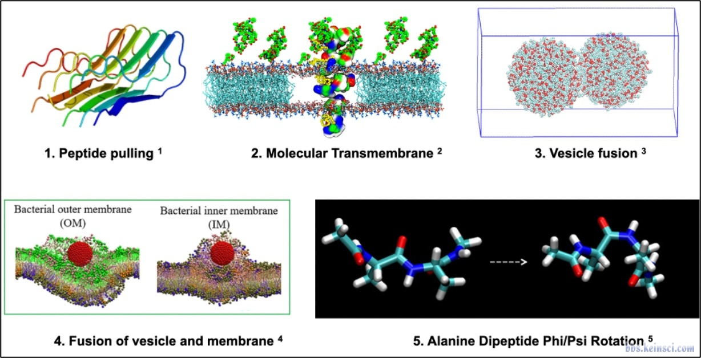
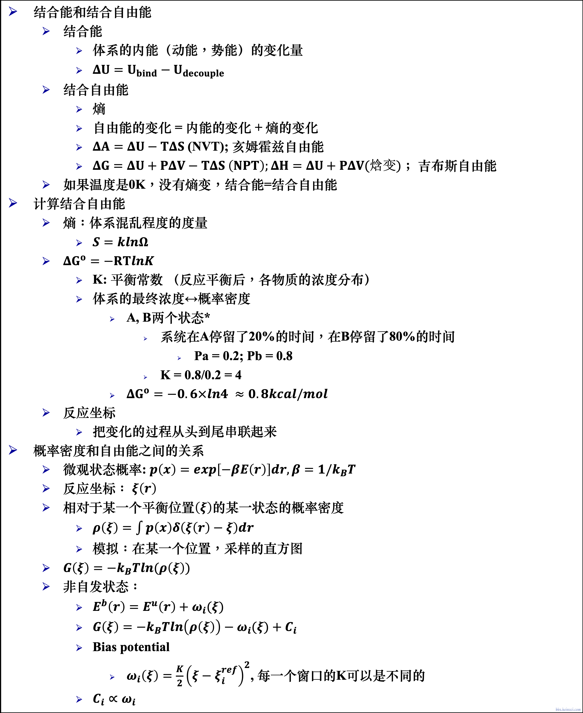

👏 Gromacs|SMD和伞形采样及实操教程

---
[TOC]

---
## 写在前面
首先使用SMD进行拉动，产生伞形采样所需的多个窗口的初始构象，然后再在各个窗口中基于初始构象进行MD，最后根据各个窗口构象概率分布计算结合能量即伞形采样，算出来的就是PMF。

## 理论
伞型采样作为一种增强采样算法，被广泛应用于分子动力学模拟的各个领域，例如多肽构象牵引、分子穿越细胞膜、囊泡融合、囊泡细胞膜融合、分子二聚自由能计算、分子溶剂化自由能计算、蛋白质-配体解离牵引、丙氨酸二肽 Phi/Psi 旋转等一系列非常有意思的生物物理现象。部分例子如下图所示：


我们通常认为的无偏分子动力学模拟（unbias molecular dynamics simulation）和物理化学里面描述的孤立体系有所类似，即系统与环境之间无物质交换也无能量的传递。就一般的凝聚态体系来说，倘若确定了体系中的温度，压力和物质的量，则系统的状态就被确定了。常规的无偏动力学模拟由于其本身底层势能函数和模拟时间的限制，对于高能态，过渡态或者稀有构象的采样率很低。因此，伞型采样，副本交换动力学等增强采样方式应运而生。这其实是一种从外部引入能量从而帮助体系越过本身需要花很长时间或者终身无法越过的能垒。其原理简述于下图：


## SMD
### pdb结构预处理
（1）编好链号
（2）一般残基的编号不要重复
（3）残基名称都可被Gromacs识别

### 将pdb结构在vmd中与坐标轴对齐
（1）计算获得复合物两个单体中与各自几何中心最接近的原子编号。
```python
import sys

def process(file_in):
    with open(file_in) as f:
        f1 = f.readlines()
    x_A = []
    y_A = []
    z_A = []
    x_B = []
    y_B = []
    z_B = []
    for i in f1:
        if i.startswith("ATOM") and i[21:22] == "A":
            x_A.append(float(i[30:38]))
            y_A.append(float(i[38:46]))
            z_A.append(float(i[46:54]))
        if i.startswith("ATOM") and i[21:22] == "B":
            x_B.append(float(i[30:38]))
            y_B.append(float(i[38:46]))
            z_B.append(float(i[46:54]))
    center_A = ((max(x_A)+min(x_A))/2, (max(y_A)+min(y_A))/2, (max(z_A)+min(z_A))/2)
    dev = 1000
    id_ = 0
    for a in range(len(x_A)):
        dist = (x_A[a]-center_A[0])**2 + (y_A[a]-center_A[1])**2 + (z_A[a]-center_A[2])**2
        if dist <= dev:
            id_ = a+1
            dev = dist
    print("A:", id_)

    center_B = ((max(x_B)+min(x_B))/2, (max(y_B)+min(y_B))/2, (max(z_B)+min(z_B))/2)
    dev_b = 1000
    id_b = 0
    for a in range(len(x_B)):
        dist_b = (x_B[a]-center_B[0])**2 + (y_B[a]-center_B[1])**2 + (z_B[a]-center_B[2])**2
        if dist_b <= dev_b:
            id_b = a+1
            dev_b = dist
    print("B:", id_b + len(x_A))

def main():
    file_in = sys.argv[1]
    process(file_in)

if __name__ == '__main__':
    main()
```
（2）vmd中将复合物拉的方向与坐标轴对齐并保存文件。
```shell
# input firstly
proc alignbond {ind1 ind2} {
set atm1 [atomselect top "serial $ind1"]
set atm2 [atomselect top "serial $ind2"]
set vecx [expr [$atm2 get x] - [$atm1 get x]]
set vecy [expr [$atm2 get y] - [$atm1 get y]]
set vecz [expr [$atm2 get z] - [$atm1 get z]]
set sel [atomselect top all]
$sel move [transvecinv "$vecx $vecy $vecz"]
}

# Then input secondly
alignbond atom_A atom_B  # computered by (1)
```
（3）计算复合物的几何中心以及长宽高用作后面设置盒子。
```python
import sys

def process(file_in):
    with open(file_in) as f:
        f1 = f.readlines()
    x = []
    y = []
    z = []
    for i in f1:
        if i.startswith("ATOM"):
            x.append(float(i[30:38]))
            y.append(float(i[38:46]))
            z.append(float(i[46:54]))
    center = ((max(x)+min(x))/2, (max(y)+min(y))/2, (max(z)+min(z))/2)
    x_com = max(x) - min(x)
    y_com = max(y) - min(y)
    z_com = max(z) - min(z)
    print("center of complex:", center)
    print("x:", x_com)
    print("y:", y_com)
    print("z:", z_com)

def main():
    file_in = sys.argv[1]
    process(file_in)

if __name__ == '__main__':
    main()
```

### gmx准备体系并em,nvt,npt
```shell
gmx pdb2gmx -f $file -o complex.gro -water tip3p -ignh
gmx editconf -f complex.gro -o newbox.gro -center 3.280 2.181 2.4775 -box 6.560 4.362 12  # 根据之前计算的复合物的长宽高设置盒子大小，最主要的是一定要将拉的那个纬度设置的足够。根据盒子设置center
gmx solvate -cp newbox.gro -cs spc216.gro -p topol.top -o solv.gro
gmx grompp -f ../ions.mdp -c solv.gro -p topol.top -o ions.tpr -maxwarn 2
echo 14|gmx genion -s ions.tpr -o solv_ions.gro -p topol.top -pname NA -nname CL -neutral -conc 0.15
# 根据需要自行生成ndx文件。

JOBPATH=/home/yqyang/yqyang_zju/umbrella
mdp_path=${JOBPATH}/mdp
# # # # # # # # # # # # # # # # # # # # # # # # # # # # # # # # # 
cd $JOBPATH/
##########################################
mkdir em
cd em 
if [ ! -f em.tpr ]; then
   gmx grompp -f ${mdp_path}/em.mdp -c ${JOBPATH}/solv_ions.gro -p ${JOBPATH}/topol.top -r ${JOBPATH}/solv_ions.gro -o em.tpr -maxwarn 2
fi
if [ -f em.tpr ] && [ ! -f em.gro ]; then 
   gmx mdrun -s em.tpr -deffnm em -ntmpi 1 -ntomp 3 -nb gpu -gpu_id 0
fi
###########################
mkdir ../nvt
cd ../nvt
if [ ! -f nvt.tpr ];then
   gmx grompp -f ${mdp_path}/nvt.mdp -c ../em/em.gro -p ${JOBPATH}/topol.top -o nvt.tpr -r ../em/em.gro -maxwarn 4
fi
if [ -f nvt.tpr ] && [ ! -f nvt.gro ];then
   gmx mdrun -s nvt.tpr -deffnm nvt -ntmpi 1 -ntomp 3 -nb gpu -bonded gpu -pme gpu  
fi
###########################
mkdir ../npt
cd ../npt
if [ ! -f npt.tpr ];then
    gmx grompp -f ${mdp_path}/npt.mdp -c ../nvt/nvt.gro -t ../nvt/nvt.cpt -p ${JOBPATH}/topol.top -o npt.tpr -r ../nvt/nvt.gro -maxwarn 4
fi
if [ -f npt.tpr ] && [ ! -f npt.gro ];then
    gmx mdrun -s npt.tpr -deffnm npt -ntmpi 1 -ntomp 3 -nb gpu -bonded gpu -pme gpu -gpu_id 0
fi
```
### 开始拉动
**注意：不要拉的太快，不然受到水的阻力大，不准确**
**最重要的**[md_pull.mdp](GromacsSMD和伞形采样及实操教程/md_pull.mdp)
mdp文件参数解析：
|Parameter Name|Parameter Value|Description|
|:----|:----|:----|
|pull_coord1_type|umbrella|A harmonic potential is applied between the centers of mass of two groups. The harmonic potential allows the pulling force to change according to interaction style. The force will gradually increase until some critical interaction is broken. To generate the initial configuration for umbrella sampling, you can use a different combination of settings (pull_coord1_type and pull_coord1_geometry), but when sampling the actual umbrella (next step), you must use pull_coord1_type = umbrella.|
|pull-group?-pbcatom|Atom ID|The reference atom, for large pull groups it is important to select a reference atom that is close to the intended center of mass. 用于处理牵引组内周期性边界条件的参考原子，仅当牵引组的直径大于最短box矢量的一半时，此选项才有必要。值为0表示使用中间原子（按数字），这仅对小基团安全。gmx-grompp检查从参考原子（特别选择或不选择）到牵引组中其他原子的最大距离是否过大。|
|pull-pbc-ref-prev-step-com|yes/no|no：使用参考原子（pull-group1-pbcatom）处理周期性边界条件；yes:使用上一步的COM作为处理周期性边界条件的参考。使用参考原子（pull-group1-pbcatom）初始化使该原子应位于组的中心。如果一个或多个牵引组较大，则使用该方法可能会更好。|
|pull_coord1_rate|(0)[nm/ps]/[deg/ps]|参考位置或参考角的变化率。|

**run**
```shell
gmx grompp -f md_pull.mdp -c ../npt/npt.gro -p ../topol.top -r ../npt/npt.gro -n pull_index.ndx -t ../npt/npt.cpt -o pull.tpr -maxwarn 6
gmx mdrun -s pull.tpr -deffnm pull -pf pullf.xvg -px pullx.xvg -dhdl dhdl -ntmpi 1 -ntomp 2 -nb gpu -bonded gpu -pme gpu -gpu_id 0
```

## 伞采样
### 根据SMD轨迹产生不同窗口的初始构型
（1）计算complex轨迹中两个单体质心间距离。
```shell
gmx distance -s ../pull/pull.tpr -f ../pull/pull.xtc -n ../pull/pull_index.ndx -select 'com of group "Chain_A" plus com of group "Chain_B"' -oall dist.xvg
```
（2）根据质心距离分为100个窗口，窗口时间可由下方脚本生成。
```python
import sys
import numpy as np
import math

def compute(dist):
    with open(dist) as f:
        f1 = f.readlines()
    data_all = []
    distance = []
    for i in f1:
        if not i.startswith(("#","@")):
            data_all.append(i)
            distance.append(i.strip().split()[1])
    distance = np.array(distance, dtype=np.float64)
    max_dis = max(distance)
    min_dis = min(distance)
    deleta = (max_dis - min_dis)/100
    index_need = []
    for a in range(100):
        temp = min_dis + deleta*a
        index_min = np.argmin(abs(distance - temp))
        index_need.append(index_min)

    pick = []
    for i in index_need:
        pick.append(data_all[i])
    result = open("gro_pick.dat", "w")
    result.write("".join(pick).strip())
    time_pick = open("time_pick.dat", "w")
    for i in pick:
        time_pick.write(str(int(float(i.strip().split()[0]))) + "\n")

def main():
    dist = sys.argv[1]
    compute(dist)
    
if __name__=="__main__":
    main()  
```
（3）根据上述脚本产生的时间从xtc文件中抽取特定时间的构型作为伞采样每个窗口的初始构型。
```shell
a=0;for i in `cat time_pick.dat`;do mkdir conf_${a};echo 0|gmx trjconv -s ../pull/pull.tpr -f ../pull/pull.xtc -o ./conf_${a}/conf_${a}.gro -b ${i} -e ${i};a=`echo "${a}+1"|bc`;done
```

### npt和prod
**在100个窗口内分别进行2ns的MD，所有窗口的MD均可独立进行。**
[npt_umbrella.mdp](./GromacsSMD和伞形采样及实操教程/npt_umbrella.mdp)
[prod_umbrella.mdp](./GromacsSMD和伞形采样及实操教程/prod_umbrella.mdp)
**run**
```shell
start=$1
end=$2
for i in `seq ${start} ${end}`
do
cd conf_${i}
mkdir npt;cd npt
if [ ! -f npt.tpr ];then
    gmx grompp -f ../../mdp/npt_umbrella.mdp -c ../conf_${i}.gro -t ../../../nvt/nvt.cpt -p ../../../topol.top -o npt.tpr -r ../../../nvt/nvt.gro -maxwarn 6
fi
if [ -f npt.tpr ] && [ ! -f npt.gro ];then
    gmx mdrun -s npt.tpr -deffnm npt -ntmpi 1 -ntomp 1 -nb gpu -bonded gpu -pme gpu -gpu_id 0 
fi
mkdir ../prod
cd ../prod
if [ ! -f prod.tpr ];then
   gmx grompp -f ../../mdp/prod_umbrella.mdp -c ../npt/npt.gro -t ../npt/npt.cpt -p ../../../topol.top -o prod.tpr -r ../npt/npt.gro -maxwarn 6
fi
if [ -f prod.tpr ] && [ ! -f prod.gro ];then
   gmx mdrun -s prod.tpr -deffnm prod -dhdl dhdl -nb gpu -bonded gpu -pme gpu -gpu_id 0 -pf pullf.xvg -px pullx.xvg
fi
cd ../../
done
```

### 数据处理得到PMF
（1）将每个窗口的tpr文件放到同一文件夹下并将名称在一个.dat文件中列出。
```shell
for i in `seq 0 99`;do cp ./conf_${i}/prod/prod.tpr ./analysis/umbrella${i}.tpr;done
for i in `seq 0 99`;do echo umbrella${i}.tpr >> tpr-files.dat;done
```
（2）将每个窗口的pullf文件放到同一文件夹下并将名称在一个.dat文件中列出。
```shell
for i in `seq 0 99`;do cp ./conf_${i}/prod/pullf.xvg ./analysis/umbrella${i}_pullf.xvg;done
for i in `seq 0 99`;do echo umbrella${i}_pullf.xvg >> pullf-files.dat;done
```
（3）wham分析
```shell
gmx wham -it tpr-files.dat -if pullf-files.dat -o -hist -unit kCal
```

## 完全AmberTools SMD 建模
（1）首先拿到复合物体系质心与坐标轴平行的pdb结构。
（2）pdb4amber处理结构。处理完之后将后面的connect信息删掉。
```shell
pdb4amber -i prod2_cluster30_chain.pdb -o complex.pdb -y --reduce --add-missing-atoms
```
（3）tleap初次加水。
```shell
source leaprc.protein.ff14SB
source leaprc.DNA.OL15
source leaprc.RNA.OL3
source leaprc.water.tip3p
source leaprc.gaff2
loadamberparams frcmod.ionsjc_tip3p
mol = loadpdb complex.pdb
check mol
setbox mol vdw {120 20 20} 
solvatebox mol TIP3PBOX 0
savepdb mol complex_sol_twoside.pdb
```
（4）删除一侧的水盒子。
```python
import sys
from pymol import cmd

def get_min_x(pdb):
    cmd.load(pdb)
    xyz = cmd.get_coords('polymer.protein', 1)
    return sorted(xyz[:,0])[0]

def delete_wat(pdb, min_x):
    with open(pdb) as f:
        f1 = f.readlines()
    # del_group = []
    result = open("complex_oneside_wat.pdb", "w")
    i = 0
    while i < len(f1):
        if f1[i].startswith("ATOM"):
            tmp = f1[i].split()
            if tmp[3] == "WAT" and tmp[2] == "O" and float(tmp[5]) < (min_x - 20):
                # del_group.append(i[4])
                i += 4
            else:
                result.write(f1[i])
                i += 1
        else:
            result.write(f1[i])
            i += 1
    cmd.delete("all")
    cmd.load("complex_oneside_wat.pdb")
    print(len(cmd.get_coords('resn WAT', 1))/3)

    # cmd.delete("all")
    # name_ = pdb.replace(".pdb", "")
    # cmd.load(pdb)
    # for i in del_group:
    #     cmd.remove("resi %d"%(int(i)))
    # cmd.save("complex_oneside_wat.pdb",name_)
    # result = open("complex_oneside_wat.pdb", "w")
    # for i in range(len(f1)):
    #     if f1[i].startswith("ATOM"):
    #         if f1[i].split()

def main():
    pdb_file = sys.argv[1]
    min_x = get_min_x(pdb_file)
    delete_wat(pdb_file, min_x)

if __name__ == '__main__':
    main()
```
运行命令：
```shell
python py complex_sol_twoside.pdb
```
（5）将一侧带水的作为对象再次tleap处理。
```shell
source leaprc.protein.ff14SB
source leaprc.DNA.OL15
source leaprc.RNA.OL3
source leaprc.water.tip3p
source leaprc.gaff2
loadamberparams frcmod.ionsjc_tip3p
mol = loadpdb complex_oneside_wat.pdb
check mol
setbox mol vdw {10 10 10} 
solvatebox mol TIP3PBOX 0
addions mol Na+ 58  # 使用两次加的水的总数目进行计算 residue*0.0187*浓度
addions mol MG 5  # 加镁离子
addIonsRand mol MG 5  # 随机替换溶剂分子加MG
addions mol Cl- 0 # 中和电荷
saveamberparm mol complex_solvated.prmtop complex_solvated.inpcrd
```
（6）将prmtop和inpcrd转成gro和top。
```python
import parmed as pmd
parm = pmd.load_file('complex_solvated.prmtop', 'complex_solvated.inpcrd')
parm.save('topol.top', format='gromacs')
parm.save('solv_ions.gro')
```

## SMD AmberTools建模complex，放到gromacs中加水加离子
（1）首先拿到复合物体系质心与坐标轴平行的pdb结构。
（2）pdb4amber处理结构。处理完之后将后面的connect信息删掉。
```shell
pdb4amber -i prod2_cluster30_chain.pdb -o complex.pdb -y --reduce --add-missing-atoms
```
（3）tleap中建模得到复合物的prmtop和inpcrd。
```shell
source leaprc.protein.ff14SB
source leaprc.DNA.OL15
source leaprc.RNA.OL3
source leaprc.water.tip3p
source leaprc.gaff2
loadamberparams frcmod.ionsjc_tip3p
mol = loadpdb complex.pdb
check mol
saveamberparm mol complex.prmtop complex.inpcrd
```
（4）prmtop和inpcrd转成gro和top。
```python
import parmed as pmd
parm = pmd.load_file('complex.prmtop', 'complex.inpcrd')
parm.save('topol.top', format='gromacs')
parm.save('complex.gro')
```
（5）更改topol.top文件，并将水模型文件，离子模型文件复制进来。
[水模型tip3p.itp](./GromacsSMD和伞形采样及实操教程/tip3p.itp)
[离子模型ions.itp](./GromacsSMD和伞形采样及实操教程/ions.itp)
**将水参数，离子参数加入topol.top。**
```text
; Include water topology
#include "tip3p.itp"

#ifdef POSRES_WATER
; Position restraint for each water oxygen
[ position_restraints ]
;  i funct       fcx        fcy        fcz
   1    1       1000       1000       1000
#endif

; Include topology for ions
#include "ions.itp"
```
**加入水原子以及离子原子类型。**
```text
HW             1   1.008000  0.00000000  A     0.00000000        0.00000
OW             8  16.000000  0.00000000  A     0.31506100       0.636386
Cl            17  35.450000  0.00000000  A     0.44776600       0.148913
Na            11  22.990000  0.00000000  A     0.24392800       0.365846
MG            12  24.305000  0.00000000  A     0.27698000      0.0123428
```
**生成蛋白RNA的位置限制文件。**
```python
import sys
from pymol import cmd

def get_atomid(file_in, obje):
    cmd.delete("all")
    cmd.load(file_in)
    cmd.remove("hydrogens")
    return cmd.identify(obje, 0)

def gene_porser(atomid):
    result = open("posre_protein.itp", "w")
    result.write("[ position_restraints ]\n; atom  type      fx      fy      fz\n")
    for i in atomid:
        result.write("{:>6d}".format(i) + "     1  1000  1000  1000 \n")

def main():
    file_in = sys.argv[1]
    atomid = get_atomid(file_in, "polymer.protein")
    for i in range(len(atomid)):
        atomid[i] = atomid[i] - 1664
    gene_porser(atomid)

if __name__ == '__main__':
    main()
```

**加入重原子位置限制**
```text
; Include Position restraint file
#ifdef POSRES
#include "posre_RNA.itp"
#endif
```
```text
; Include Position restraint file
#ifdef POSRES
#include "posre_Protein.itp"
#endif
```

（6）gromacs中加盒子，加水，加离子。
```shell
gmx editconf -f complex.gro -o newbox.gro -center 4 5 5 -box 22 12 11
gmx solvate -cp newbox.gro -cs spc216.gro -p topol.top -o solv.gro
gmx grompp -f ~/file/gmx_file/ions.mdp -c solv.gro -p topol.top -o ions.tpr -maxwarn 2
gmx genion -s ions.tpr -o solv_ions_mg.gro -p topol.top -pname MG -nname CL -conc 0.003
gmx grompp -f ~/file/gmx_file/ions.mdp -c solv_ions_mg.gro -p topol.top -o ions_mg.tpr -maxwarn 2
gmx genion -s ions_mg.tpr -o solv_ions.gro -p topol.top -pname NA -nname CL -conc 0.15 -neutral
```

## 拉互作界面原子，制作index。
```python
import sys
from pymol import cmd

def get_atomid(file_in):
    cmd.load(file_in)
    cmd.remove("resn SOL")
    cmd.remove("resn NA")
    cmd.remove("resn CL")
    cmd.remove("resn MG")
    cmd.select("polymer.nucleic within 4 of polymer.protein")
    return cmd.identify("sele", 0)

def gene_index(atomid):
    index = ""
    for i in range(1, len(atomid) + 1):
        if (i-1)%15 == 0:
            index = index + "{:>4d}".format(atomid[i-1])
        elif i%15 == 0:
            index = index + "{:>5d}".format(atomid[i-1]) + "\n"
        else:
            index = index + "{:>5d}".format(atomid[i-1])
    with open("pull_index.ndx", "w") as result:
        result.write(index)

def main():
    file_in = sys.argv[1]
    atomid = get_atomid(file_in)
    gene_index(atomid)

if __name__ == '__main__':
    main()
```

## 自选残基，制作index。
（1）pymol中选好残基。
（2）打印选中残基的原子ID。
```python
print(cmd.identify("sele", 0))
```
（3）下述脚本生成index格式文本。
```python
import sys

def gene_index(atomid):
    index = ""
    for i in range(1, len(atomid) + 1):
        if (i-1)%15 == 0:
            index = index + "{:>4d}".format(atomid[i-1])
        elif i%15 == 0:
            index = index + "{:>5d}".format(atomid[i-1]) + "\n"
        else:
            index = index + "{:>5d}".format(atomid[i-1])
    with open("pull_index.ndx", "w") as result:
        result.write(index)

def main():
    atomid = [764, 765, 766, 767, 768, 769, 770, 771, 772, 773, 774, 775, 776, 777, 778, 779, 780, 781, 782, 783, 784, 785, 786, 787, 788, 789, 790, 791, 792, 793, 794, 795, 796, 797, 798, 799, 800, 801, 802, 803, 804, 805, 806, 807, 808, 809, 810, 811, 812, 813, 814, 815, 816, 817, 818, 819, 820, 821, 822, 823, 824, 825, 826, 827, 828, 829, 830, 831, 832, 833, 834, 835, 836, 837, 838, 839, 840, 841, 842, 843, 844, 845, 846, 847, 848, 849, 850, 851, 852, 853, 854, 855, 856, 857, 858, 859, 860, 861, 862, 863, 864, 865, 866, 867, 868, 869, 870, 871, 872, 873, 874, 875, 876, 877, 878, 879, 880, 881, 882, 883, 884, 885, 886, 887, 888, 889, 890, 891, 892, 893, 894, 895, 896, 897, 898, 899, 900, 901, 902, 903, 904, 905, 906, 907, 908, 909, 910, 911, 912, 913, 914, 915, 916, 917, 918, 919, 920, 921, 922, 923, 924, 925, 926, 927, 928, 929, 930, 931, 932, 933, 934, 935, 936, 937, 938, 939, 940, 941, 942, 943, 944, 945, 946, 947, 948, 949, 950, 951, 952, 953, 954, 955, 956, 957, 958, 959, 960, 961, 962, 963, 964, 965, 966, 967, 968, 969, 970, 971, 972, 973, 974, 975, 976, 977, 978, 979, 980, 981, 982, 983, 984, 985, 986, 987, 988, 989, 990, 991, 992, 993, 994, 995, 996, 997, 998, 999, 1000, 1001, 1002, 1003, 1004, 1005, 1006, 1007, 1008, 1009, 1010, 1011, 1012, 1013, 1014, 1015, 1016, 1017, 1018, 1019, 1020, 1021, 1022, 1023, 1024, 1025, 1026, 1027, 1028, 1029, 1030, 1031, 1032, 1033, 1034, 1035, 1036, 1037, 1038, 1039, 1040, 1041, 1042, 1043, 1044, 1045, 1046, 1276, 1277, 1278, 1279, 1280, 1281, 1282, 1283, 1284, 1285, 1286, 1287, 1288, 1289, 1290, 1291, 1292, 1293, 1294, 1295, 1296, 1297, 1298, 1299, 1300, 1301, 1302, 1303, 1304, 1305, 1306, 1307, 1308, 1309, 1310, 1311, 1312, 1313, 1314, 1315, 1316, 1317, 1318, 1319, 1320, 1321, 1322, 1323, 1324, 1325, 1326, 1327, 1328, 1329, 1330, 1331, 1332, 1333, 1334, 1335, 1336, 1337, 1338, 1339]
    gene_index(atomid)

if __name__ == '__main__':
    main()
```

## 参考资料
1. [GROMACS中文教程之: 伞形采样](https://blog.sciencenet.cn/blog-548663-922986.html?mType=Group)
2. [伞形采样官方教程](http://www.mdtutorials.com/gmx/umbrella/index.html)
3. [让指定化学键平行于笛卡尔坐标轴的方法](http://sobereva.com/177)
4. [GROMACS中伞型采样算法应用详解](http://bbs.keinsci.com/thread-36490-1-1.html)

## 参考文献
1. Wriggers W, Schulten K. Investigating a back door mechanism of actin phosphate release by steered molecular dynamics[J]. Proteins: Structure, Function, and Bioinformatics, 1999, 35(2): 262-273. [文献pdf](./GromacsSMD和伞形采样及实操教程/SMD.pdf)
2. Torrie G M, Valleau J P. Nonphysical sampling distributions in Monte Carlo free-energy estimation: Umbrella sampling. Journal of Computational Physics, 1977, 23(2): 187-199. [文献pdf](./GromacsSMD和伞形采样及实操教程/umbrella_sampling.pdf)