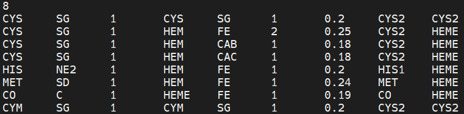
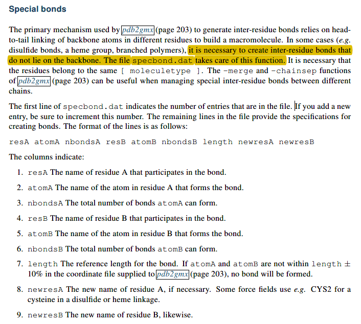
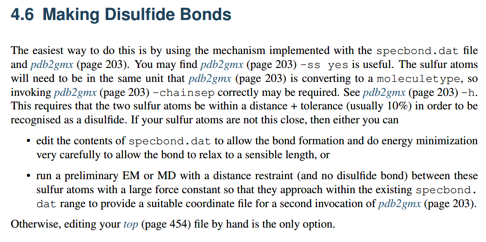

👏 Gromacs|建模时二硫键的构建

---
[TOC]

---
$GMX/share/gromacs/top/specbond.dat 文件中定义了一些残基残基间的特殊连接方式。如下图所示：

一般为了更方便的对二硫键进行建模，我们将需要建模的pdb文件中的CYS对的硫原子间的距离调整至2埃左右，pdb2gmx便可以自动识别并生成二硫键。

## 增加侧链的酰胺键
更新specbond.dat的内容后，需将其放于GMXLIB所在的目录下方能起效。