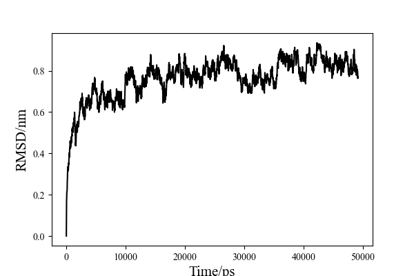

👏 Gromacs|绘制RMSD曲线

---
[TOC]

---
## 输入数据格式
输入数据文件是gmx rms生成的rms.xvg文件。

## 绘图代码
```python
# usage：python py rms.xvg
import sys
import pandas as pd
import matplotlib.pyplot as plt

def huitu(file):
    with open(file) as f:
        f1 = f.readlines()
    rms = []
    time = []
    a = 0
    for i in f1:
        if i.startswith("#"):
            pass
        elif i.startswith("@"):
            pass
        else:
            rms.append(float(i.split()[1]))
            time.append(20*a)
            a += 1
    result = open("huitu.csv", "w")
    result.write("Time,Dis\n")
    for i in range(len(rms)):
        result.write(str(time[i]) + "," + str(rms[i]) + "\n")
    df=pd.read_csv("huitu.csv")
    fig =plt.figure(figsize=(6,4), dpi=100)
    plt.plot(df.Time, df.Dis, color='black')
    #plt.plot(df.index, df.AAPL, color='#06BCF9', label='AAPL')
    plt.xticks(size=12,font="Times New Roman") 
    plt.yticks(size=12,font="Times New Roman") 
    plt.xlabel("Time/ps",fontproperties="Times New Roman",fontsize=15)
    plt.ylabel("RMSD/nm",fontproperties="Times New Roman", fontsize=15)
    #plt.legend(loc='upper left',edgecolor='none',facecolor='none')
    plt.show()
    fig.savefig('Figure_1.pdf')

def main():
    file = str(sys.argv[1])
    huitu(file)
    
if __name__=="__main__":
    main() 
```

## 图片样本
