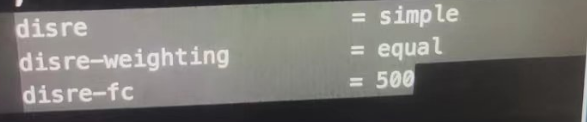

👏 Gromacs|距离限制

---
[TOC]

---
## 距离限制做法一
使用genrestr命令产生限制的文件，然后在mdp文件中加入下述命令：

## 距离限制做法二
增加一个力场文件.prm，里面写上原子类型之间的bond相关参数。
然后在topol文件中增加原子index之间的bond信息。

## 距离限制做法三
参考《在gromacs模拟的过程中要限制某几组原子之间的距离》

## Temp
1. [解析gromacs的restraint、constraint和freeze](http://sobereva.com/10)
2. [在gromacs模拟的过程中要限制某几组原子之间的距离](http://bbs.keinsci.com/thread-15380-1-2.html)