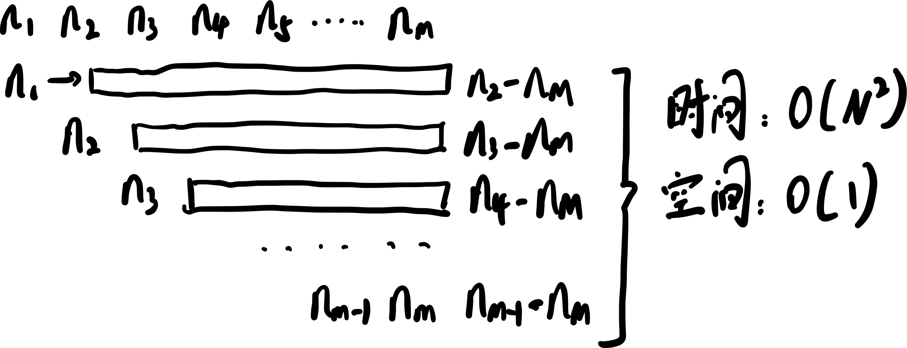
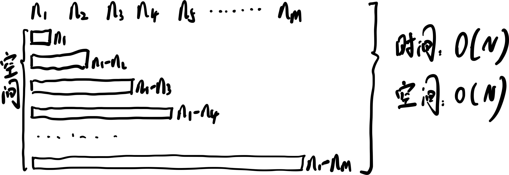

👏 LeeCode|两数之和

---
[TOC]

---
## 题目
&emsp;&emsp;给定一个整数数组 nums 和一个整数目标值 target，请你在该数组中找出 和为目标值 target  的那 两个 整数，并返回它们的数组下标。你可以假设每种输入只会对应一个答案。但是，数组中同一个元素在答案里不能重复出现。你可以按任意顺序返回答案。
示例 1：
```python
输入：nums = [2,7,11,15], target = 9
输出：[0,1]
解释：因为 nums[0] + nums[1] == 9 ，返回 [0, 1] 。
```
示例 2：
```python
输入：nums = [3,2,4], target = 6
输出：[1,2]
```
示例 3：
```python
输入：nums = [3,3], target = 6
输出：[0,1]
```

## 暴力枚举解法
说明：时间复杂度：O($\ N^2$)；空间复杂度：O(1)

python:  
```python
class Solution:
    def twoSum(self, nums, target):
        n = len(nums)
        for i in range(n):
            for j in range(i+1, n):
                if nums[i] + nums[j] == target:
                    return [i, j]
        return []
compute_sum = Solution()
print(compute_sum.twoSum([2,7,11,15], 9))
```
C++:
```cpp
#include <iostream>
#include <vector>

using namespace std;
class Solution {
public:
    vector<int> twoSum(vector<int>& nums, int target) {
        int n = nums.size();
        for (int i = 0; i < n; ++i) {
            for (int j = i + 1; j < n; ++j) {
                if (nums[i] + nums[j] == target) {
                    return {i, j};
                }
            }
        }
        return {};
    }
};

int main(void){
    Solution s = Solution();
    vector<int> nums = {1,2,3,4,5,6,7,8};
    int target = 10;
    vector<int> res = s.twoSum(nums, target);
    cout << res[0] << " " << res[1] << endl;
    return 0;
}
```

## 哈希表解法

python:
```python
class Solution:
    def twoSum(self, nums, target):
        hashtable = dict()
        for i, num in enumerate(nums):
            if target - num in hashtable:
                return [hashtable[target - num], i]
            hashtable[nums[i]] = i
        return []
compute_sum = Solution()
print(compute_sum.twoSum([2,7,11,15], 9))
```

C++:
```cpp
#include <iostream>
#include <vector>
#include <unordered_map>

using namespace std;
class Solution {
public:
    vector<int> twoSum(vector<int>& nums, int target) {
        unordered_map<int, int> hashtable;
        for (int i = 0; i < nums.size(); ++i) {
            auto it = hashtable.find(target - nums[i]);
            if (it != hashtable.end()) {
                return {it->second, i};
            }
            hashtable[nums[i]] = i;
        }
        return {};
    }
};

int main(void){
    Solution s = Solution();
    vector<int> nums = {1,2,3,4,5,6,7,8};
    int target = 10;
    vector<int> res = s.twoSum(nums, target);
    cout << res[0] << " " << res[1] << endl;
    return 0;
}
```

## 哈希表
&emsp;&emsp;哈希表是一种数据结构，可以使数据的查询效率得到提升。哈希表存储的是由键（key）和值（value）组成的数据。先将所有的数据存储起来，用的时候根据key快速检索。是一种典型的空间换时间的做法。

## C++ STL: unordered_map
**摸板**
```cpp
1 template < class Key,                                    // unordered_map::key_type
2            class T,                                      // unordered_map::mapped_type
3            class Hash = hash<Key>,                       // unordered_map::hasher
4            class Pred = equal_to<Key>,                   // unordered_map::key_equal
5            class Alloc = allocator< pair<const Key,T> >  // unordered_map::allocator_type
6            > class unordered_map;
```
**迭代器**
&emsp;&emsp;unordered_map的迭代器是一个指针，指向这个元素，通过迭代器来取得它的值。
```cpp
1 unordered_map<Key,T>::iterator it;
2 (*it).first;             // the key value (of type Key)
3 (*it).second;            // the mapped value (of type T)
4 (*it);                   // the "element value" (of type pair<const Key,T>) 
```
&emsp;&emsp;它的键值分别是迭代器的first和second属性。 
```cpp
1 it->first;               // same as (*it).first   (the key value)
2 it->second;              // same as (*it).second  (the mapped value) 
```
**成员函数**
==迭代器== 
begin 　　返回指向容器起始位置的迭代器（iterator） 
end 　　   返回指向容器末尾位置的迭代器 
cbegin　   返回指向容器起始位置的常迭代器（const_iterator） 
cend 　　 返回指向容器末尾位置的常迭代器 
==Capacity==
size  　　 返回有效元素个数 
max_size  返回 unordered_map 支持的最大元素个数 
empty        判断是否为空 
==元素访问== 
operator[]  　　   访问元素 
at  　　 　　　　访问元素 
==元素修改==
insert  　　插入元素 
erase　　 删除元素 
swap 　　 交换内容 
clear　　   清空内容 
emplace 　构造及插入一个元素 
emplace_hint 按提示构造及插入一个元素 
==操作==
find 　　　　　　通过给定主键查找元素,没找到：返回unordered_map::end
count 　　　　　返回匹配给定主键的元素的个数 
equal_range 　　返回值匹配给定搜索值的元素组成的范围 
==Buckets==
bucket_count 　　　返回槽（Bucket）数 
max_bucket_count    返回最大槽数 
bucket_size 　　　   返回槽大小 
bucket 　　　　　　返回元素所在槽的序号 
load_factor　　　　 返回载入因子，即一个元素槽（Bucket）的最大元素数 
max_load_factor 　  返回或设置最大载入因子 
rehash　　　　　　 设置槽数 
reserve 　　　　　  请求改变容器容量

## 参考资料
1. [详细介绍C++STL：unordered_map](https://www.cnblogs.com/langyao/p/8823092.html)  