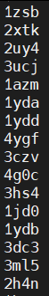

👏 Linux命令

---
[TOC]

---
## 1. 文件/字符命令
### 1.1 ls
简介：   
### 1.2 pwd
简介：    
### 1.3 cd
简介：    
### 1.4 mkdir
简介：建立目录      
参数：    
-p: 递归创建目录    
### 1.5 cat
简介：    
### 1.6 more
简介：   
### 1.7 head
简介：    
### 1.8 cp
简介：   
### 1.9 mv
简介：移动文件
示例：
例1：同时移动多个文件。
```shell
mv pro-lig-em.log pro-lig-nptstep2.log pro-lig-prodstep1.log yqyang_zju/
```    
### 1.10 rm
简介：     
### 1.11 chmod
简介：     
### 1.12 wc
简介：    
### 1.13 split
简介：根据行数或者文件大小对文件进行切割。
示例：
例1：根据文件行数进行切割，每个文件中含有${line}行
```shell
line=`wc -l ZINC_997402117.smi| awk '{print int($1/50)+1}'`
split -l ${line} ZINC_997402117.smi -d -a 2 ZINC_
```
### 1.14 grep
简介：在文件中搜索匹配正则表达式的文本并且打印在屏幕上。     
参数：    
-w: 精确匹配，显示全字符合的行     
-v: 排除某些特定字符的行     
-E: 同时匹配多个关键字 
-n: 显示行号    
示例：    
例1：在test.txt中搜索出所有含ICV100字段的行。     
```shell
grep ICV100 test.txt
grep '\$\$\$\$' test.txt     # 在test.txt中搜索出所有含$$$$字段的行。
```
例2：精确匹配，搜索出仅含有ICV100的字段，而不能打印出ICV1000的字段，需要精确匹配。
```shell
grep -w ICV100 test.txt
```
例3：不显示 # 的行。
```shell
echo -e "aaaaaa\nbbbbbb#"|grep -v "#"
# output: aaaaaa
```
例4：同时匹配多个字段。
```shell
echo "HETATM32300  O2  0MA  3937     241.988 200.467 288.988  1.00  0.00           O"|grep -E "O2|0MA|3937"
```
例5：匹配tab键的方式，加$符号      
例如查找下列文件中所有含有“-nan    -nan”的行    
>0.795000        5.000000        6.248122        -nan     
>0.821000        4.600000        4.892459        -nan    
>0.821000        5.000000        4.892459        -nan    
>0.847000        4.200000        3.405877        -nan    
>0.847000        4.600000        3.405877        -nan     
>0.847000        5.000000        3.405877        -nan    
>0.847000        7.400000        3.405877        -nan     
>0.873000        4.600000        0.285877        -nan    
>1.705000        0.200000        -nan    -nan    
>1.705000        0.600000        -nan    -nan    
>1.705000        1.000000        -nan    -nan    
>1.705000        1.400000        -nan    -nan    

```shell
grep  $'\-nan\t\-nan' 2d-0.dat
```
例6：查询含有特定字符的行号
```
grep -n "test" file|head -1|awk -F ":" '{print $1}'
```


### 1.15 vi
简介：Linux中文本编辑器。    
示例：   
例1：去掉由于win与Linux系统不兼容导致的文本中的^M   
```shell
%s/\r//g
```
例2：删除匹配指定字符串的行
```shell
:g/,NA/d   # 删除含有 ,NA 字符串的行。
```
例3：删除第一行到当前行的所有内容
```shell
:1,.d
```
例4：查看版本信息
```shell
:version
```
例5：查看行号
```shell
:nu
```
例6：删除操作
```shell
ndd                # n是数字，删除光标所在行向下的n行。20dd：删除光标所在行向下的20行
d1G                # 删除光标所在行到第一行的所有内容
dG                 # 删除光标所在行到最后一行的所有内容
```
例7：替换操作
```shell
:s/foo/bar/g                   # 将当前行中的所有foo替换为bar
:%s/foo/bar/g                  # 将全文中的所有foo替换为bar
:5,12s/foo/bar/g               # 将5-12行中的所有foo替换为bar
:.,+2s/foo/bar/g               # 将当前行与接下来两行中的所有foo替换为bar
```

### 1.16 awk
简介：列处理  
语法：  
```shell
awk [选项] ‘条件{编辑指令}' 文件...
```
参数：  

示例：  
例1：getline-获取特定字符下一行的值。  
```shell
# awk中的getline()函数获取下一行
docking_score=`awk '$0 ~ /minimizedAffinity/{getline score; print score}' ./${i}_smina.sdf`   
# minimizedAffinity部分无论有无空格均可，有空格也不用加引号。
```
例2：根据数据某一列进行排序，之后再根据另外一列进行去重保留第一次出现的值。  
```shell
sort -t, -k2 -g test >> test_1   # 先根据第二列进行排序
cat test_1 |awk '!a[$1]++{print}'  >> test_2    # 再根据第一列进行去重

# 去重以第一列和第二列重复的行：
cat 2.txt |awk '!a[$1" "$2]++{print}'

# 去除重复的行：
cat 2.txt |awk '!a[$0]++{print}'

# 只显示重复行：
cat 2.txt |awk 'a[$0]++{print}'
```
例3：根据数据计算虚筛库分子量分布情况-if语句。  
```shell
file=MW.txt
echo "Molecular Weight" >distribution.txt
n1=`awk '{if ($1>=1 && $1<=50) print $0}' $file|wc -l`
n2=`awk '{if ($1>50 && $1<=100) print $0}' $file|wc -l`
n3=`awk '{if ($1>100 && $1<=150) print $0}' $file|wc -l`
n4=`awk '{if ($1>150 && $1<=200) print $0}' $file|wc -l`
n5=`awk '{if ($1>200 && $1<=250) print $0}' $file|wc -l`
echo "Total $total" >>distribution.txt
echo "[1,50] $n1" >>distribution.txt
echo "(50,100] $n2" >>distribution.txt
echo "(100,150] $n3" >>distribution.txt
echo "(150,200] $n4" >>distribution.txt
echo "(200,250] $n5" >>distribution.txt
totol=`expr $n1 + $n2 + $n3 + $n4 + $n5 + $n6 + $n7 + $n8 + $n9 + $n10`
```
例4：打印除过第一列以外其他所有列的内容，并一行变多行。  
初始图：  
  
结果图：  
  
初始图到结果图的实现代码：  
```shell
awk -F "," '{for(i=2;i<=NF;++i) print $i}' test.txt|sed '/^\s*$/d'
# awk -F "," '{for(i=2;i<=NF;++i) print $i}' test.txt 打印除过第一行之外的其他所有行。
# sed '/^\s*$/d 将由所有空格，tab键等组成的空行删除。
```
例5：输出文件中某一列重复字段的所有行，包括第一次出现的行。  
```shell
awk -F "," 'NR==FNR{a[$2]++}NR>FNR&&a[$2]>1' 8-mer.txt 8-mer.txt    # 该命令可以输出第二列重复字段的所有行，包括第一次出现的行。
cat 2.txt |awk 'a[$0]++{print}'    # 该命令也能显示重复出现的行，但是不能显示重复行第一次出现的现象。
```
例6：awk实现仅保留一列或者几列相互之间完全不重复的行。（注意：不是去重操作）  
```shell
awk -f script.awk test.txt
```
```shell
# 思路就是通过两次遍历列来寻找列内元素没有重复出现过的行
BEGIN {
    FS=","       # FS代表分隔符
}
{
    col1[NR - 1] = $1     # 将每一列存成一个单独的数组
    col2[NR - 1] = $2
    col3[NR - 1] = $3
}
END{
    len = length(col2)
    for (i = 0; i != len; ++i)
    {
        printflag = 1
        for (j = 0; j != len; ++j)
        {
            if (i == j) continue
            else {
                if (col2[j] == col2[i]) {     # 判断条件，这个判断的是第二列不重复的行
                # if (col1[j] == col1[i] && col2[j] == col2[i]) {      # 这个则是判断第一和第二列一起不重复的行
                    printflag = 0
                    break
                }
            }
        }
        if (printflag == 1) print col1[i] "," col2[i] "," col3[i]
    }
}
```
例7：计算文本文件中某列数字之和，平均值。  
```shell
awk '{s+=$2} END {print s}' test.data
awk -F "," '{s+=$2} END {print s/NR}' test.dat
```
例8：awk命令行中引用变量。
```shell
for i in `seq 1 3`;do awk '{print $a}' a=${i} test;done
```

### 1.17 sed
简介：行处理。    
参数：    
-i：在原始文件中进行编辑。    
-e：script 指定sed编辑命令。   
示例：     
例1：批量修改一个目录下面所有文件的第1(n)行。      
```shell
for i in `ls`;do sed -i "1s/.*/`basename ${i} -opt.sdf`/" ${i};done  
# -i 代表对文件本身进行修改
# 1s代表是第一行
# .*代表第一行的所有内容
# .*/`basename ${i} -opt.sdf`/ 代表将第一行所有内容替换成`basename ${i} -opt.sdf`
```
例2：sed命令单双引号的区别。    
```shell
for i in `ls`;do sed -i '1s/.*/`basename ${i} -opt.sdf`/' ${i};done
for i in `ls`;do sed -i "1s/.*/`basename ${i} -opt.sdf`/" ${i};done
# 上述两条命令执行的结果是不一样的。
# 双引号内可以应用变量，则双引号内会替换成变量的名字。
# 单引号内不能用变量，则单引号内直接替换成单引号内字符本身。
# 仅限于sed
```
例3：sed去除空格-正则表达式应用。
```shell
sed s/[[:space:]]//g list-id-score >> list-id-score-1    # 去除所有空格
# 命令详解：s代表的是替换字符串，[[:space:]]代表所有类型的空格，g代表进行全局替换，无g则只替代每行第一个。
sed 's/^[ \t]*//g' test.txt >> test_1.txt    # 去除行首空格，^代表行首。
sed 's/[ \t]*$//g' test.txt >> test_1.txt    # 去除行末空格，$代表行末。
```
例4：sed删除空行。
```shell
sed '/^$/d' test.txt   # linux中行开头符号是^，行结束符号是$，d是删除的意思。
sed '/^\s*$/d' test.txt   # 该命令可以将完全空格，tab组成的空行删除。
```
例5：sed将空格以及斜线(/)替换成下划线。
```shell
sed 's/ /_/g' test.txt
sed 's/\//_/g' test.txt   # 将斜线替换掉的时候要记得转义。
```
例6：sed处理多重指令，多重指令使用分号分隔开。
```shell
sed 's/10/11/g;s/15/12/' test     # (s:搜索，搜索所有10替换成11，搜索第一个15替换成12)
```
例7：行删除。
```shell
sed -i '1d' test      # 删除首行
sed -i '1,100d' test       # 删除前100行
sed -i '$d' test      # 删除尾行
sed '/sdf/d' list      # 删除list文件中包含sdf的所有行
sed -i "${end_sep},$ d" LIG.rtf   # 引用变量删除m到n行
```
例8：在文件的指定行(n)插入内容。
```shell
sed -i "ni***test***" txt     # 在txt文件的第n行插入***test***
```
例9：去除文件中所有的换行符，将文件内容变为一行。
```shell
sed ':label;N;s/\n//;b label' P06025.txt
```
例10：删除文件的第一行到第三行内容。
```shell
sed '1,3d' test.txt
```
例11：在指定行数增加内容。
```shell
sed -i "22i cd ${i}" ${name_first}.sh
```

### 1.18 tar
简介：压缩、解压缩文件  
参数：  
示例：  
例1：解压缩文件。  
```shell
tar -zxvf PDBbind_2016_plain_text_index.tar.gz
tar -xvf Desmond_Maestro_2022.1.tar
```
例2：压缩文件夹。  
```shell
tar -czvf D3Similarity-database.tar.gz ./D3Similarity-database/
```
例3：解压缩到指定文件夹内。
```shell
mkdir NAMD_3.0alpha13
tar -zxvf NAMD_3.0alpha13_Linux-x86_64-netlrts-smp-CUDA-SingleNode.tar.gz -C ./NAMD_3.0alpha13/
```
例4：解压缩.bz2格式压缩包。
```shell
tar -jxvf gv6.tar.bz2
```
例5：解压缩.tgz格式压缩包。
```shell
tar -zxvf charmm36_ljpme-jul2022.ff.tgz
```

### 1.19 basename
简介：获取路径中的文件名或路径名、去掉文件的后缀名。     
示例：    
例1：     
```shell
basename /home/mcdx/test.sh # 返回test.sh
```
例2：
```shell
basename /home/mcdx/test.sh .sh # 返回test
```
例3：
```shell
basename test.sh .sh # 返回test
```
### 1.20 tmux
简介：tmux是一个 terminal multiplexer（终端复用器），它可以启动一系列终端会话。     
使用：     
```shell
tmux new -s yqyang   # 创建新的会话
tmux attach -t yqyang   # 重接会话 使用伪窗口名称
Ctrl + b / d      # 保存退出
Ctrl + b / PgUp   # 向上翻页
Ctrl + b / PgDn   # 向下翻页
q  # 退出翻页
Ctrl + b / c      # 创建一个新窗口
Ctrl + b / p      # 切换到上一个窗口
Ctrl + b / n      # 切换到下一个窗口
Ctrl + b / &      # 删除当前窗口
```
### 1.21 paste
简介：合并文件的列。
参数：
-d：指定间隔符号。
示例：
例1：合并两列文件并以逗号进行分隔。
```shell
paste -d "," temp temp_1 > temp_2
``` 

### 1.22 cut
简介：截取字符。  
参数：  
-b：以字节为单位进行分割。    
-d：自定义分隔符，默认为制表符。  
示例：  
例1：提取第11个字节之后的所有字节。  
```shell
cut -b 11- test.txt
```

### 1.23 echo
简介：打印字符。
参数：
-e：开启转义
-n：不输出行尾的换行符，即不换行
```shell
# Shell
echo "1111\n2222\n\n3333" # 输出结果为1111\n2222\n\n3333

echo -e "1111\n2222\n\n3333"
# 输出结果为
1111
2222

3333
```

示例：
例1：echo 中的单引号与双引号。
说明：双引号内可引用变量，可转义；单引号内不能引用变量，将引号内内容原模原样输出。
```shell
# Shell
for i in `seq 1 10`;do echo "${i}";done 
# 输出结果为：1 2 3 4 5 6 7 8 9 10

for i in `seq 1 10`;do echo '${i}';done
# 输出结果为：${i} ${i} ${i} ${i} ${i} ${i} ${i} ${i} ${i} ${i}
```

例2：转义
```shell
# Shell
echo -e "OK! \n";echo "It is a test" # 转义换行
# 输出为
OK!

It is a test

echo -e "OK! \c";echo "It is a test" # 转义不换行    \c表示不打印换行符
# 输出为
OK! It is a test
```

例3：打印命令输出结果
```shell
echo ``
# Shell
echo `date` # 输出Sat Nov 7 21:16:02 CST 2020
```

例4：打印空行
```shell
echo -e
```

例5：交互式界面输入字符和换行进行批量操作。
```shell
echo -ne "c\nc\nc\n"|gmx trjcat -f prod.xtc prod1.xtc prod2.xtc -settime -o test.xtc
```

例6：**注意** -e选项在命令行界面和在脚本中的不同作用。
命令行界面用-e选项才能转义换行。
脚本中加了-e选项就会报错。

---
## 2. 设备管理
### 2.1 df
简介：    
### 2.2 du
简介：
例1：查看当前目录所有文件及一级目录的大小。
```shell
du -h --max-depth=1
```    

---
## 3. 进程管理
### 3.1 ps
简介：    
### 3.2 kill
简介：    
### 3.3 nohup
简介：后台提交任务。
例1：后台提交任务且不输出日志。
```shell
nohup python utility.py activity_data-20221215_under10.csv > /dev/null &
```
### 3.4 ulimit
简介：限制每个用户可使用的资源，如CPU、内存、句柄等。


---
## 4. 系统管理和用户管理
### 4.1 su
简介：    
### 4.2 passwd
简介：修改密码

---
## 5. 通信和邮件
### 5.1 wget
简介：下载文件。  
参数：  
-O：指定文件名，将下载的内容重命名。  
-b：后台下载。  
-c：断点续传。  

### 5.2 scp
简介：主机之间复制传输文件。
参数：

示例：
例1：从win上传多个文件至linux。多个文件间以空格进行分隔。
```shell
scp -r -P 606 cluster30 cluster12 yqyang@10.77.14.28:/public/home/yqyang/COVID-19/NucleicAcid/md_10ns/mmpbsa_igb/
```

### 5.3 ifconfig
简介：查询ip地址。

示例：

---
## 6. 数学计算命令
### 6.1 bc
简介：    

---

## 7. 环境变量相关
### 7.1 export

### 7.2 unset
简介：删除变量  
示例：  
例1：删除当前的环境变量。  
```shell
unset CUDA_VISIBLE_DEVICES
```

### 7.3 alias
简介：设置指令的别名
示例：
例1：设置pymol编译安装的启动命令。
```shell
alias pymol="/public/home/yqyang/software/pymol/bin/pymol"
```