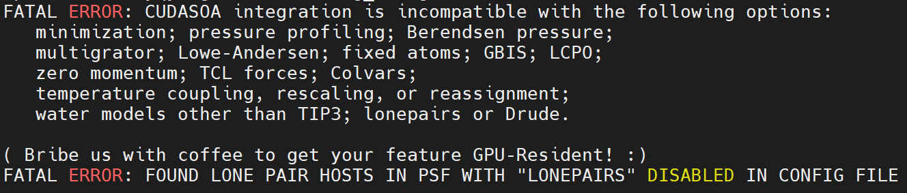
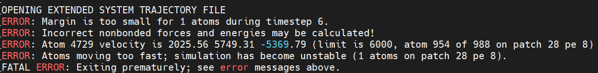
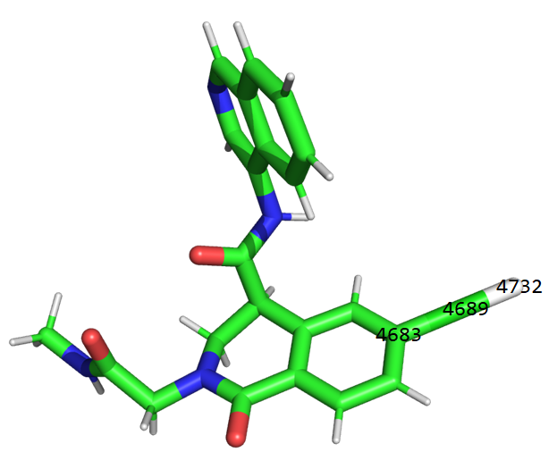

👏 NAMD|NAMD中的错误集锦

---
[TOC]

---
## 模拟时配体中含有氯溴碘等含有lone pair的体系中遇到的error。
（1）错误描述：使用CHARMM-GUI产生配体力场，VMD中构建模拟体系，配体中含有一个氯原子。在min的时候出现如下错误：
```text
FATAL ERROR: UNABLE TO FIND BOND PARAMETERS FOR CLGR1 LPH (ATOMS 8316 8279)
```
解决办法：找到使用的参数文件par_all36_cgenff.prm，在文件里面将下面一行取消注释：
```text
LPH CLGR1 0.00 0.0000 ! aromatic halogen to lone pair
```

（2）错误描述：使用CHARMM-GUI产生配体力场，VMD中构建模拟体系，配体中含有一个氯原子。使用NAMD3，在equil的时候出现lone pairs的错误，如下所示：

解决办法1：试验了一下，NAMD3遇到氯确实会报错，但是NAMD2不会报错。所以更换版本。并且CUDASOAintegrate选项只有NAMD3中才能使用，所以还需要将该项注释掉。
解决办法2：可以使用NAMD3跑，但是必须将CUDASOAintegrate选项关掉。

（3）错误描述：使用CHARMM-GUI产生配体力场，VMD中构建模拟体系，配体中含有一个氯原子。NAMD3可以跑完min，但是nvt的时候报如下错误：

错误原因：lone pair未被正确的写入system.psf文件中。检查psf文件看是否有以下几行，若体系中含有lone pair一定要有这几行，建体系的时候很多时候不能正确生成，一定要仔细检查。需要更改的是“4732      4689      4683”。
```text
1         3 !NUMLP NUMLPH
2        1 F          1.6400     0.0000     0.0000
4732      4689      4683
```
“4732      4689      4683”的意义如下所示：


其他解决办法：后来发现采用最新版本VMD进行建模一般能够正确写入lone pair的信息。

## NAMD中的常见错误
（1）错误描述：所有输入文件准备好，但是em的时候报“Abnormal EOF Found -buffer”的错误。
错误原因：这样的错误主要是因为文件的终止行部分异常导致不能正确读取。
解决办法：检查.pdb和.psf以及新加的.str文件。特别是.str文件，应该以END为终止符。

（2）错误描述：设置“CUDASOAintegrate         on”后在模拟固定的时间后任务会自动死掉。
解决办法：在设置“CUDASOAintegrate         on”后应该只使用一个CPU核，不能使用多个CPU核。