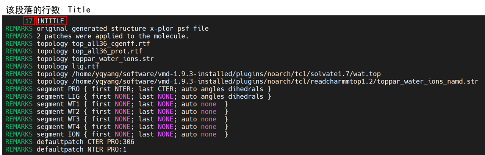
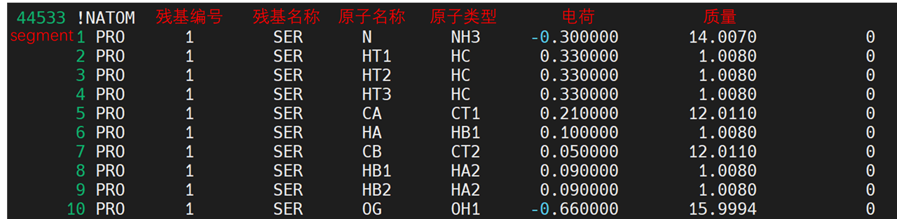
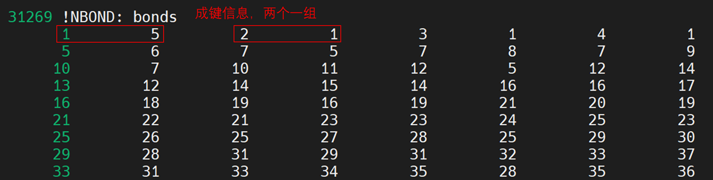
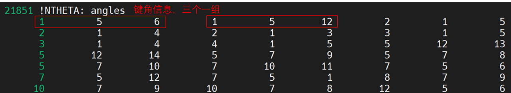
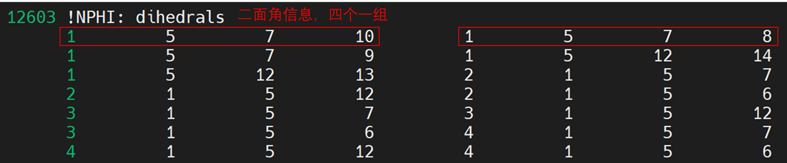
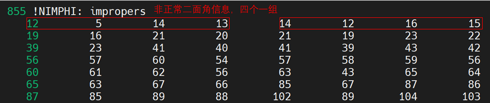
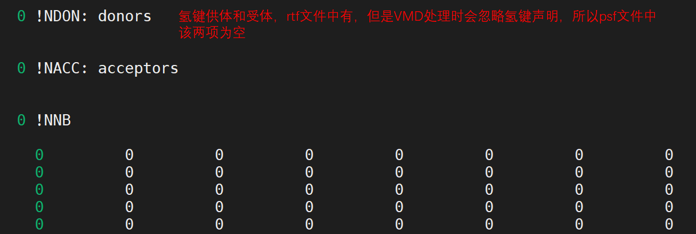
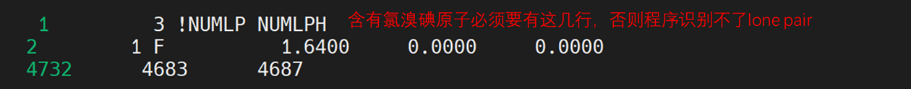
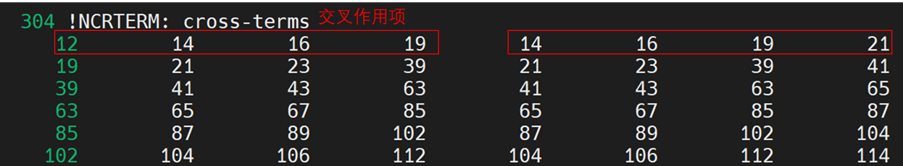

👏 NAMD|参数文件解析

---
[TOC]

---
## PSF文件
psf: protein structure file
pdb文件负责存储蛋白的所有原子坐标，还可以存储原子的运动速度。psf文件负责存储蛋白的结构信息。pdb文件中只存储蛋白原子的位置信息，并不存储蛋白原子间的成键信息。成键信息由psf文件负责记录。文件主要包括以下几项内容：

这几行还不知道是什么意思。
 

## Topology文件

## Parameter文件
参数文件提供用于评估力和能量的数字常数。使用pdb文件中的原子坐标信息加上psf文件中的结构信息作为输入便可计算力和能量。

## NAMD Configuration文件

