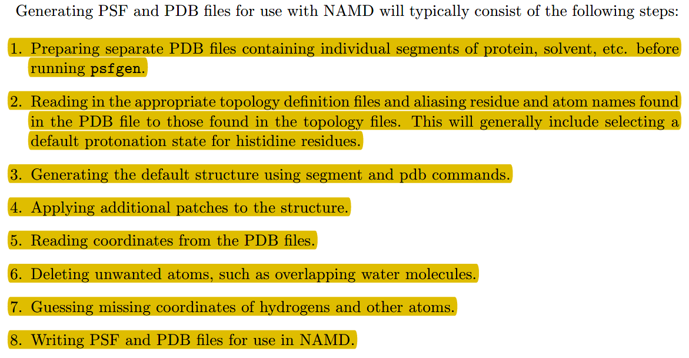
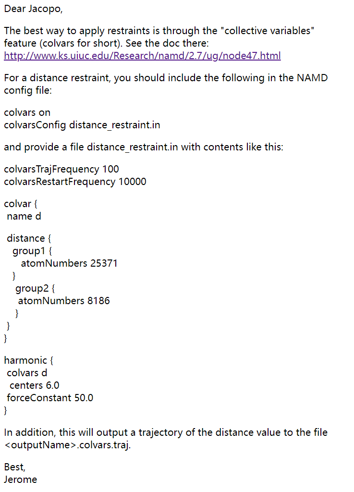
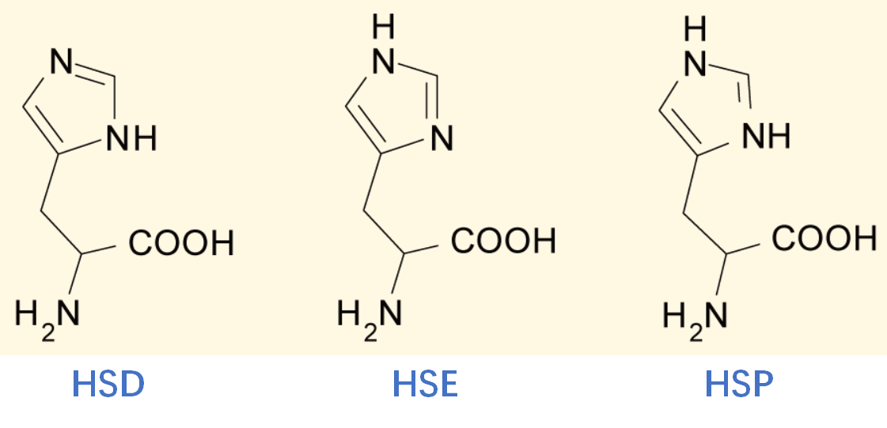

👏 NAMD|蛋白配体复合物动力学模拟

---
[TOC]

---
## 蛋白-配体文件准备
（1）获取蛋白pdb文件
（2）获取配体pdb/mol2文件
（3）获取蛋白配体复合物文件

## CHARMM-GUI对配体建模
（1）将配体上传至CHARMM-GUI配体准备模块，检查正确性。
（2）下一步，下一步，生成配体的参数文件。
（3）下载参数文件压缩包。

## 配体3D结构修饰
使用pymol中的Builder模块编辑小分子的3D结构。

## VMD中加水加离子构建模型
**VMD中常规建模流程**


**所需文件：** [toppar](./NAMD蛋白配体复合物动力学模拟/toppar/)  [namd-conf](./NAMD蛋白配体复合物动力学模拟/namd-conf/)   [namd_pre](./NAMD蛋白配体复合物动力学模拟/namd_pre/)
```shell
# sh sh ${name}-charmm-gui
file=$1
ffpath="/home/yqyang/software/toppar"
namd_conf="/home/yqyang/software/namd-conf"
namd_pre="/home/yqyang/software/namd_pre"
mkdir ${file}
tar -zxvf charmm-gui.tgz -C ${file}
mkdir build
cd build
rm pipline.tcl
cp ../com21-receptor.pdb .
cp ${namd_pre}/top_all36_cgenff.rtf .
cp ${namd_pre}/top_all36_prot.rtf .
cp ${namd_pre}/toppar_water_ions.str .
cp ../${file}/charmm*/ligandrm.pdb .
cp ../${file}/charmm*/lig/lig.rtf .
echo "package require psfgen" >> pipline.tcl
echo "psfcontext reset" >> pipline.tcl
echo "topology top_all36_cgenff.rtf" >> pipline.tcl
echo "topology top_all36_prot.rtf" >> pipline.tcl
echo "topology toppar_water_ions.str" >> pipline.tcl
echo "pdbalias residue HIS HSE" >> pipline.tcl
echo "alias atom ILE CD1 CD" >> pipline.tcl        
echo "alias atom SER HG HG1" >> pipline.tcl         
echo "alias atom CYS HG HG1" >> pipline.tcl   
echo "segment PRO {pdb com21-receptor.pdb}" >> pipline.tcl
echo "coordpdb com21-receptor.pdb PRO" >> pipline.tcl
echo "topology lig.rtf" >> pipline.tcl
echo "segment LIG {" >> pipline.tcl
echo "    first none" >> pipline.tcl
echo "    last none" >> pipline.tcl
echo "    pdb ligandrm.pdb" >> pipline.tcl
echo "    }" >> pipline.tcl
echo "coordpdb ligandrm.pdb LIG" >> pipline.tcl
echo "guesscoord" >> pipline.tcl
echo "writepdb merged.pdb" >> pipline.tcl
echo "writepsf merged.psf" >> pipline.tcl
echo "psfcontext reset" >> pipline.tcl
echo "mol load psf merged.psf pdb merged.pdb" >> pipline.tcl
echo "package require solvate" >> pipline.tcl
echo "solvate merged.psf merged.pdb -t 11.5 -o solvated" >> pipline.tcl
echo "mol delete all" >> pipline.tcl
echo "package require autoionize" >> pipline.tcl
echo "autoionize -psf solvated.psf -pdb solvated.pdb -sc 0.15 -o system" >> pipline.tcl
echo "exit" >> pipline.tcl
/home/yqyang/software/vmd-1.9.3-installed/vmd -dispdev text -e pipline.tcl
cd ..
mkdir md
cd md
cp ../build/system.pdb .
cp ../build/system.psf .
cp ${namd_conf}/namdmd.sh .
cp -r ${ffpath} .
mkdir prod
cp ${namd_conf}/pro-lig* ./prod/
cp ../${file}/charmm*/lig/lig.prm ./toppar/
```

## 当模拟体系的配体中含有氯溴碘时，一定要注意。
检查system.psf文件中是否将lone pair单独写入了，若未写入需要进行手动添加。
```text
       1       0 !NGRP
         0         0         0

       1         3 !NUMLP NUMLPH
      2        1 F          1.6400     0.0000     0.0000
      4732      4689      4683
```

## 开始MD模拟
```shell
nohup sh namdmd.sh &
```

## 模拟轨迹周期性处理生成平滑轨迹
```shell
#!/bin/bash
# by kevin

SEL_TEXT="segname PRO"

PDB="$1"; shift
[ $# -eq 0 ] && { echo "mkvmd> Usage: $0 [PSF/PDB] [TRJ]"; \
                  echo "mkvmd> [TRJ] could be multiple files."; \
                  echo "mkvmd> Note that XST files must exist in the same directory as the DCD files"; \
                  echo "mkvmd> By default, the selection is '$SEL_TEXT'"; exit 1; }

if [ ! -f $PDB ]; then
    echo -e "$PDB \nStructure not found!"
    exit 0
fi

cat > tcl <<EOF
package require pbctools
mol new $PDB waitfor all
EOF

for ii in $@; do
    prefix=${ii%.*}
    echo "mol addfile $ii waitfor all" >> tcl
    echo "pbc readxst ${prefix}.xst" >> tcl
done

cat >> tcl <<EOF
pbc wrap -all -compound segid -center com -centersel "${SEL_TEXT}"
set sel_all [atomselect top all]
set sel_ref0 [atomselect top "${SEL_TEXT}" frame 0]
set sel_ref [atomselect top "${SEL_TEXT}"]
set num_frames [molinfo top get numframes]
for {set ii 0} {\$ii<\$num_frames} {incr ii} {
    \$sel_all frame \$ii
    \$sel_ref frame \$ii
    \$sel_all move [measure fit \$sel_ref \$sel_ref0]
}
animate write dcd wrapped.dcd
quit
EOF

vmd -dispdev text -e tcl
rm tcl
```

## 续跑
修改conf文件进行续跑即可。修改下述几行即可：
```text
set INPUTNAME       com21-prod                   ;# restart
firsttimestep       72250000    ; # 上次断点时的步数
numsteps    100000000    ; # 一共要跑的步数，续跑的步数=numsteps-firsttimestep
#run 100000000           ;# 200ns
```

## 计算配体或任意某些原子的RMSD曲线
```shell
PDB=${1}
SELRMSD_PRO="segname PRO and ((resid 24 to 28) or (resid 38 to 45) or (resid 54) or (resid 85 to 86) or (resid 114) or (resid 116 to 119) or (resid 126) or (resid 136 to 147) or (resid 161 to 175) or (resid 181) or (resid 185 to 190))"
SELRMSD_all="(segname LIG) && noh"
SELRMSD_main="(segname LIG) && (name C8 || name N4 || name C9 || name C10 || name C14 || name C13 || name C12 || name C11 || name C7 || name C15 || name N3 || name C6 || name O2 || name C5 || name C16 || name C17 || name C18 || name CL || name C19 || name C20 || name C21)"
SELRMSD_side="(segname LIG) && (name C22 || name O3 || name N2 || name C4 || name C3 || name C2 || name O1 || name N1 || name C1)"
cat > tcl << EOF
mol new "$PDB" waitfor all
EOF

for ii in $@; do
    prefix=${ii%.*}
    echo "mol addfile $ii waitfor all" >> tcl
done

cat >> tcl << EOF
set sel_rmsd_pro0 [atomselect top "${SELRMSD_PRO}" frame 0]
set sel_rmsd_pro [atomselect top "${SELRMSD_PRO}"]
set sel_rmsd_all0 [atomselect top "${SELRMSD_all}" frame 0]
set sel_rmsd_all [atomselect top "${SELRMSD_all}"]
set sel_rmsd_main0 [atomselect top "${SELRMSD_main}" frame 0]
set sel_rmsd_main [atomselect top "${SELRMSD_main}"]
set sel_rmsd_side0 [atomselect top "${SELRMSD_side}" frame 0]
set sel_rmsd_side [atomselect top "${SELRMSD_side}"]
set num_frames [molinfo top get numframes]
set outfile [open "huitu_input_pktalign.csv" "w"]
# set outfile [open "huitu_input.csv" "w"]
puts \$outfile "frames,pro,all,main,side"
for {set ii 0} {\$ii<\$num_frames} {incr ii} {
    \$sel_rmsd_pro frame \$ii
    set rmsd_pro [measure rmsd \$sel_rmsd_pro \$sel_rmsd_pro0]
    \$sel_rmsd_all frame \$ii
    set rmsd_all [measure rmsd \$sel_rmsd_all \$sel_rmsd_all0]
    \$sel_rmsd_main frame \$ii
    set rmsd_main [measure rmsd \$sel_rmsd_main \$sel_rmsd_main0]
    \$sel_rmsd_side frame \$ii
    set rmsd_side [measure rmsd \$sel_rmsd_side \$sel_rmsd_side0]
    puts \$outfile "\$ii,\$rmsd_pro,\$rmsd_all,\$rmsd_main,\$rmsd_side"
}
quit
EOF

/public/software/apps/vmd/1.9.4/vmd -dispdev text -e tcl
rm tcl
```

## 配体聚类
### 方法一：Clustering Tool in VMD
安装及使用教程：https://github.com/yqyang733/clustering
**聚类**
```shell
get_map_of_clusters_frames_v2(){
    rm huitu_in_pktalign.csv
    rm tcl
    SEL_TEXT="resname LIG and noh"

    PDB="$1"; shift
    cat > tcl << EOF
mol new $PDB waitfor all
EOF

    for ii in $@; do
        prefix=${ii%.*}
        echo "mol addfile $ii waitfor all" >> tcl
    done

cat >> tcl << EOF
set outfile [open "huitu_in_pktalign.csv" "w"]
# set outfile [open "huitu_in.csv" "w"]
puts \$outfile "cluster1,cluster2,cluster3,cluster4,cluster5,cluster6,"
set sel_lig [atomselect top "$SEL_TEXT"]
foreach {cluster1 cluster2 cluster3 cluster4 cluster5 cluster6} [measure cluster \$sel_lig num 5 cutoff 1.2 first 0 last -1 step 1 distfunc rmsd weight none] break
for {set ii 0} {\$ii < 1000} {incr ii} {puts \$outfile "[lindex \$cluster1 \$ii],[lindex \$cluster2 \$ii],[lindex \$cluster3 \$ii],[lindex \$cluster4 \$ii],[lindex \$cluster5 \$ii],[lindex \$cluster6 \$ii],"}
quit
EOF

    /public/software/apps/vmd/1.9.4/vmd -dispdev text -e tcl
    rm tcl
}
```

### 方法二：CLUSTER-ANALYSIS-USING-VMD-TCL
使用教程：https://github.com/yqyang733/CLUSTER-ANALYSIS-USING-VMD-TCL

## 位置限制
（1）生成位置限制的pdb文件
```shell
protein="((segname PRO) and backbone)"
ligand="(segname LIG) and (name C10 || name N2 || name C9 || name C8 || name C14 || name C13 || name C12 || name C11 || name C7 || name C6 || name N1 || name C2 || name O1 || name C16 || name C1 || name C3 || name C4 || name CL || name LP1 || name C5 || name C15 || name C18)"

cat > tcl <<EOF
mol new system.pdb type pdb waitfor all
set all [atomselect top "all"]

\$all set beta 0
set sel [atomselect top "(${protein} or ${ligand})"]
\$sel set beta 1
\$all writepdb constraints.pdb

quit
EOF

/public/software/apps/vmd/1.9.4/vmd -dispdev text -e tcl
rm tcl
```
## CGenFF对配体建模并生成NAMD模拟的输入文件
（1）将配体导入maestro中并加氢保存为mol2文件，这里注意一定要加氢，并且要保证每个原子都有特定的名称。
（2）上传CGenFF网站并下载.str文件。.str文件中的前半部分相当于charmm-gui中生成的.rtf文件，后半部分相当于.prm文件。
（3）将配体mol2文件转换成pdb文件。
（4）按照前面相同流程生成NAMD需要的输入文件。
（5）注意含有lone pair的时候，只有最新版的VMD才能自动生成pdb中lone pair的位置。

## 距离限制
（1）使用extraBonds进行原子间距离限制
在conf文件中加入：
```text
extraBonds     on
extraBondsFile     ../extra_bonds.dat
```
其中extra_bonds.dat内容如下所示，其中2501和4693是距离限制的两个原子在vmd中显示的index，一般为atom id - 1。10为k的值。2.5是最小距离，3.0是最大距离，若是两原子间距离超出最大（小）距离区间，则使用外力进行约束。
```text
wall 2501 4693 10 2.5 3.0
```


**参考资料：**
1. https://www.ks.uiuc.edu/Research/namd/2.14/ug/node29.html

## 删除lone pair进行模拟
（1）将charmm-gui中生成的ligandrm.pdb中的LP行删掉。
（2）将lig.rtf文件中含有LP的行删除。
（3）使用删除LP行的文件进行建模即可。

## NAMD中使用H++预测到的蛋白质子化状态
（1）将蛋白上传至H++网站预测质子化状态并下载预测完成的pdb文件。
（2）修改pdb文件中原子的名称，使得psfgen可以识别原子名称。如下脚本：
```python
def generate_h_pdb(file):
    atom_map = {"SER":{"N":"N", "H1":"HT1", "H2":"HT2", "H3":"HT3", "CA":"CA", "HA":"HA", "CB":"CB", "HB2":"HB1", "HB3":"HB2", "OG":"OG", "HG":"HG1", "C":"C", "O":"O", "H":"HN"}, 
        "GLY":{"N":"N", "H":"HN", "CA":"CA", "HA2":"HA1", "HA3":"HA2", "C":"C", "O":"O"},
        "PHE":{"N":"N", "H":"HN", "CA":"CA", "HA":"HA", "CB":"CB", "HB2":"HB1", "HB3":"HB2", "CG":"CG", "CD1":"CD1", "HD1":"HD1", "CE1":"CE1", "HE1":"HE1", "CZ":"CZ", "HZ":"HZ", "CE2":"CE2", "HE2":"HE2", "CD2":"CD2", "HD2":"HD2", "C":"C", "O":"O"},
        "ARG":{"N":"N", "H":"HN", "CA":"CA", "HA":"HA", "CB":"CB", "HB2":"HB1", "HB3":"HB2", "CG":"CG", "HG2":"HG1", "HG3":"HG2", "CD":"CD", "HD2":"HD1", "HD3":"HD2", "NE":"NE", "HE":"HE", "CZ":"CZ", "NH1":"NH1", "HH11":"HH11", "HH12":"HH12", "NH2":"NH2", "HH21":"HH21", "HH22":"HH22", "C":"C", "O":"O"},
        "LYS":{"N":"N", "H":"HN", "CA":"CA", "HA":"HA", "CB":"CB", "HB2":"HB1", "HB3":"HB2", "CG":"CG", "HG2":"HG1", "HG3":"HG2", "CD":"CD", "HD2":"HD1", "HD3":"HD2", "CE":"CE", "HE2":"HE1", "HE3":"HE2", "NZ":"NZ", "HZ1":"HZ1", "HZ2":"HZ2", "HZ3":"HZ3", "C":"C", "O":"O"},
        "MET":{"N":"N", "H":"HN", "CA":"CA", "HA":"HA", "CB":"CB", "HB2":"HB1", "HB3":"HB2", "CG":"CG", "HG2":"HG1", "HG3":"HG2", "SD":"SD", "CE":"CE", "HE1":"HE1", "HE2":"HE2", "HE3":"HE3", "C":"C", "O":"O"},
        "ALA":{"N":"N", "H":"HN", "CA":"CA", "HA":"HA", "CB":"CB", "HB1":"HB1", "HB2":"HB2", "HB3":"HB3", "C":"C", "O":"O"},
        "PRO":{"N":"N", "H":"HN", "CA":"CA", "HA":"HA", "CB":"CB", "HB2":"HB1", "HB3":"HB2", "CG":"CG", "HG2":"HG1", "HG3":"HG2", "CD":"CD", "HD2":"HD1", "HD3":"HD2", "C":"C", "O":"O"},
        "VAL":{"N":"N", "H":"HN", "CA":"CA", "HA":"HA", "CB":"CB", "HB":"HB", "CG1":"CG1", "HG11":"HG11", "HG12":"HG12", "HG13":"HG13", "CG2":"CG2", "HG21":"HG21", "HG22":"HG22", "HG23":"HG23", "C":"C", "O":"O"},
        "GLU":{"N":"N", "H":"HN", "CA":"CA", "HA":"HA", "CB":"CB", "HB2":"HB1", "HB3":"HB2", "CG":"CG", "HG2":"HG1", "HG3":"HG2", "CD":"CD", "OE1":"OE1", "OE2":"OE2", "C":"C", "O":"O"},
        "CYS":{"N":"N", "H":"HN", "CA":"CA", "HA":"HA", "CB":"CB", "HB2":"HB1", "HB3":"HB2", "SG":"SG", "HG":"HG1", "C":"C", "O":"O"},
        "GLN":{"N":"N", "H":"HN", "CA":"CA", "HA":"HA", "CB":"CB", "HB2":"HB1", "HB3":"HB2", "CG":"CG", "HG2":"HG1", "HG3":"HG2", "CD":"CD", "OE1":"OE1", "NE2":"NE2", "HE21":"HE21", "HE22":"HE22", "C":"C", "O":"O"},
        "THR":{"N":"N", "H":"HN", "CA":"CA", "HA":"HA", "CB":"CB", "HB":"HB", "CG2":"CG2", "HG21":"HG21", "HG22":"HG22", "HG23":"HG23", "OG1":"OG1", "HG1":"HG1", "C":"C", "O":"O"},
        "LEU":{"N":"N", "H":"HN", "CA":"CA", "HA":"HA", "CB":"CB", "HB2":"HB1", "HB3":"HB2", "CG":"CG", "HG":"HG", "CD1":"CD1", "HD11":"HD11", "HD12":"HD12", "HD13":"HD13", "CD2":"CD2", "HD21":"HD21", "HD22":"HD22", "HD23":"HD23", "C":"C", "O":"O"},
        "ASN":{"N":"N", "H":"HN", "CA":"CA", "HA":"HA", "CB":"CB", "HB2":"HB1", "HB3":"HB2", "CG":"CG", "OD1":"OD1", "ND2":"ND2", "HD21":"HD21", "HD22":"HD22", "C":"C", "O":"O"},
        "TRP":{"N":"N", "H":"HN", "CA":"CA", "HA":"HA", "CB":"CB", "HB2":"HB1", "HB3":"HB2", "CG":"CG", "CD1":"CD1", "HD1":"HD1", "NE1":"NE1", "HE1":"HE1", "CE2":"CE2", "CZ2":"CZ2", "HZ2":"HZ2", "CH2":"CH2", "HH2":"HH2", "CZ3":"CZ3", "HZ3":"HZ3", "CE3":"CE3", "HE3":"HE3", "CD2":"CD2", "C":"C", "O":"O"},
        "ASP":{"N":"N", "H":"HN", "CA":"CA", "HA":"HA", "CB":"CB", "HB2":"HB1", "HB3":"HB2", "CG":"CG", "OD1":"OD1", "OD2":"OD2", "C":"C", "O":"O"},
        "HIS":{"N":"N", "H":"HN", "CA":"CA", "HA":"HA", "CB":"CB", "HB2":"HB1", "HB3":"HB2", "CG":"CG", "ND1":"ND1", "CE1":"CE1", "HE1":"HE1", "NE2":"NE2", "HE2":"HE2", "CD2":"CD2", "HD2":"HD2", "C":"C", "O":"O", "HD1":"HD1"},
        "TYR":{"N":"N", "H":"HN", "CA":"CA", "HA":"HA", "CB":"CB", "HB2":"HB1", "HB3":"HB2", "CG":"CG", "CD1":"CD1", "HD1":"HD1", "CE1":"CE1", "HE1":"HE1", "CZ":"CZ", "OH":"OH", "HH":"HH", "CE2":"CE2", "HE2":"HE2", "CD2":"CD2", "HD2":"HD2", "C":"C", "O":"O"},
        "ILE":{"N":"N", "H":"HN", "CA":"CA", "HA":"HA", "CB":"CB", "HB":"HB", "CG2":"CG2", "HG21":"HG21", "HG22":"HG22", "HG23":"HG23", "CG1":"CG1", "HG12":"HG11", "HG13":"HG12", "CD1":"CD1", "HD11":"HD1", "HD12":"HD2", "HD13":"HD3", "C":"C", "O":"O"},
    }
    with open(file) as f:
        f1 = f.readlines()
    result = open("com21-receptor-h-name.pdb", "w")
    for i in f1:
        if i.startswith("ATOM"):
            if i[12:16].strip() in atom_map[i[17:20].strip()].keys():
                print("000")
                result.write(i[0:12] + "{:^4s}".format(atom_map[i[17:20].strip()][i[12:16].strip()]) + i[16:])
            else:
                print("111")
                result.write(i)
        else:
            result.write(i)
```
（3）特别注意组氨酸的质子化状态，如下图所示，根据H++的预测结果将pdb中组氨酸修改成对应的名称即可。

（4）检查生成文件的结果坐标。

## 找到第一次聚类中心结构配体周围残基align再进行聚类
**寻找中心结构周围残基**
```python
def find_arround_resi():
    from pymol import cmd

    cmd.delete("all")
    # cmd.load(file_in)
    cmd.load("cluster1_centroid.pdb")
    myspace = {"lst":[]}
    cmd.iterate("(br. all within 10 of resn LIG) and (not resn LIG) and polymer.protein and (name CA)", "lst.append(resi)", space = myspace)
    # lst_ = [int(i) for i in myspace["lst"]]
    # lst_ = sorted(cmd.identify("(br. all within 10 of resn LIG) and (not resn LIG) and polymer.protein and (not hydrogens)", 0))
    # print(lst_)
    a = [int(i) for i in myspace["lst"]]
    # a = myspace["lst"]
    # print(a)
    all_lst = []
    s = []  # 定义一个空列表
    for i in a:
        if len(s) == 0 or s[-1] + 1 == i:  # 判断，如果是空列表或者列表中最后一个值加1等于当前值
            s.append(i)  # 写入列表
        else:  # 不满足以上条件
            # if len(s) >= 2:  # 判断长度是否大于2， 大于2则打印出来
            all_lst.append(s)
            s = [i]  # 给s重新复制为i
    # if len(s) >= 2:  # 最后一轮，判断是否是连续值，是的话就打印
    all_lst.append(s)
    all_resid = []
    for i in all_lst:
        if len(i) == 1:
            all_resid.append("(resid "+str(i[0])+")")
        else:
            all_resid.append("(resid "+str(i[0])+" to "+str(i[-1])+")")
    print(" or ".join(all_resid))
```

**vmd聚类中每一类的第一个构象就是该类的中心结构。**
**截取一帧进行FEP计算时，要从初始轨迹中进行截取，截取之后用pbc将complex完全放入水盒子中进行FEP计算即可。**

## 蛋白-配体FEP构象选取的workflow
（1）选择初始构象。如果有晶体结构用晶体结构即可，若没有晶体结构可根据最相近的晶体结构进行3D编辑，也可以使用对接产生。
（2）NAMD进行MD模拟。em；nvt（限制配体和蛋白重原子）；nptstep1（限制配体和蛋白重原子）；nptstep2（限制配体重原子和蛋白骨架）；prod
（3）平行跑3条轨迹，聚类找最大类的中心结构。若中心结构有>=2的构象是一致的。就拿该中心结构进行FEP即可。若三个都不一致则增加平行轨迹条数直至有最大类存在。
（4）找到（3）中结构周围10埃范围内的残基，据此残基进行结构align，再次聚类找到最大类中心结构。
（5）从原始轨迹中截取该中心结构所在帧并进行pbc处理。
（6）FEP计算即可