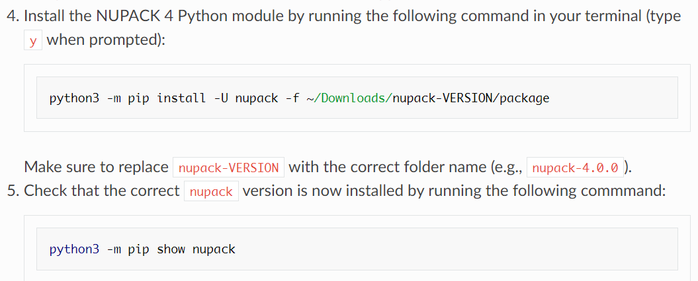

👏 NUPACK|核酸设计与分析工具

---
[TOC]

---
## nupack安装

安装在local:AmberTools22

参考资料：
1. [NUPACK User Guide](https://docs.nupack.org/start/)

## nupack在线网站
1. http://www.nupack.org/
账号：yanqyang@zju.edu.cn
密码：yyq3month28day

## 碱基序列突变脚本
```python
import sys

def process(num, base):
    fasta_base = "GGCGACAUUUGUAAUUCCUGGACCGAUACUUCCGUCAGGACAGAGGUUGCCA"
    fasta_base = list(fasta_base)
    fasta_base[num-1] = base
    fasta_base = "".join(fasta_base)
    f = open("cluster30_" + str(num) + "to" + base + ".txt", "w")
    f.write(fasta_base)
    f.close

def main():
    num = int(sys.argv[1])
    base = sys.argv[2]
    process(num, base)

if __name__ == '__main__':
    main()
```

**用法**
```shell
python py n G   # n代表突变碱基的位置序号，G代表要突变成的碱基
```

## 碱基突变前后RNA二级结构能量变化统计脚本
```python
import sys
from nupack import *

origin_sequence = "GGCGACAUUUGUAAUUCCUGGACCGAUACUUCCGUCAGGACAGAGGUUGCCA"
rna_model = Model(material='rna95', celsius=20, sodium=1.0, magnesium=0.0)
origin = Strand(origin_sequence, name="origin")
tem = Tube(strands={origin:1e-6,}, complexes=SetSpec(max_size=1), name='Tube tem')
tube_result = tube_analysis(tubes=[tem], compute=['mfe'], model=rna_model)
walker_result = tube_result['(origin)']
for i, s in enumerate(walker_result.mfe):
    origin_energy = s.energy

def process():
    base = ["A","G","C","U"]
    rt = open("result.csv", "w")
    rt.write("energy,")
    for i in origin_sequence:
        rt.write(i + ",")
    rt.write("\n")
    for a in base:
        rt.write(a + ",")
        for b in range(len(origin_sequence)):
            if origin_sequence[b] == a:
                rt.write("0,")
            else:
                mutate_sequence = list(origin_sequence)
                mutate_sequence[b] = a
                mutate_sequence = "".join(mutate_sequence)
                mutate = Strand(mutate_sequence, name="mutate")
                tem = Tube(strands={mutate:1e-6,}, complexes=SetSpec(max_size=1), name='Tube tem')
                tube_result = tube_analysis(tubes=[tem], compute=['mfe'], model=rna_model)
                walker_result = tube_result['(mutate)']
                for i, s in enumerate(walker_result.mfe):
                    mutate_energy = s.energy
                cha = mutate_energy - origin_energy
                rt.write(str(cha) + ",")
        rt.write("\n")

def main():
    process()

if __name__ == '__main__':
    main()
```

## 计算相同序列不同二级结构的能量差
```python
import sys
from nupack import *

origin_sequence = "GGCGACAUUUGUAAUUCCUGGACCGAUACUUCCGUCAGGACAGAGGUUGCCA"
origin_secondary = "((((((.((((....(((((.((.((....)).))))))))))).))))))."
rna_model = Model(material='rna95', celsius=20, sodium=1.0, magnesium=0.0)
origin_energy = structure_energy(strands=[origin_sequence,], structure=origin_secondary, model=rna_model)
pairs = {1:51, 2:50, 3:49, 4:48, 5:47, 6:46, 8:44, 9:43, 10:42, 11:41, 16:40, 17:39, 18:38, 19:37, 20:36, 22:35, 23:34, 25:32, 26:31}

def process():
    base = ["A","G","C","U"]
    rt = open("result.csv", "w")
    rt.write("energy,")
    for i in origin_sequence:
        rt.write(i + ",")
    rt.write("\n")
    for a in base:
        rt.write(a + ",")
        for b in range(len(origin_sequence)):
            if origin_sequence[b] == a:
                rt.write("0,")
            else:
                mutate_sequence = list(origin_sequence)
                mutate_sequence[b] = a
                mutate_sequence = "".join(mutate_sequence)
                mutate = Strand(mutate_sequence, name="mutate")
                tem = Tube(strands={mutate:1e-6,}, complexes=SetSpec(max_size=1), name='Tube tem')
                tube_result = tube_analysis(tubes=[tem], compute=['mfe'], model=rna_model)
                walker_result = tube_result['(mutate)']
                for i, s in enumerate(walker_result.mfe):
                    mutate_energy_1 = s.energy
                try:
                    mutate_energy_2 = structure_energy(strands=[mutate_sequence,], structure=origin_secondary, model=rna_model)
                except:
                    mutate_secondary = list(origin_secondary)
                    mutate_secondary[b] = "."
                    mutate_secondary[pairs[b+1]-1] = "."
                    mutate_energy_2 = structure_energy(strands=[mutate_sequence,], structure=mutate_secondary, model=rna_model)
                cha = mutate_energy_2 - mutate_energy_1
                rt.write(str(cha) + ",")
        rt.write("\n")

def main():
    process()

if __name__ == '__main__':
    main()
```

## temp
目前没有找到生成二级结构图片的命令。