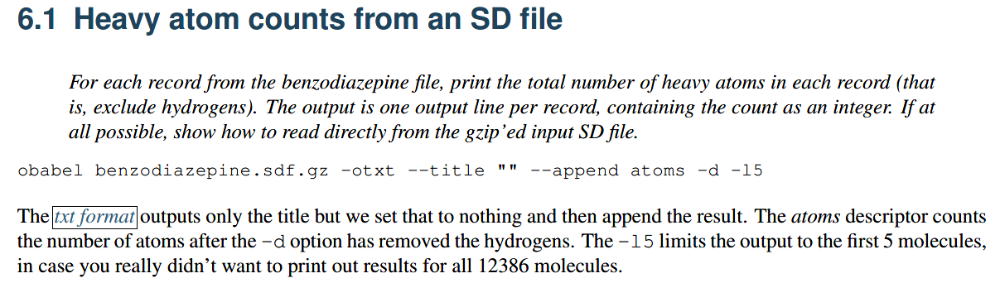

👏 OpenBabel

---
[TOC]

---
## 安装

```shell
conda install -c openbabel openbabel
```

## 转换文件格式   

1. 例如sdf转换成mol2文件，不能直接改后缀名，需要进行格式转换。
```shell
obabel -isdf test.sdf -omol2 -O ./test/test.mol2
```

2. 将sdf、mol或者mol2文件转换成标准的smiles，即相同的分子生成的smiles一摸一样。
```shell
obabel -imol test3-1.mol -ocan -O test3-122.smi
```

3. smiles转成3D mol2文件。其中mol2文件中的原子序列和smiles中的原子序列是一致的。
```shell
obabel -:"NCc1cc(CO)cc(c1)C(CC(=O)O)C" -omol2 -O test1.mol2 --gen3D
```

## 计算二维相似性

1.计算两个单个sdf文件之间的二维相似性。

```shell
obabel test1.sdf test2.sdf -ofpt
```

2.计算一个单个分子(smi)与另外很多分子(sdf)之间的二维相似性，其中result中的格式是">ICV225 Tanimoto from first mol = 0.0761905"，其中ICV225是分子文件内部的名字。

```shell
obabel test.smi multi_test.sdf -ofpt >> result.txt
```

## 计算小分子rmsd

```shell
obrms ligand.sdf ligand_after_dock.sdf
```

## 计算物理化学性质

1. 计算重原子数


## Python API

