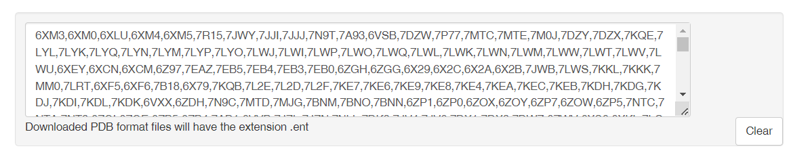

👏 PDB晶体结构数据库特定蛋白晶体信息统计

---
[TOC]

---
（1）打开PDB数据库RCSB对特定蛋白进行检索，这里以SARS-CoV-2的Spike蛋白为例。如下图所示，点击下载所有，会生成所有pdbid列表，将所有pdbid保存为pdb_download_all.txt。


（2）脚本如下所示：
```python
import sys
import os
from Bio.PDB import *

def read_in(file_in):
    with open(file_in) as f:
        f1 = f.readlines()
    lst = []
    for i in f1:
        lst.extend(i.strip(",\n").split(","))
    return lst

def get_attri(lst, path_save):
    rt = open("result.txt", "w")
    err = open("error.txt", "w")
    rt.write("$name$head$idcode$deposition_date$release_date$structure_method$resolution$structure_reference$journal_reference$author$compound$source$has_missing_residues$missing_residues$keywords$journal\n")
    for i in lst:
        try:
            pdbl = PDBList()
            pdbl.retrieve_pdb_file(i, pdir = path_save, file_format = 'pdb')
            parser = PDBParser(PERMISSIVE = True, QUIET = True)
            data = parser.get_structure(i, os.path.join(path_save, "pdb" + i.lower() + ".ent"))
            tmp_txt = str(i)
            for key in data.header.keys():
                tmp_txt = tmp_txt + "$" + str(data.header[key])
            tmp_txt += "\n"
            rt.write(tmp_txt)
        except:
            err.write(i + "\n")
        rt.flush()
        err.flush()
    rt.close()
    err.close()

def process(file_in, path_save):
    lst = read_in(file_in)
    get_attri(lst, path_save)

def main():
    file_in = sys.argv[1]
    path_save = sys.argv[2]
    process(file_in, path_save)

if __name__ == '__main__':
    main()
```

（3）运行脚本获得pdb信息。
```shell
mkdir pdb_spike
python py pdb_download_all.txt ./pdb_spike/
```

（4）运行完成之后，即可获得结果文件result.txt，将该文件在excel中以$分列即可得到所有pdb信息。

（5）error.txt文件中的是没有pdb格式的晶体结构。

（6）下载error.txt文件中晶体结构的cif格式进行信息提取。
```python
import sys
import os
from Bio.PDB import *

def read_in(file_in):
    with open(file_in) as f:
        f1 = f.readlines()
    lst = []
    for i in f1:
        lst.append(i.strip("\n"))
    return lst

def get_attri(lst, path_save):
    rt = open("result.txt", "w")
    err = open("error_1.txt", "w")
    for i in lst:
        try:
            pdbl = PDBList()
            pdbl.retrieve_pdb_file(i, pdir = path_save, file_format = 'mmCif')
            parser = MMCIFParser(QUIET = True)
            data = parser.get_structure(i, os.path.join(path_save, i.lower() + ".cif"))
            tmp_txt = str(i)
            # print(data.header.keys())
            for key in data.header.keys():
                tmp_txt = tmp_txt + "$" + str(data.header[key])
            tmp_txt += "\n"
            # print(tmp_txt)
            rt.write(tmp_txt)
        except:
            err.write(i + "\n")
        rt.flush()
        err.flush()
    rt.close()
    err.close()

def process(file_in, path_save):
    lst = read_in(file_in)
    get_attri(lst, path_save)

def main():
    file_in = sys.argv[1]
    path_save = sys.argv[2]
    process(file_in, path_save)

if __name__ == '__main__':
    main()
```

（7）运行脚本获得cif信息。
```shell
mkdir cif_spike
python py error.txt ./cif_spike/
```

（8）正常情况下此次运行之后的error_1.txt为空。

（9）excel中合并两次生成的result.txt文件即可。

（10）更新，随着pdb数据库的不断更新，需要生成之前没有生成的pdb的信息。在pdb官网检索最新的pdbid列表，与当前excel中的pdbid做差，将没有的pdbid根据上述流程再走一遍获取新结构的信息即可。求差脚本如下所示：
```python
import sys

def cha(file_result_1, spike_new):
    with open(spike_new) as f:
        f1 = f.readlines()
    lst = []
    for i in f1:
        lst.extend(i.strip(",\n").split(","))

    with open(file_result_1) as f:
        f1 = f.readlines()
    for i in range(1, len(f1)):
        id_ = f1[i].split("$")[0]
        lst.remove(id_)
    print(len(lst))
    f = open("result_cha.txt", "w")
    f.write(",".join(lst))
    f.close()

def main():
    file_result_1 = sys.argv[1]
    spike_new = sys.argv[2]
    cha(file_result_1, spike_new)

if __name__ == "__main__":
    main()
```
输入数据：一个文件是所有pdb信息合并的txt文件，另一个是最新的pdbid列表文件。
```shell
python py file_result.txt spike_new
```
获取的result_cha.txt即可进行下一轮的信息获取。