👏 Pymol|Pymol图形界面操作

---
[TOC]

---
## 基本操作
[PyMOL-GUI](PymolPymol图形界面操作/PyMOL-GUI.docx)
### pymol中执行python脚本
打开Pymol在命令行中输入如下python脚本命令。    
```python
python   # 唤醒pymol中的python
for i in range(10):
    print(i)    # 输入python脚本时可以直接复制大量脚本内容到pymol，pymol会自动对其进行换行。
python end   # 最后必须输入python end才能运行上述脚本内容。
```
### 分子移动
**打开编辑模式或者Builder模块**
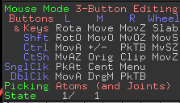
|操作|效果|
|:----|:----|
|shift+left|分子原位旋转|
|shift+middle|分子平移|
|shift+right|分子原位缩放|
|ctrl+left|移动单个原子|
|ctrl+right|以键为轴进行旋转|

## 编辑三维结构-Builder

## 透明度设置相关
**透明模式设置：**
（1）Uni-layer; 点击菜单栏中的Setting->Transparency->Uni-layer
（2）Multi-Layer; 点击菜单栏中的Setting->Transparency->Multi-Layer
（3）Multi-Layer(real time oit); 点击菜单栏中的Setting->Transparency->Multi-layer(real time oit)
（4）Fast-ugly; 点击菜单栏中的Setting->Transparency->Fast-ugly
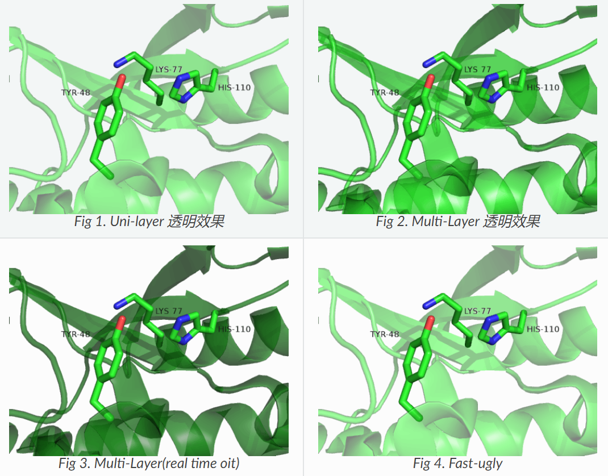

```python
## Cartoon透明度
set cartoon_transparency, 0.5, <object>  # 50%透明度, <object>是对象的名字
set cartoon_transparency, 0.5, <sele>  # 50%透明度, <sele>是选择的部分
## Stick透明度
set stick_transparency, 0.5, <object>  
```

## 雾化处理
PyMOL中支持各种雾化处理，保证depth_cue是开启的。前面清晰，后面雾化可通过滚动鼠标中键进行调节。向上滚动，雾化程度减轻；向上滚动，雾化程度加深。如下图所示：
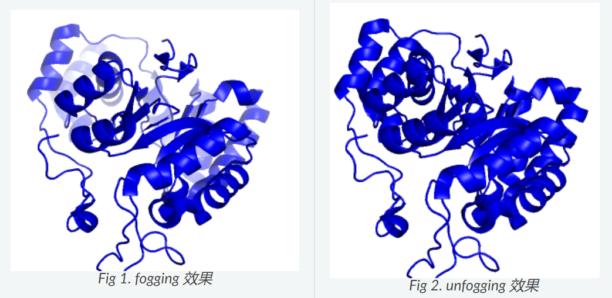
完全不想要雾化处理，可以点击 Display->Depth cue (Fogging) 取消。或者使用下述命令关闭。
```shell
set depth_cue, 0
```

## 光照模式
**（1）PyMOL中内置5种不同的光照模式：** default, metal(金属), plastic(塑料), rubber(橡胶), X-ray。点击Plugin->lighting Settings进行设置不同的光照，如下图所示图。
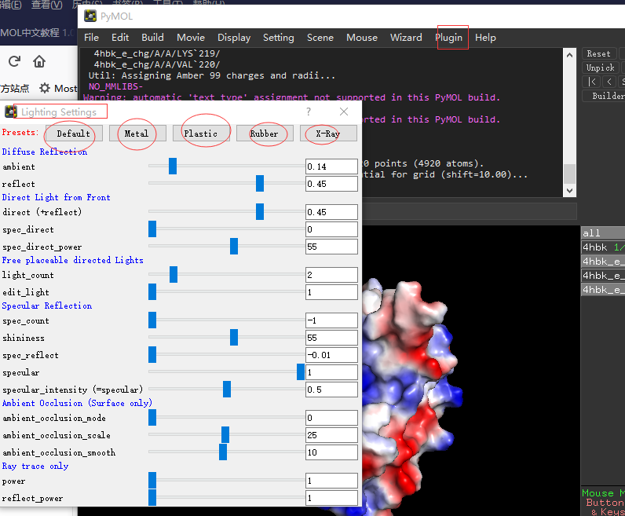
除了默认的5种模式外，你也可以通过设置光源的参数，达到自己想要的效果。下面，我们查看蛋白的静电势表面在不同光照模式下的效果。
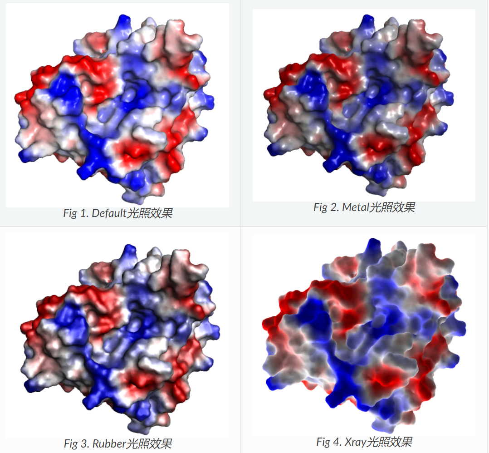

**（2）Pymol渲染（Ray）** 设置Ray_trace_mode设置可以修改最终成图的时候的PyMOL的内部渲染蛋白的模式。
```shell
set ray_trace_mode, 0   # 普通颜色
set ray_trace_mode, 1   # 普通颜色+黑色线
set ray_trace_mode, 2   # 仅包含黑色线
set ray_trace_mode, 3   # 倍色+黑色线
set antialias, 2   # 建议设置
set ray_trace_color, magenta   # 更改线的颜色
```
参考：[Pymol渲染（Ray）笔记](https://www.jianshu.com/p/ba89f50e0c0c)

## atom id/rank/index
（1）ID (int): PDB atom id (not guaranteed to be unique)
（2）rank (int): atom index from original file import (not guaranteed to be unique)
（3）index (int): internal atom index (unique per object, sensitive to sorting and removing of atoms, cannot be altered)

## pymol自动记录界面操作命令行
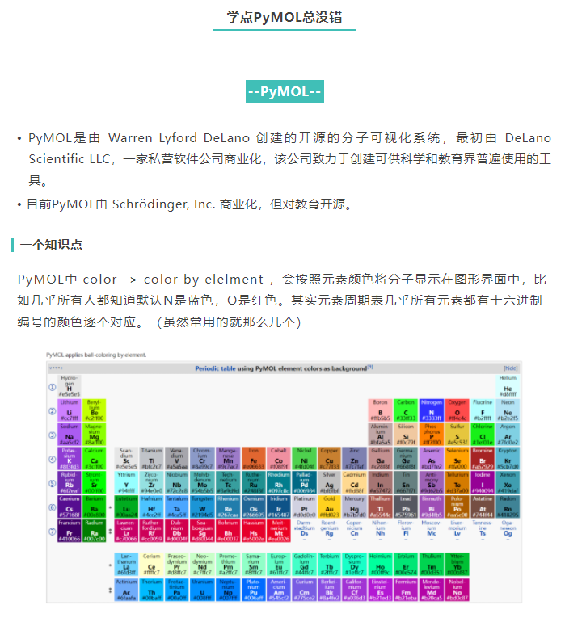
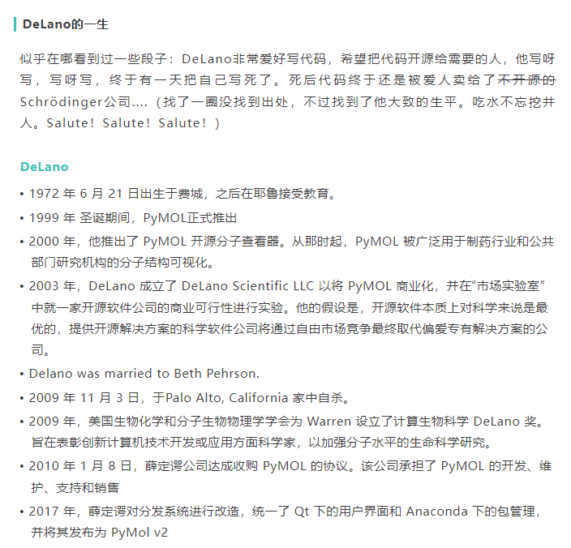
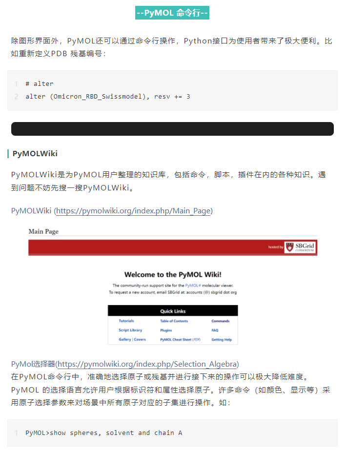
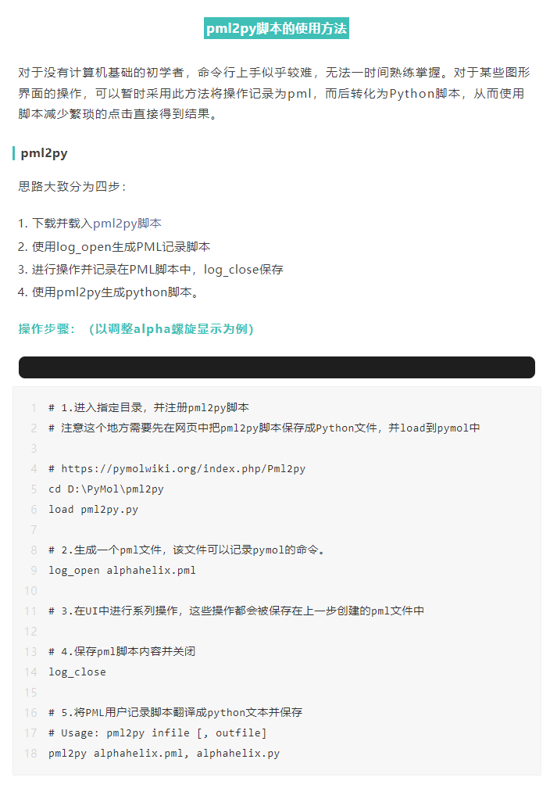
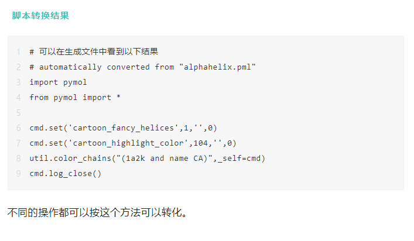

## 核酸相关Show
### Examples of nucleic acid cartoons
参考链接：https://pymolwiki.org/index.php/Examples_of_nucleic_acid_cartoons

## 蛋白骨架以及侧链Show
### Cartoon side chain helper
效果如下：
```python
set cartoon_side_chain_helper, off            
set cartoon_side_chain_helper, 0              #off
```
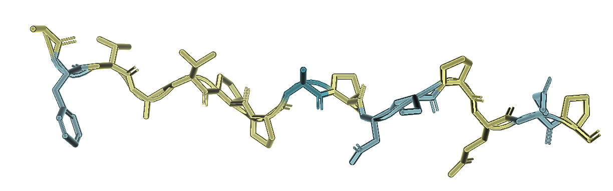
```python
set cartoon_side_chain_helper, on             
set cartoon_side_chain_helper, 1              #on
```
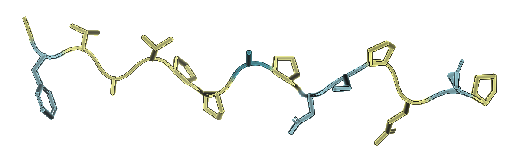

## 一些常用命令
```python
fetch 4IE5
as sticks
show sticks
as cartoon
remove hydrogen
remove solvent + inorganic
split_states object
delete object
join_states 1j8k, 1j8k_*
align 1qoh, 2chb
cealign 1qoh, 2chb
super 1qoh, 2chb
rein  # 清空所有，重新开始

util.cbc   # cbc = color by chain
util.cnc   # cnc = color not carbon
util.chainbows
util.cbc
color black, organic
util.cnc
bg_color white
orient
```

### Selection
```python
select /2chb   # select 2chb   molecular obj
select /2chb/A   # select 2chb & segi A   molecule semi (sometimes)
select /2chb//D   # select 2chb and chain D   chain
select /2chb//D/PRO   # select 2chb & c. D & i. 10   residue
select /2chb//D/PRO`53   # select 2chb & c. D & i. 53 & r. PRO   residue				
select /2chb//D/10/ca   # select 2chb & c. D & i. 10 & n. ca   atom
select ////PRO/ca   # select r. PRO & n. ca   atom

select /2chb//D/10-12/ca   # select 2chb & c. D & i. 10-12 & n. ca   atom range
select /2chb//D/6+8/c+o   # select 2chb & c. D & i. 10+12 & n. ca   atom range

select 2chb and chain D and resi 10+12 and not name ca
select 2chb & c. D & i. 10+12 & ! n. n+o+c

select 2chb & c. D & i. 4 | i. 7
select 2chb & c. D & i. 4 + i. 7	# 这个和上面一个等价，都是 (2chb & c. D & i. 4) + i. 7
select 2chb & c. D & i. 4+7		# 这个是 2chb & c. D & (i. 4+7)
```

**示例1：

## 画图相关精细设置
### 单双键设置(Valence)
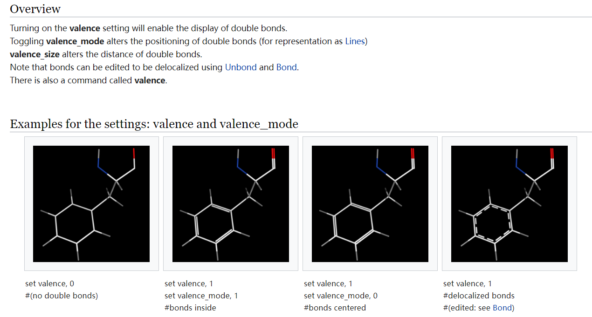  

**应用示例**  
```shell
set valence, 0 # off
set valence, 1 # on

set valence_mode, 0 # centered
set valence_mode, 1 # inside

set valence_size, 0.1 # default: 0.06 # range 0 - ~0.5
```

### Cartoon的相关设置
**（1）调整Cartoon中loop的粗细**  
```shell
set cartoon_loop_radius, 0.35
```

### Stick的相关设置
**（1）调整Stick中键的粗细**  
```shell
set_bond stick_radius, 0.14, object,
```

### Sphere的相关设置  
**（1）调整球的尺寸**  
```shell
set sphere_scale, 0.25, sele
```

### Ball and Stick
（1）图形界面在 A -> Preset -> ball and stick, 但图形界面无法对单一对象进行个性化操作，则需要命令行对对象进行个性化设置。   
（2）命令行  
```shell
set stick_ball, on  # 开启球棍模型，原子显示为球形，键显示为棍状
set stick_ball_ratio, 2, object,  # 设置object中球棍的比例
set_bond stick_radius, 0.14, object,  # 设置object中棍的粗细
set sphere_scale, 0.25, sele  # 设置选中的原子球的大小
```