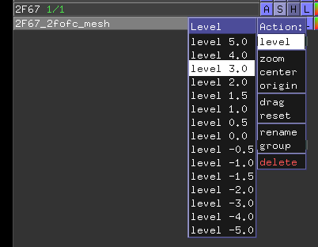
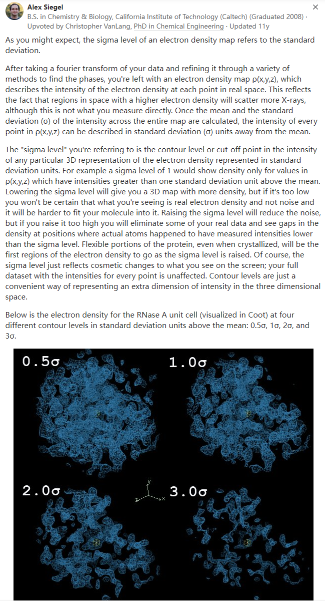

👏 Pymol|处理电子密度图

---
[TOC]

---
## What does the **sigma level** refer to in electron density mapping?

简单来说就是，整个电子密度图是有一个均值的，然后每个点的电子密度稀疏程度都能使用sigma（std）来表示，例如：pymol中显示的 level 3 就代表只将 std>=3 的点显示出来。即选择的level越小越密集，选择的level越大越稀疏。

## 参考资料
1. https://pymolwiki.org/index.php/Display_CCP4_Maps
2. https://bioinformaticsreview.com/20221008/how-to-generate-electron-density-map-using-pymol/
3. https://pymol.sourceforge.net/newman/user/S0400xtal.html
4. https://www.youtube.com/watch?v=0Lzwd35mNg8