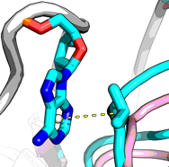

👏 Pymol绘图|ΠΠ堆叠等相互作用绘制

---
[TOC]

---
## 示意图
  

## 具体操作
（1）寻找环的中心生成小球  
```shell
# 输入命令
import center_of_mass
com sele, object=p1	# 点击49PRO，环上相对的两个原子
com sele, object=p2	# 点击50TRP，环1上相对的两个原子
com sele, object=p3	# 点击50TRP，环2上相对的两个原子
set sphere_scale ,0.3		# 调节球的大小
```

（2）使用距离测量两个小球之间的距离，生成虚线。  
（3）将虚线上面的label隐掉即可。  