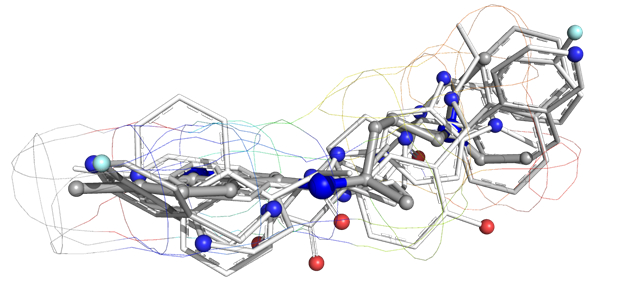

👏 Pymol绘图|分子相似性比较图

---
[TOC]

---
## 图片示例


## 图片特征
1. 图片中一共有6个分子结构，最粗的一个是最主要的分子，其他的是和最粗分子相似性最高的5个分子
2. 需要调节不同对象的粗细达到Stick形式的分子粗细不同，凸显主要分子
3. 调节最粗的分子的球棍比例，使得原子半径与棍的半径不同
4. 把N原子，O原子和卤素原子用带颜色的球凸显出来
5. 最外层加上分子的mesh结构并调节mesh的颜色和密集程度

## 图片制作
软件：Pymol
```python
### 制作最粗的分子
A > preset > ball and stick     # object(main)为最主要的最粗的那个分子
# 选中N原子，O原子和卤素原子copy出来成一个独立的object(atom_color)
S > as > sticks   # object(main)为最主要的最粗的那个分子
C > grays > gray70    # object(main)为最主要的最粗的那个分子
set stick_ball, on  # 开启球棍模型，原子显示为球形，键显示为棍状
set stick_ball_ratio, 2, main,  # 设置object(main)中球棍的比例
set_bond stick_radius, 0.14, main,  # 设置object(main)中棍的粗细
# 选中object(atom_color)中的所有原子
set sphere_scale, 0.25, sele  # 设置选中的原子球的大小
# 将object(atom_color) copy进object(main)中，删掉object(atom_color)
###################################################################

### 其余五个分子的制作方法是一样的，这里只介绍一个
A > preset > ball and stick     # object(sub)为其余5个分子中的1个
# 选中N原子，O原子和卤素原子copy出来成一个独立的object(sub_color)
S > as > sticks   # object(sub)为其余5个分子中的1个
set_bond stick_radius, 0.1, sub,  # 设置object(sub)中棍的粗细
# 选中object(sub_color)中的所有原子
set sphere_scale, 0.2, sele  # 设置选中的原子球的大小
# 将object(sub_color) copy进object(sub)中，删掉object(sub_color)
#####################################################################

### 制作最外层的线条
# 将object(main)copy一个出来为object(main_mesh)
S > as > mesh     # object(main_mesh)为对象
C > spectrum > rainbow(elem C)     # object(main_mesh)为对象
# setting > Edit All > mesh_skip 3.5     # 调节mesh的密度
# setting > Edit All > mesh_width 0.2     # 调节mesh的线条粗细
######################################################################
```