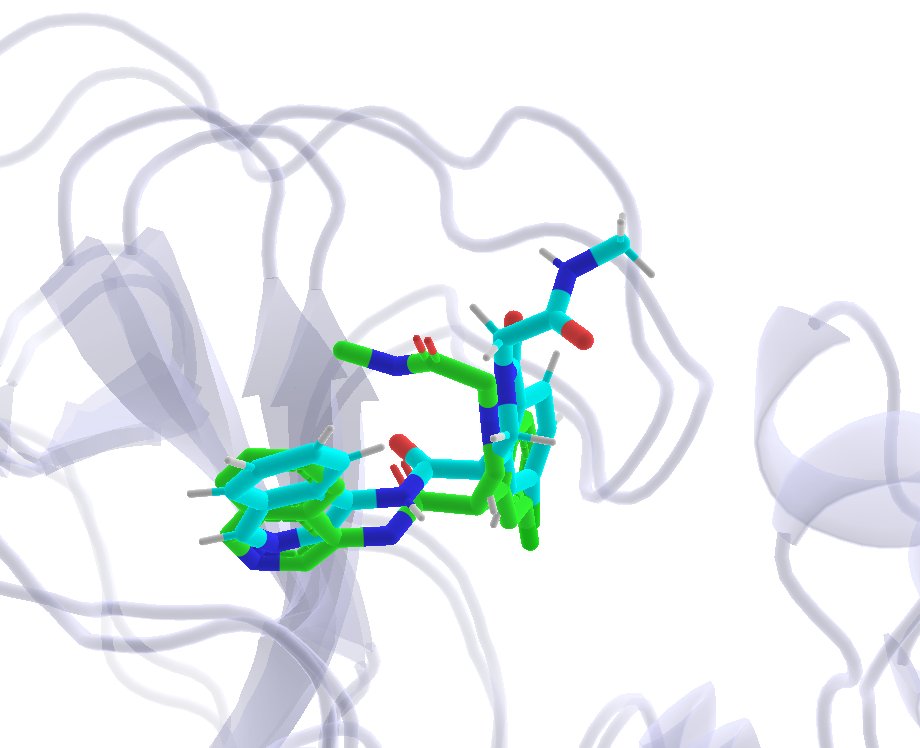
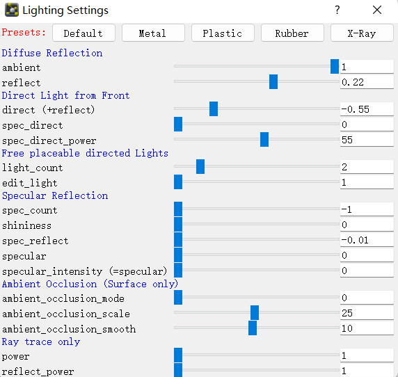
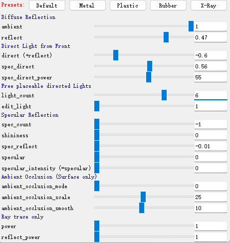

👏 Pymol绘图|蛋白配体互作展示图

---
[TOC]

---
## 示例图一

（1）调整配体的位置和颜色。
（2）调整蛋白的颜色为 C -> tints -> bluewhite。
（3）调整Cartoon的透明度为50%。
（4）鼠标上下键使蛋白稍微雾化。
（5）调整透明模式为Multi-Layer(real time oit); 点击菜单栏中的Setting->Transparency->Multi-layer(real time oit)
（6）调整光照模式为：Plugin->lighting Settings

