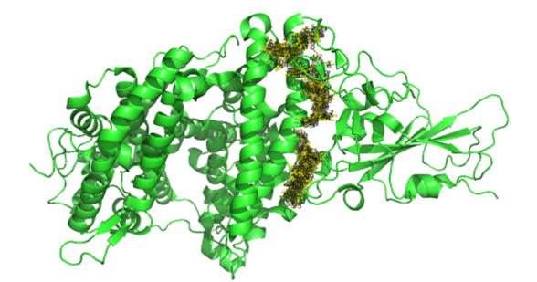

👏 Pymol脚本|计算两个object原子pairs间的最短距离

---
[TOC]

---
## 脚本
```python
from pymol import cmd

def list_contacts_shortest(selection1,selection2,cutoff=100.0,contact_name='contacts'):
  """
  USAGE

  list_contacts_shortest selection1, selection2, [cutoff (default=4], [contact_name (default='contacts']

  e.g.
    list_contacts_shortest 1abc & c. a &! r. hoh, 1xyz & c. b &! r. hoh, cutoff=3.2, contact_name=abc-xyz_contacts
  """
  cutoff=float(cutoff)
  contacts = cmd.find_pairs(selection1,selection2,mode=0,cutoff=cutoff)
  
  dist_shortest = 10.0
  for pairs in contacts:
    dist = cmd.distance(contact_name,"%s and index %s" % (pairs[0][0],pairs[0][1]),"%s and index %s" % (pairs[1][0],pairs[1][1]))
    if (dist < dist_shortest):
      dist_shortest = dist
      dist_sele1 = "%s and index %s" % (pairs[0][0],pairs[0][1])
      dist_sele2 = "%s and index %s" % (pairs[1][0],pairs[1][1])
  print(cmd.iterate(dist_sele1, 'print("%s/%s/%3s`%s/%s " % (model,chain,resn,resi,name),)'), cmd.iterate(dist_sele2, 'print("%s/%s/%3s`%s/%s " % (model,chain,resn,resi,name),)'), dist_shortest)

cmd.extend("list_contacts_shortest",list_contacts_shortest)
```

## 使用
（1）将上述脚本保存为list_contacts_shortest.py文件。
（2）打开pymol切换至list_contacts_shortest.py位置。
（3）使用示例
```python
run list_contacts_shortest.py
list_contacts_shortest sele, cluster7_1 and chain A, cutoff=5
list_contacts_shortest sele, model_9_0001, cutoff=5
```
（4）Pymol中会显示5埃范围内的所有距离，最终会打印出最短的pairs和距离。
（5）如下图所示：
