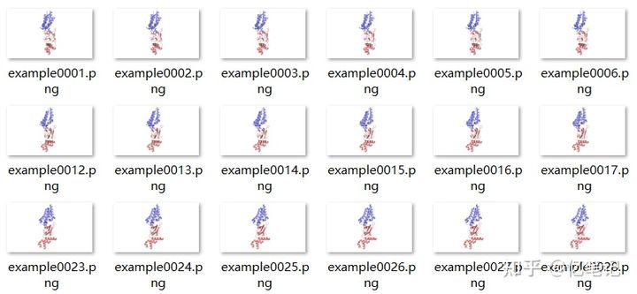
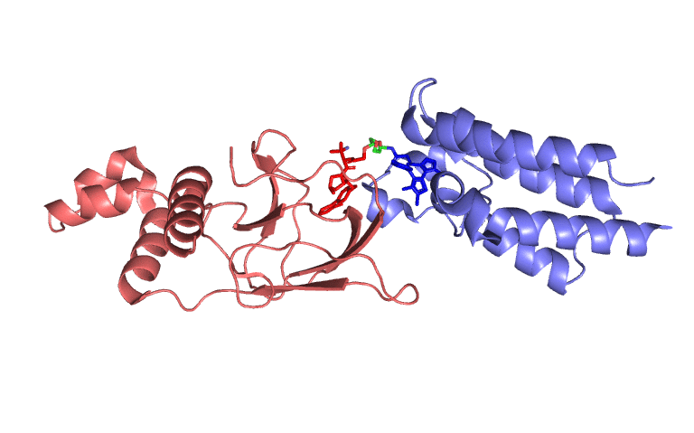

👏 Python绘图|Python将多张静态图片合成gif动态图片

---
## Contents
[TOC]

---
写在前面：动态变化的gif图片往往能使PPT演讲更加出彩。gif动态图是由多个静态图片按照时间顺序堆积而成的。下面便是使用Python脚本将多张静态图片合成动态gif图片。

---
## 1. 素材准备
本例中使用的素材为多张png图片，如下图所示：


---
## 2. gif 图片合成
运行如下命令：
```shell
python py ./example/     # ./example/ 是静态图片的存放路径
```
py脚本内容如下：
```python
import imageio, os, sys

def png_gif(path):
    png_lst = os.listdir(path)
    frames = []
    for i in png_lst:
        frames.append(imageio.imread(path + i))
    # for i in range(0, 51):
    #     i = i*4 + 1
    #     k = str(i)
    #     z = k.zfill(4)
        # frames.append(imageio.imread(path + "/pten" + z + ".png"))
    imageio.mimsave("result.gif", frames, 'GIF', duration=0.5)

def main():
    path = str(sys.argv[1])
    png_gif(path)
    
if __name__=="__main__":
    main()    
```

## 3. 图片示例
