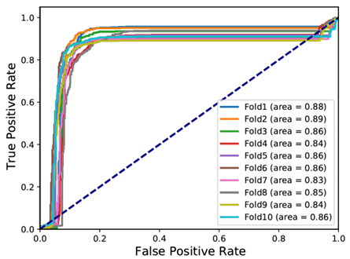
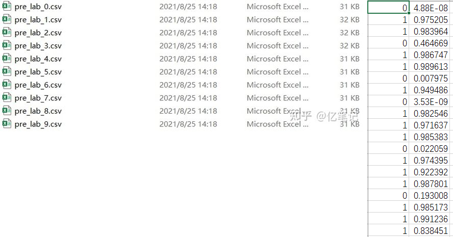
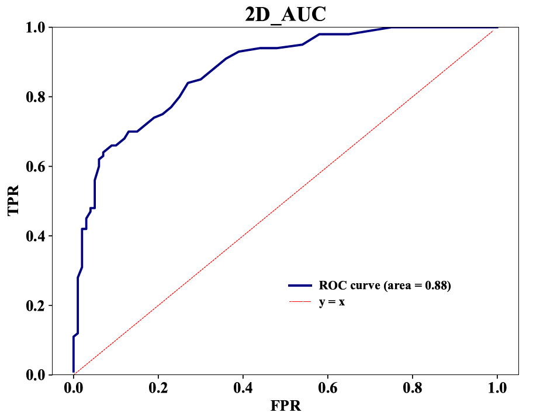
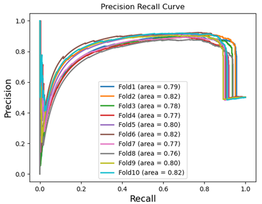
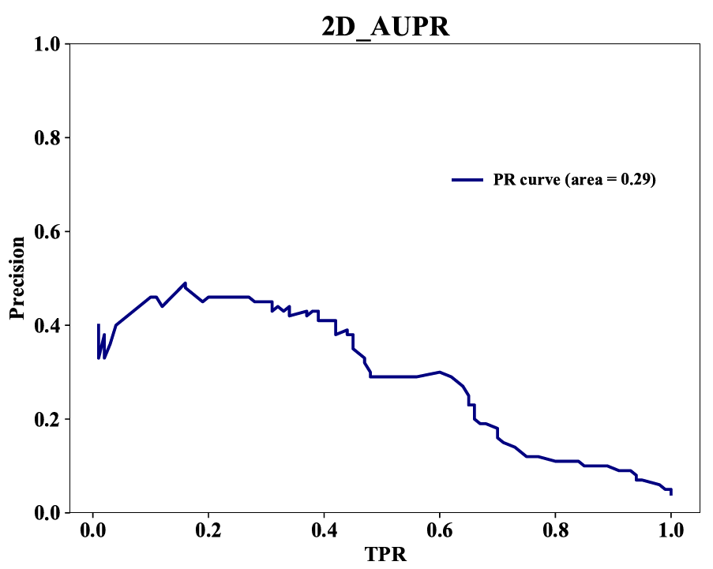

👏 Python绘图|Python绘制ROC曲线和PR曲线

---
[TOC]

---
写在前面：AUC和AUPR是模型评估中的两个重要指标。AUC反映了模型的查准率，AUPR反映了模型的查全率。ROC曲线下面积即AUC，PR曲线下面积即AUPR。该文章中使用Python绘制ROC曲线和PR曲线。

---
## 1. 多数据系列ROC曲线
（1）图片示例。


（2）输入数据格式。
这里使用的是十折交叉验证，所以会有十个文件，同时画曲线时会在同一张图中画十根曲线。数据共包含10个文件，每个文件格式如下图所示。  



（3）绘图代码。
运行下述命令：
```shell
python auc.py
```
auc.py内容如下：
```python
import matplotlib.pyplot as plt
from sklearn.metrics import roc_curve, auc
from sklearn.metrics import roc_auc_score
import csv
import sys
import numpy as np

def ro_curve(y_pred, y_label, figure_file, method_name):
    '''
        y_pred is a list of length n.  (0,1)
        y_label is a list of same length. 0/1
        https://scikit-learn.org/stable/auto_examples/model_selection/plot_roc.html#sphx-glr-auto-examples-model-selection-plot-roc-py  
    '''
    y_label = np.array(y_label)
    y_pred = np.array(y_pred)    
    fpr = dict()
    tpr = dict() 
    roc_auc = dict()
    fpr[0], tpr[0], _ = roc_curve(y_label, y_pred)
    roc_auc[0] = auc(fpr[0], tpr[0])
    lw = 2
    plt.plot(fpr[0], tpr[0],
         lw=lw, label= method_name + ' (area = %0.2f)' % roc_auc[0])
    plt.plot([0, 1], [0, 1], color='navy', lw=lw, linestyle='--')
    plt.xlim([0.0, 1.0])
    plt.ylim([0.0, 1.05])
    # plt.xticks(font="Times New Roman",size=18,weight="bold")
    # plt.yticks(font="Times New Roman",size=18,weight="bold")
    fontsize = 14
    plt.xlabel('False Positive Rate', fontsize = fontsize)
    plt.ylabel('True Positive Rate', fontsize = fontsize)
    #plt.title('Receiver Operating Characteristic Curve', fontsize = fontsize)
    plt.legend(loc="lower right")
    plt.savefig(figure_file + ".pdf")
    return 

def col_pic():
    for i in range(10):
        y_label = []
        y_pred = []
        with open("pre_lab_" + str(i) + ".csv") as f:
            f1 = csv.reader(f)
            for line in f1:
                y_label.append(int(float(line[0])))
                # if float(line[1]) > 0.5:
                #     y_pred.append(1)
                # else:
                #     y_pred.append(0)
                y_pred.append(float(line[1]))
            ro_curve(y_pred,y_label,"auc_val_1","Fold" + str(i+1))

def main():
    col_pic()
    
if __name__=="__main__":
    main() 
```

---
## 2. 单数据系列ROC曲线
（1）图片示例。


（2）绘图代码。
```python
import sys
import numpy as np
import matplotlib.pyplot as plt
from sklearn.metrics import auc  ###计算roc和auc
import pandas as pd

def huitu(file):
    df = pd.read_csv(file, encoding='utf8', delimiter=',', header=0)
    tpr = df.TPR
    fpr = df.FPR
    #presion = df.Precision
    roc_auc = auc(fpr,tpr) ###计算auc的值
    fig = plt.figure(figsize=(8,6))
    plt.plot(fpr, tpr, color='navy', lw=2, label='ROC curve (area = %0.2f)' % roc_auc)
    m=np.arange(0,1,0.01)
    plt.plot(m, m, "r--", lw=0.5, label='y = x')
    plt.ylim(0,1)
    plt.xticks(font="Times New Roman",size=15,weight="bold")
    plt.yticks(font="Times New Roman",size=15,weight="bold")
    plt.xlabel('FPR', fontproperties="Times New Roman",fontsize=15,weight="bold")
    plt.ylabel('TPR', fontproperties="Times New Roman",fontsize=15,weight="bold")
    plt.title('2D3D_AUC', fontproperties='Times New Roman', fontsize=20,weight="bold") 
    plt.legend(loc=(0.50,0.18),ncol=1,frameon=False,prop="Times New Roman")
    leg = plt.gca().get_legend()
    ltext = leg.get_texts()
    plt.setp(ltext, fontsize=12, weight="bold")

    plt.show()

    nme = file.strip(".txt")
    fig.savefig(nme + '.pdf')

def main():
    file = str(sys.argv[1])
    huitu(file)
    
if __name__=="__main__":
    main() 
```

---
## 3. 多数据系列PR曲线
（1）图片示例。


（2）输入数据格式。


（3）绘图代码。
运行下述命令：
```shell
python aupr.py
```
aupr.py内容如下：
```python
import matplotlib.pyplot as plt
from sklearn.metrics import precision_recall_curve, average_precision_score
from sklearn.metrics import f1_score
from sklearn.metrics import auc
import csv
import sys
import numpy as np

def ro_curve(y_pred, y_label, figure_file, method_name):
    '''
        y_pred is a list of length n.  (0,1)
        y_label is a list of same length. 0/1
        https://scikit-learn.org/stable/auto_examples/model_selection/plot_roc.html#sphx-glr-auto-examples-model-selection-plot-roc-py  
    '''
    y_label = np.array(y_label)
    y_pred = np.array(y_pred)    
    # fpr = dict()
    # tpr = dict() 
    # roc_auc = dict()
    # fpr[0], tpr[0], _ = precision_recall_curve(y_label, y_pred)
    # roc_auc[0] = auc(fpr[0], tpr[0])
    # lw = 2
    # plt.plot(fpr[0], tpr[0],
    #      lw=lw, label= method_name + ' (area = %0.2f)' % roc_auc[0])
    # plt.plot([0, 1], [0, 1], color='navy', lw=lw, linestyle='--')
    # plt.xlim([0.0, 1.0])
    # plt.ylim([0.0, 1.05])
    # fontsize = 14
    # plt.xlabel('Recall', fontsize = fontsize)
    # plt.ylabel('Precision', fontsize = fontsize)
    # plt.title('Precision Recall Curve')
    # plt.legend(loc="lower right")
    # plt.savefig(figure_file)
    lr_precision, lr_recall, _ = precision_recall_curve(y_label, y_pred)    
#   plt.plot([0,1], [no_skill, no_skill], linestyle='--')
    plt.plot(lr_recall, lr_precision, lw = 2, label= method_name + ' (area = %0.2f)' % average_precision_score(y_label, y_pred))
    fontsize = 14
    plt.xlabel('Recall', fontsize = fontsize)
    plt.ylabel('Precision', fontsize = fontsize)
    plt.title('Precision Recall Curve')
    plt.legend()
    plt.savefig(figure_file)
    return 

def col_pic():
    for i in range(10):
        y_label = []
        y_pred = []
        with open("pre_lab_" + str(i) + ".csv") as f:
            f1 = csv.reader(f)
            for line in f1:
                y_label.append(float(line[0]))
                # if float(line[1]) > 0.5:
                #     y_pred.append(1)
                # else:
                #     y_pred.append(0)
                y_pred.append(float(line[1]))
            ro_curve(y_pred,y_label,"aupr_val_1","Fold" + str(i+1))

def main():
    col_pic()
    
if __name__=="__main__":
    main() 
```

---
## 4. 单数据系列PR曲线
（1）图片示例。


（2）绘图代码。
```python
import sys
import numpy as np
import matplotlib.pyplot as plt
from sklearn.metrics import auc  ###计算roc和auc
import pandas as pd

def huitu(file):
    df = pd.read_csv(file, encoding='utf8', delimiter=',', header=0)
    tpr = df.TPR
    #fpr = df.FPR
    presion = df.Precision
    roc_auc = auc(tpr,presion) ###计算auc的值
    fig = plt.figure(figsize=(8,6))
    plt.plot(tpr, presion, color='navy', lw=2, label='PR curve (area = %0.2f)' % roc_auc)
    #m=np.arange(0,1,0.01)
    #plt.plot(m, m, "r--", lw=0.5, label='y = x')
    plt.ylim(0,1)
    plt.xticks(font="Times New Roman",size=15,weight="bold")
    plt.yticks(font="Times New Roman",size=15,weight="bold")
    plt.xlabel('TPR', fontproperties="Times New Roman",fontsize=15,weight="bold")
    plt.ylabel('Precision', fontproperties="Times New Roman",fontsize=15,weight="bold")
    plt.title('2D3D_AUPR', fontproperties='Times New Roman', fontsize=20,weight="bold") 
    plt.legend(loc=(0.60,0.68),ncol=1,frameon=False,prop="Times New Roman")
    leg = plt.gca().get_legend()
    ltext = leg.get_texts()
    plt.setp(ltext, fontsize=12, weight="bold")

    plt.show()

    nme = file.strip(".txt")
    fig.savefig(nme + '.pdf')

def main():
    file = str(sys.argv[1])
    huitu(file)
    
if __name__=="__main__":
    main() 
```