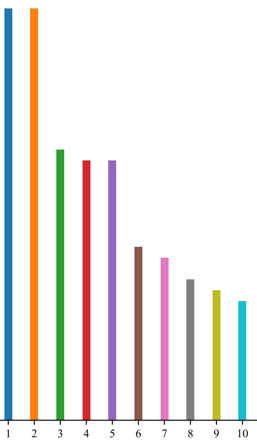

👏 Python绘图|matplotlib绘图设置细节系统性详解

---
[TOC]

---
## Color
（1）官方默认的前10种颜色
```python
colors = ['#1f77b4', '#ff7f0e', '#2ca02c', '#d62728', '#9467bd', '#8c564b', '#e377c2', '#7f7f7f', '#bcbd22', '#17becf']
```
如下图：
