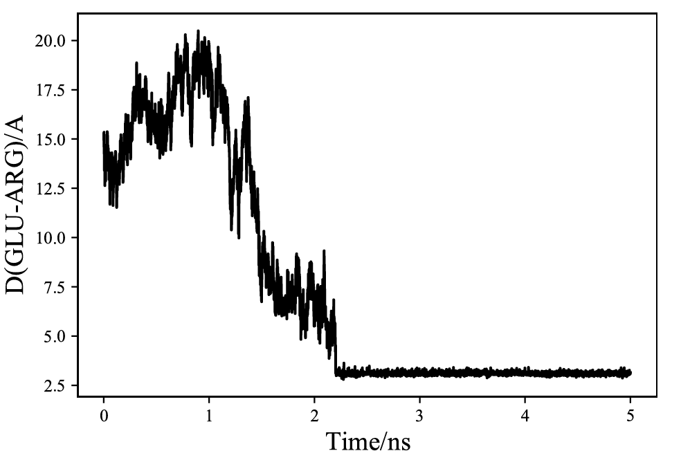
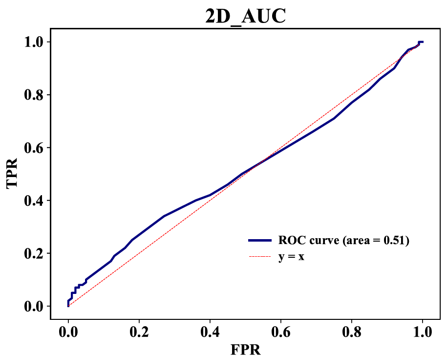

👏 Python绘图|单数据系列折线图

---
[TOC]

---
## 普通单数据系列折线图
### 例1
（1）图片示例。


（2）输入数据格式。


（3）绘图脚本。
```python
import sys
import seaborn as sns
import pandas as pd
import matplotlib.pyplot as plt

def huitu(file):
    df=pd.read_csv(file)
    fig =plt.figure(figsize=(6,4), dpi=100)
    plt.plot(df.Time, df.Dis, color='black')
    #plt.plot(df.index, df.AAPL, color='#06BCF9', label='AAPL')
    plt.xticks(size=12,font="Times New Roman") 
    plt.yticks(size=12,font="Times New Roman") 
    plt.xlabel("Time/ns",fontproperties="Times New Roman",fontsize=15)
    plt.ylabel("D(GLU-ARG)/A",fontproperties="Times New Roman", fontsize=15)
    #plt.legend(loc='upper left',edgecolor='none',facecolor='none')
    fig.savefig('Figure.pdf')

def main():
    file = str(sys.argv[1])
    huitu(file)
    
if __name__=="__main__":
    main() 
```

### 例2
（1）图片示例。


（2）绘图代码。
```python
import sys
import numpy as np
import matplotlib.pyplot as plt
from sklearn.metrics import auc  ###计算roc和auc
import pandas as pd

def huitu(file):
    df = pd.read_csv(file, encoding='utf8', delimiter=',', header=0)
    tpr = df.TPR
    fpr = df.FPR
    roc_auc = auc(fpr, tpr) ###计算auc的值
    fig = plt.figure(figsize=(10,8))
    plt.plot(fpr, tpr, color='navy', lw=2, label='ROC curve (area = %0.2f)' % roc_auc)
    m=np.arange(0,1,0.01)
    plt.plot(m, m, "r--", lw=0.5, label='y = x')
    plt.xticks(font="Times New Roman",size=15,weight="bold")
    plt.yticks(font="Times New Roman",size=15,weight="bold")
    plt.xlabel('FPR', fontproperties="Times New Roman",fontsize=15,weight="bold")
    plt.ylabel('TPR', fontproperties="Times New Roman",fontsize=15,weight="bold")
    plt.title('2D_AUC', fontproperties='Times New Roman', fontsize=20,weight="bold") 
    plt.legend(loc=(0.50,0.18),ncol=1,frameon=False,prop="Times New Roman")
    leg = plt.gca().get_legend()
    ltext = leg.get_texts()
    plt.setp(ltext, fontsize=12, weight="bold")

    plt.show()

    nme = file.strip(".txt")
    fig.savefig(nme + '.pdf')

def main():
    file = str(sys.argv[1])
    huitu(file)
    
if __name__=="__main__":
    main() 
```