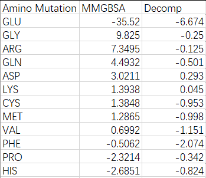
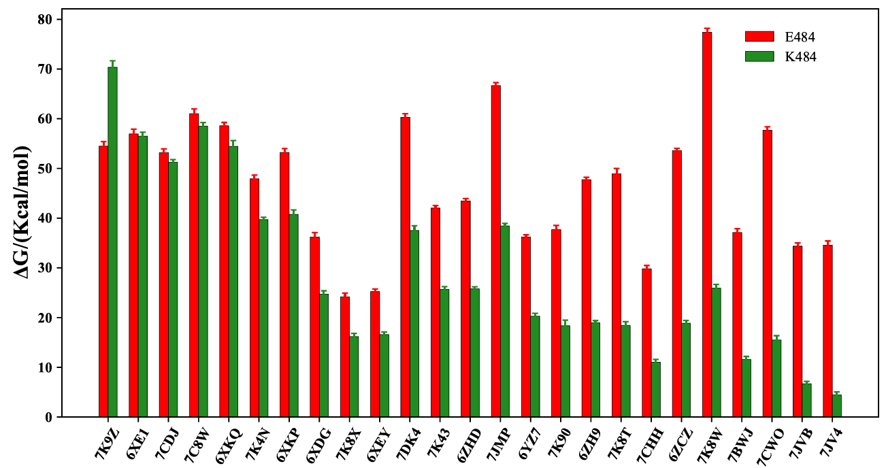
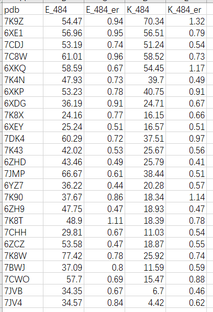
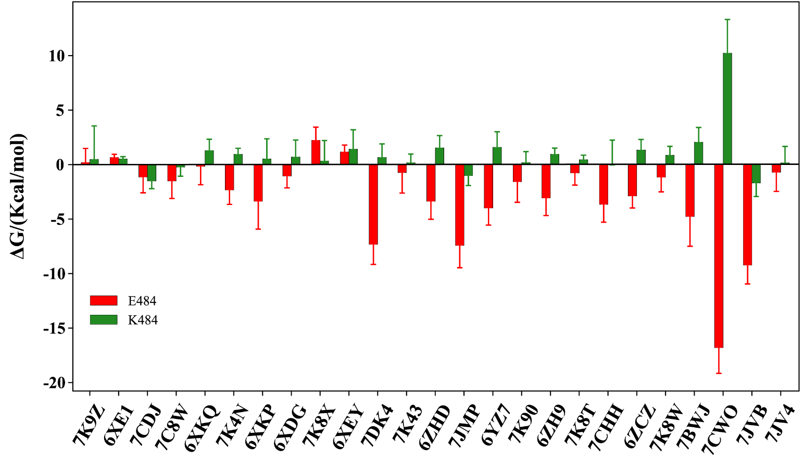
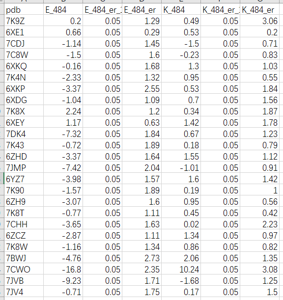
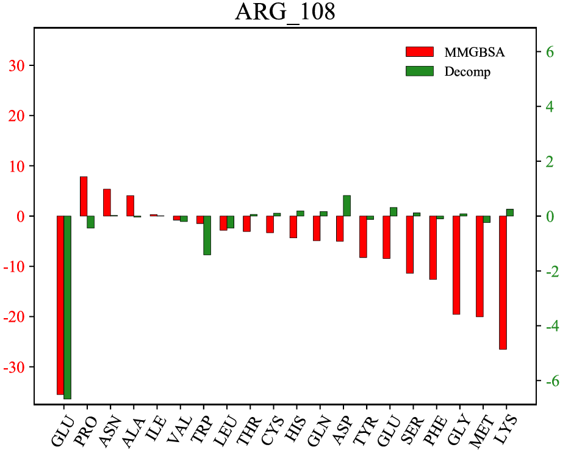
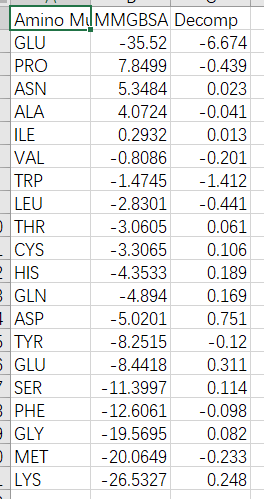

👏 Python绘图|双数据系列柱状图

---
[TOC]

---
## 普通双数据系列柱状图
（1）图片示例，如下图所示：  
  

（2）应用场景
有两组成对数据需要放在一起比较的；或者两组数据间的比较。  

（3）输入数据格式
输入文件：csv文件，如下图所示：  
  

（4）绘图脚本
* 创建一个py脚本，内容如下所示：
```python
import sys
from matplotlib import cm,colors
from matplotlib import pyplot as plt
from matplotlib.pyplot import figure, show, rc
import numpy as np
import pandas as pd

#%matplotlib inline                   
plt.rcParams["font.sans-serif"]='SimHei'   #解决中文乱码问题
plt.rcParams['axes.unicode_minus']=False   #解决负号无法显示的问题
plt.rc('axes',axisbelow=True)  

def col_pic(file):
    df=pd.read_csv(file)
    #df=df.sort_values(by='1996', ascending=False)

    x_label=np.array(df["Amino Mutation"])
    x=np.arange(len(x_label))
    y1=np.array(df["MMGBSA"])
    y2=np.array(df["Decomp"])

    fig=plt.figure(figsize=(5,5))
    plt.subplots_adjust(left=0.1, right=0.9, top=0.9, bottom=0.1)           #设置绘图区域大小位置

    plt.bar(x,y1,width=0.3,color='#00AFBB',label='MMGBSA',edgecolor='k', linewidth=0.25)                     #调整y1轴位置，颜色，label为图例名称，与下方legend结合使用
    plt.bar(x+0.3,y2,width=0.3,color='#FC4E07',label='Decomp',edgecolor='k', linewidth=0.25)                 #调整y2轴位置，颜色，label为图例名称，与下方legend结合使用
    plt.xticks(x+0.15,x_label,font="Times New Roman",size=12,rotation=90)                                #设置x轴刻度，位置,大小

    plt.legend(loc=(0.73,0.85),ncol=1,frameon=False,prop="Times New Roman")    #显示图例，loc图例显示位置(可以用坐标方法显示），ncol图例显示几列，默认为1列,frameon设置图形边框

    plt.yticks(font="Times New Roman",size=12)                                          #设置y轴刻度，位置,大小
    #plt.grid(axis="y",c=(217/256,217/256,217/256))        #设置网格线
                     #将y轴网格线置于底层
    #plt.xlabel("Quarter",labelpad=10,size=18,)                          #设置x轴标签,labelpad设置标签距离x轴的位置
    #plt.ylabel("Amount",labelpad=10,size=18,)                                   #设置y轴标签,labelpad设置标签距离y轴的位置

    ax = plt.gca()                         #获取整个表格边框
    #ax.spines['top'].set_color('none')  # 设置上‘脊梁’为无色
    #ax.spines['right'].set_color('none')  # 设置右‘脊梁’为无色
    #ax.spines['left'].set_color('none')  # 设置左‘脊梁’为无色

    fig.savefig('Figure.pdf')

def main():
    file = str(sys.argv[1])
    col_pic(file)
    
if __name__=="__main__":
    main() 
```
* 执行下述命令进行绘图
```shell
python py csv
```

## 带误差线的双数据系列柱状图
### 例1
（1）图片示例。


（2）输入数据格式。


（3）绘图脚本。
```python
import sys
from matplotlib import cm,colors
from matplotlib import pyplot as plt
from matplotlib.pyplot import figure, show, rc
import numpy as np
import pandas as pd

#%matplotlib inline                   
plt.rcParams["font.sans-serif"]='SimHei'   #解决中文乱码问题
plt.rcParams['axes.unicode_minus']=False   #解决负号无法显示的问题
plt.rc('axes',axisbelow=True)  

def col_pic(file):
    df=pd.read_csv(file)
    #df=df.sort_values(by='1996', ascending=False)

    x_label=np.array(df["pdb"])
    x=np.arange(len(x_label))
    y1=np.array(df["E_484"])
    er_1=np.array(df["E_484_er"])
    y2=np.array(df["K_484"])
    er_2=np.array(df["K_484_er"])
    error_attri_1={"elinewidth":1,"ecolor":"red","capsize":2}
    error_attri_2={"elinewidth":1,"ecolor":"forestgreen","capsize":2}

    fig=plt.figure(figsize=(10,5))
    plt.subplots_adjust(left=0.1, right=0.9, top=0.9, bottom=0.1)           #设置绘图区域大小位置

    plt.bar(x,y1,width=0.3,color='red',label='E484',edgecolor='k', linewidth=0.25, yerr=er_1, error_kw=error_attri_1, alpha=1)                     #调整y1轴位置，颜色，label为图例名称，与下方legend结合使用
    plt.bar(x+0.3,y2,width=0.3,color='forestgreen',label='K484',edgecolor='k', linewidth=0.25, yerr=er_2, error_kw=error_attri_2, alpha=1)                 #调整y2轴位置，颜色，label为图例名称，与下方legend结合使用
    plt.xticks(x+0.15,x_label,font="Times New Roman",size=18,rotation=60,weight="bold")                                #设置x轴刻度，位置,大小

    plt.legend(loc=(0.83,0.85),ncol=1,frameon=False,prop="Times New Roman",)    #显示图例，loc图例显示位置(可以用坐标方法显示），ncol图例显示几列，默认为1列,frameon设置图形边框

    plt.yticks(font="Times New Roman",size=18,weight="bold")                                          #设置y轴刻度，位置,大小
    plt.xlabel('PDB', fontproperties="Times New Roman",fontsize=15,weight="bold")
    plt.ylabel('ΔG/(Kcal/mol)',fontproperties="Times New Roman",fontsize=15,weight="bold")
    #plt.grid(axis="y",c=(217/256,217/256,217/256))        #设置网格线
                     #将y轴网格线置于底层
    #plt.xlabel("Quarter",labelpad=10,size=18,)                          #设置x轴标签,labelpad设置标签距离x轴的位置
    #plt.ylabel("Amount",labelpad=10,size=18,)                                   #设置y轴标签,labelpad设置标签距离y轴的位置

    ax = plt.gca()                         #获取整个表格边框
    #ax.spines['top'].set_color('none')  # 设置上‘脊梁’为无色
    #ax.spines['right'].set_color('none')  # 设置右‘脊梁’为无色
    #ax.spines['left'].set_color('none')  # 设置左‘脊梁’为无色

    plt.show()
    fig.savefig('pdb_vG.pdf')

def main():
    file = str(sys.argv[1])
    col_pic(file)
    
if __name__=="__main__":
    main() 
```

### 例2
（1）图片示例。


（2）输入数据格式。


（3）绘图脚本。
```python
import sys
from matplotlib import cm,colors
from matplotlib import pyplot as plt
from matplotlib.pyplot import figure, show, rc
import numpy as np
import pandas as pd

#%matplotlib inline                   
plt.rcParams["font.sans-serif"]='SimHei'   #解决中文乱码问题
plt.rcParams['axes.unicode_minus']=False   #解决负号无法显示的问题
plt.rc('axes',axisbelow=True)  

def col_pic(file):
    df=pd.read_csv(file)
    #df=df.sort_values(by='1996', ascending=False)

    x_label=np.array(df["pdb"])
    x=np.arange(len(x_label))
    y1=np.array(df["E_484"])
    er_1=np.array(df["E_484_er"])
    er_1_1=np.array(df["E_484_er_1"])
    for i in range(len(x_label)):
        if y1[i] < 0:
            er_1[i], er_1_1[i] = er_1_1[i], er_1[i]
    er_1=[er_1_1,er_1]
    y2=np.array(df["K_484"])
    er_2=np.array(df["K_484_er"])
    er_2_1=np.array(df["K_484_er_1"])
    for i in range(len(x_label)):
        if y2[i] < 0:
            er_2[i], er_2_1[i] = er_2_1[i], er_2[i]
    er_2=[er_2_1,er_2]
    error_attri_1={"elinewidth":1,"ecolor":"red","capsize":2}
    error_attri_2={"elinewidth":1,"ecolor":"forestgreen","capsize":2}

    fig=plt.figure(figsize=(10,3))
    plt.subplots_adjust(left=0.1, right=0.9, top=0.9, bottom=0.2)           #设置绘图区域大小位置

    plt.bar(x,y1,width=0.3,color='red',label='E484',edgecolor='k', linewidth=0.25, yerr=er_1, error_kw=error_attri_1, alpha=1)                     #调整y1轴位置，颜色，label为图例名称，与下方legend结合使用
    plt.bar(x+0.3,y2,width=0.3,color='forestgreen',label='K484',edgecolor='k', linewidth=0.25, yerr=er_2, error_kw=error_attri_2, alpha=1)                 #调整y2轴位置，颜色，label为图例名称，与下方legend结合使用
    plt.xticks(x+0.15,x_label,font="Times New Roman",size=10,rotation=60,weight="bold")                                #设置x轴刻度，位置,大小

    plt.legend(loc=(0.05,0.15),ncol=1,frameon=False,prop="Times New Roman")    #显示图例，loc图例显示位置(可以用坐标方法显示），ncol图例显示几列，默认为1列,frameon设置图形边框

    plt.yticks(font="Times New Roman",size=10,weight="bold")                                          #设置y轴刻度，位置,大小
    plt.xlabel('PDB', fontproperties="Times New Roman",fontsize=12,weight="bold")
    plt.ylabel('ΔG/(Kcal/mol)',fontproperties="Times New Roman",fontsize=12,weight="bold")
    #plt.grid(axis="y",c=(217/256,217/256,217/256))        #设置网格线
                     #将y轴网格线置于底层
    #plt.xlabel("Quarter",labelpad=10,size=18,)                          #设置x轴标签,labelpad设置标签距离x轴的位置
    #plt.ylabel("Amount",labelpad=10,size=18,)                                   #设置y轴标签,labelpad设置标签距离y轴的位置

    ax = plt.gca()                         #获取整个表格边框
    #ax.spines['top'].set_color('none')  # 设置上‘脊梁’为无色
    #ax.spines['right'].set_color('none')  # 设置右‘脊梁’为无色
    #ax.spines['left'].set_color('none')  # 设置左‘脊梁’为无色

    plt.show()
    fig.savefig('temp.pdf')

def main():
    file = str(sys.argv[1])
    col_pic(file)
    
if __name__=="__main__":
    main() 
```

## 双轴双数据系列柱状图
### 例1
（1）图片示例。


（2）输入数据格式。


（3）绘图脚本。
```python
import sys
from matplotlib import cm,colors
from matplotlib import pyplot as plt
from matplotlib.pyplot import figure, show, rc
import numpy as np
import pandas as pd

plt.rcParams["font.sans-serif"]='SimHei'   #解决中文乱码问题
plt.rcParams['axes.unicode_minus']=False   #解决负号无法显示的问题
plt.rc('axes',axisbelow=True)  

def col_pic(file):
    df=pd.read_csv(file)
    #df=df.sort_values(by='1996', ascending=False)

    x_label=np.array(df["Amino Mutation"])
    x=np.arange(len(x_label))
    y1=np.array(df["MMGBSA"])
    y2=np.array(df["Decomp"])

    fig=plt.figure(figsize=(10,10))
    fig,ax1=plt.subplots()
    ax1.set_ylim(-abs(max(y1,key=abs))-2,(abs(max(y1,key=abs))+2)/1)
    plt.subplots_adjust(left=0.1, right=0.9, top=0.9, bottom=0.1)           #设置绘图区域大小位置

    b1 = plt.bar(x,y1,width=0.3,color='red',label='MMGBSA',edgecolor='k', linewidth=0.25)                     #调整y1轴位置，颜色，label为图例名称，与下方legend结合使用
    plt.xticks(x+0.15,x_label,font="Times New Roman",size=12,rotation=60)                                #设置x轴刻度，位置,大小
    plt.yticks(font="Times New Roman",size=12,color="red")
    
    ax2=ax1.twinx()#产生一个ax1的镜面坐标
    b2 = plt.bar(x+0.3,y2,width=0.3,color='forestgreen',label='Decomp',edgecolor='k', linewidth=0.25)                 #调整y2轴位置，颜色，label为图例名称，与下方legend结合使用
    ax2.set_ylim(-abs(max(y2,key=abs))-0.2,(abs(max(y2,key=abs))+0.2)/1)
    plt.yticks(font="Times New Roman",size=12,color="forestgreen")

    plt.legend(handles=[b1,b2],loc=(0.73,0.85),ncol=1,frameon=False,prop="Times New Roman")    #显示图例，loc图例显示位置(可以用坐标方法显示），ncol图例显示几列，默认为1列,frameon设置图形边框

    #plt.yticks(font="Times New Roman",size=12)                                          #设置y轴刻度，位置,大小
    #plt.grid(axis="y",c=(217/256,217/256,217/256))        #设置网格线
                     #将y轴网格线置于底层
    #plt.xlabel("Quarter",labelpad=10,size=18,)                          #设置x轴标签,labelpad设置标签距离x轴的位置
    #plt.ylabel("Amount",labelpad=10,size=18,)                                   #设置y轴标签,labelpad设置标签距离y轴的位置

    ax = plt.gca()                         #获取整个表格边框
    #ax.spines['top'].set_color('none')  # 设置上‘脊梁’为无色
    #ax.spines['right'].set_color('none')  # 设置右‘脊梁’为无色
    #ax.spines['left'].set_color('none')  # 设置左‘脊梁’为无色

    plt.title('ARG_108', fontproperties='Times New Roman', fontsize=18)

    fig.show()
    fig.savefig('ARG_108.pdf')

def main():
    file = str(sys.argv[1])
    col_pic(file)
    
if __name__=="__main__":
    main() 
```