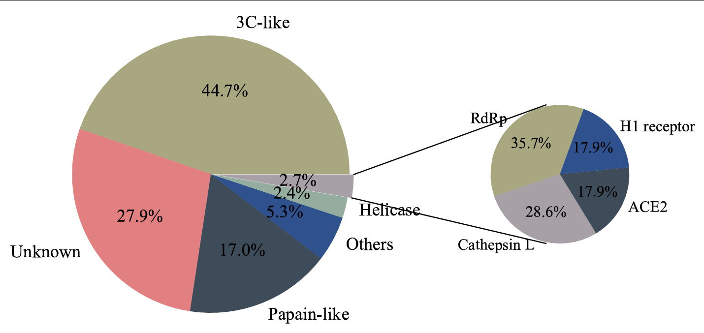

👏 Python绘图|复合饼图绘制

---
[TOC]

---
## Demo
如下图所示：  
  

## 应用场景
饼图的类别太多的时候采用复合饼图进行绘制。  

## 输入数据格式
```python
data = {'category': ['3C-like', 'Unknown', 'Papain-like', 'Others', 'Helicase', ''],
        'quantity': [44.7, 27.9, 17.0, 5.3, 2.4, 2.7]
       }

others = {'category': ['RdRp', 'Cathepsin L', 'ACE2', 'H1 receptor'],
          'quantity': [10, 8, 5, 5]
         }
```

## 绘图脚本
```python
import matplotlib as mpl
import matplotlib.pyplot as plt
from matplotlib.patches import ConnectionPatch
import numpy as np

def huitu():
    # 使图表元素中正常显示中文
    mpl.rcParams['font.sans-serif'] = 'SimHei'
    # 使坐标轴刻度标签正常显示负号
    mpl.rcParams['axes.unicode_minus'] = False

    # 画布
    fig = plt.figure(figsize=(12, 6),
                     facecolor='white'
                    )
    ax1 = fig.add_subplot(121)
    ax2 = fig.add_subplot(122)
    fig.subplots_adjust(wspace=0)

    # 定义数据
    data = {'category': ['3C-like', 'Unknown', 'Papain-like', 'Others', 'Helicase', ''],
            'quantity': [44.7, 27.9, 17.0, 5.3, 2.4, 2.7]
           }

    others = {'category': ['RdRp', 'Cathepsin L', 'ACE2', 'H1 receptor'],
              'quantity': [10, 8, 5, 5]
             }

    # 大饼图
    labs = data['category']
    quantity = data['quantity']
    explode = (0, 0, 0, 0, 0, 0.03)    # 分裂距离

    ax1.pie(x=quantity,
            colors=['#A9A780', '#E28081', '#3E4C59', '#2F528F', '#95AD9F', '#A7A0A7'],
            explode=explode,
            autopct='%1.1f%%',
            #startangle=0,
            labels=labs,
            textprops={'color': 'k',
                       'font': 'Times New Roman',
                       'fontsize': 17,
                      }
           )

    # 小饼图
    labs2 = others['category']
    quantity_2 = others['quantity']

    ax2.pie(x=quantity_2,
            colors=['#A9A780', '#A7A0A7', '#3E4C59', '#2F528F'],
            autopct='%1.1f%%',
            startangle=70,
            labels=labs2,
            radius=0.5,
          #  shadow=True,
            textprops={'color': 'k',
                       'font': 'Times New Roman',
                       'fontsize': 15,
                      },
           )

    # 用 ConnectionPatch 画出两个饼图的间连线
    ## 饼图边缘的数据
    theta1 = ax1.patches[-1].theta1
    theta2 = ax1.patches[-1].theta2
    center = ax1.patches[-1].center
    r = ax1.patches[-1].r

    width=0.2
    # 上边缘的连线
    x = r*np.cos(np.pi/180*theta2)+center[0]
    y = np.sin(np.pi/180*theta2)+center[1]
    con_a = ConnectionPatch(xyA=(-width/2,0.5), xyB=(x,y),
                            coordsA='data', coordsB='data',
                            axesA=ax2, axesB=ax1
                           )

    # 下边缘的连线
    x = r*np.cos(np.pi/180*theta1)+center[0]
    y = np.sin(np.pi/180*theta1)+center[1]
    con_b = ConnectionPatch(xyA=(-width/2,-0.5), xyB=(x,y),
                            coordsA='data', coordsB='data',
                            axesA=ax2, axesB=ax1
                           )

    for con in [con_a, con_b]:
        con.set_linewidth(1)    # 连线宽度
        con.set_color=([0,0,0])    # 连线颜色
        ax2.add_artist(con)   # 添加连线

    fig.savefig('Figure.pdf')

def main():
    huitu()

if __name__ == '__main__':
    main()
```

## 参考
(1) https://blog.csdn.net/imakeithappen/article/details/104185686  