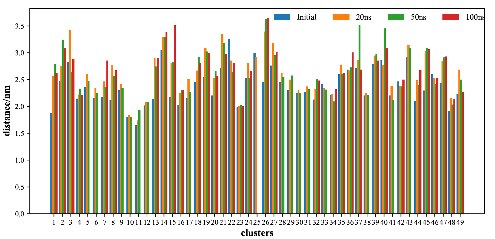
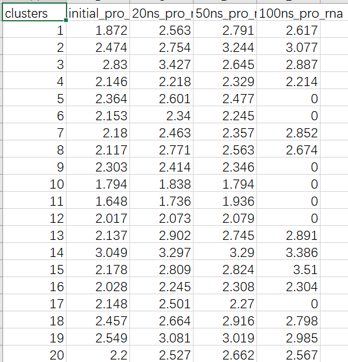

👏 Python绘图|多数据系列柱状图

---
[TOC]

---
## 普通多数据系列柱状图
### 例1
（1）图片示例。


（2）输入数据格式。


（3）绘图脚本。
```python
import sys
from matplotlib import cm,colors
from matplotlib import pyplot as plt
from matplotlib.pyplot import figure, show, rc
import numpy as np
import pandas as pd

#%matplotlib inline                   
plt.rcParams["font.sans-serif"]='SimHei'   #解决中文乱码问题
plt.rcParams['axes.unicode_minus']=False   #解决负号无法显示的问题
plt.rc('axes',axisbelow=True)  

def col_pic(file):
    df=pd.read_csv(file)
    #df=df.sort_values(by='1996', ascending=False)

    x_label=np.array(df["clusters"])
    x=np.arange(len(x_label))
    y1=np.array(df["initial_pro_rna"])
    y2=np.array(df["20ns_pro_rna"])
    y3=np.array(df["50ns_pro_rna"])
    y4=np.array(df["100ns_pro_rna"])

    fig=plt.figure(figsize=(20,5))
    plt.subplots_adjust(left=0.1, right=0.9, top=0.9, bottom=0.1)           #设置绘图区域大小位置

    # plt.bar(x,y1,width=0.3,color='#00AFBB',label='Initial',edgecolor='#00AFBB', linewidth=0.25)                     #调整y1轴位置，颜色，label为图例名称，与下方legend结合使用
    plt.bar(x,y1,width=0.2,label='Initial',edgecolor='#00AFBB', linewidth=0)
    # plt.bar(x+0.3,y2,width=0.3,color='#FC4E07',label='20ns',edgecolor='#FC4E07', linewidth=0.25)                 #调整y2轴位置，颜色，label为图例名称，与下方legend结合使用
    plt.bar(x+0.2,y2,width=0.2,label='20ns',edgecolor='#00AFBB', linewidth=0)
    plt.bar(x+0.4,y3,width=0.2,label='50ns',edgecolor='#00AFBB', linewidth=0)
    plt.bar(x+0.6,y4,width=0.2,label='100ns',edgecolor='#00AFBB', linewidth=0)
    plt.xticks(x+0.3,x_label,font="Times New Roman",size=9)      # rotation=90                          #设置x轴刻度，位置,大小

    plt.legend(loc=(0.53,0.92),ncol=4,frameon=False,prop="Times New Roman")    #显示图例，loc图例显示位置(可以用坐标方法显示），ncol图例显示几列，默认为1列,frameon设置图形边框

    plt.yticks(font="Times New Roman",size=9)                                          #设置y轴刻度，位置,大小
    #plt.grid(axis="y",c=(217/256,217/256,217/256))        #设置网格线
                     #将y轴网格线置于底层
    #plt.xlabel("Quarter",labelpad=10,size=18,)                          #设置x轴标签,labelpad设置标签距离x轴的位置
    #plt.ylabel("Amount",labelpad=10,size=18,)                                   #设置y轴标签,labelpad设置标签距离y轴的位置
    plt.xlabel('clusters', fontproperties="Times New Roman",fontsize=12,weight="bold")
    plt.ylabel('distance/nm', fontproperties="Times New Roman",fontsize=12,weight="bold")

    ax = plt.gca()                         #获取整个表格边框
    #ax.spines['top'].set_color('none')  # 设置上‘脊梁’为无色
    #ax.spines['right'].set_color('none')  # 设置右‘脊梁’为无色
    #ax.spines['left'].set_color('none')  # 设置左‘脊梁’为无色
    plt.show()

    fig.savefig('Figure.pdf')

def main():
    file = str(sys.argv[1])
    col_pic(file)
    
if __name__=="__main__":
    main() 
```