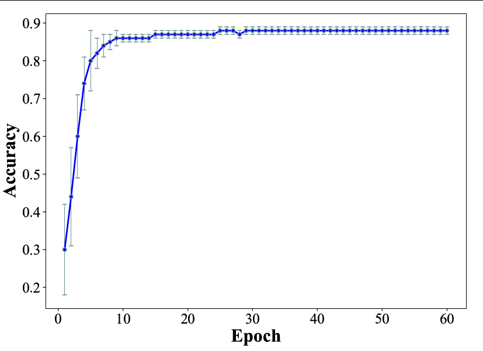
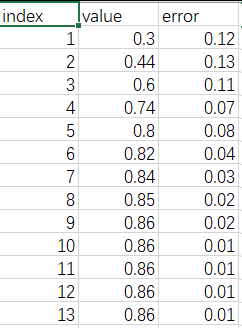

👏 Python绘图|带有误差线的散点图

---
[TOC]

---
## Demo
  

## 输入数据格式
  

## 绘图脚本
```python
import sys, math
from matplotlib import cm,colors
from matplotlib import pyplot as plt
from matplotlib.pyplot import figure, show, rc
import numpy as np
import pandas as pd

def col_pic(file):
    df = pd.read_csv(file)
    fig = plt.figure(figsize=(10,8))
    plt.subplots_adjust(left=0.1, right=0.9, top=0.9, bottom=0.2)
    ax = plt.gca()
    
    plt.errorbar(df['index'],df['value'],yerr=df['error'],fmt='b-o',lw = 2,ecolor='#6A8F95',mfc='blue',mec='#6A8F95',elinewidth=1,ms=5,capsize=3) 

    plt.xlabel('Epoch', fontproperties="Times New Roman",fontsize=25,weight="bold")
    plt.ylabel('Accuracy',fontproperties="Times New Roman",fontsize=25,weight="bold")
    plt.xticks(font="Times New Roman",size=20)      # size must be after the font.
    plt.yticks(font="Times New Roman",size=20)
    plt.show()
    fig.savefig('Acc_fold.pdf')

def main():
    file = str(sys.argv[1])
    col_pic(file)
    
if __name__=="__main__":
    main() 
```

## 误差线绘图参数
```python
plt.errorbar(x, y, yerr=None, xerr=None, fmt=’’, ecolor=None, elinewidth=None, capsize=None, capthick=None)  # 语法
# x, y: 数据点的位置坐标
# xerr, yerr: 数据的误差范围
# fmt: 数据点的标记样式以及相互之间连接线样式(例如'b-o'代表蓝色实线)
# ecolor: 误差棒的线条颜色
# elinewidth: 误差棒的线条粗细
# capsize: 误差棒边界横杠的大小
# capthick: 误差棒边界横杠的厚度
# ms: 数据点的大小
# mfc: 数据点的颜色
# mec: 数据点边缘的颜色
```