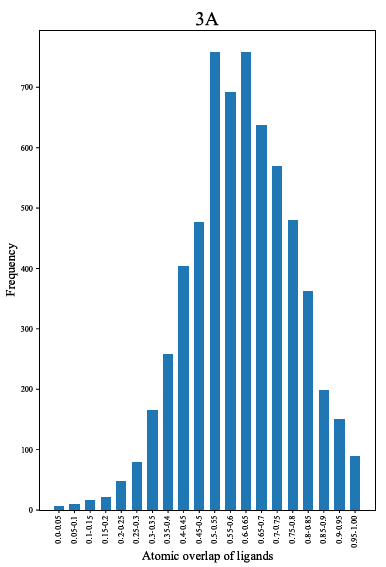
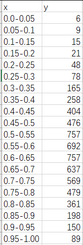
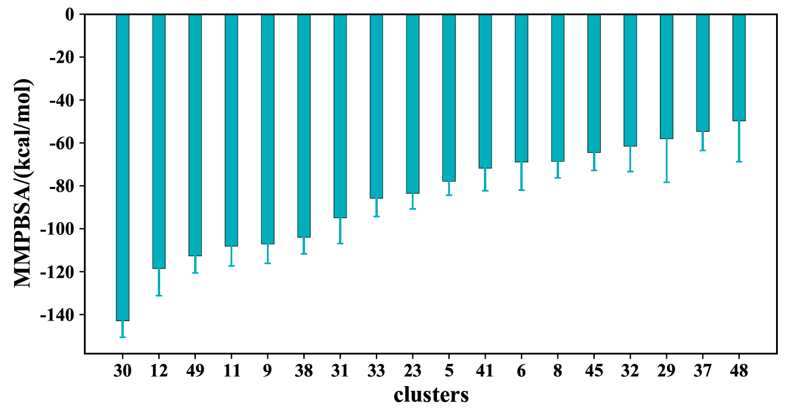

👏 Python绘图|普通单数据系列柱状图

---
[TOC]

---
## 普通单数据系列柱状图
### 例1
（1）图片示例如下所示：  
  

（2）输入文件：csv文件，如下图所示：  
  

（3）绘图脚本。  
```python
import sys
from matplotlib import cm,colors
from matplotlib import pyplot as plt
from matplotlib.pyplot import figure, show, rc
import numpy as np
import pandas as pd

def col_pic(file):
    df = pd.read_csv(file)
    fig = plt.figure(figsize=(7,10),dpi=70)
    plt.subplots_adjust(left=0.1, right=0.9, top=0.9, bottom=0.1)
    ax = plt.gca()
    plt.bar(df['x'],df['y'],width=0.6,align="center",label="Cut")
    plt.xlabel('Atomic overlap of ligands', fontproperties="Times New Roman",fontsize=15)
    plt.ylabel('Frequency',fontproperties="Times New Roman",fontsize=15)
    plt.xticks(font="Times New Roman",rotation=90,size=12)      # size must be after the font.
    plt.yticks(font="Times New Roman",size=12)
    plt.title('4A', fontproperties='Times New Roman', fontsize=23)
    plt.show()
    fig.savefig('Figure.pdf')

def main():
    file = str(sys.argv[1])
    col_pic(file)
    
if __name__=="__main__":
    main() 
```

## 带误差线的单数据系列柱状图
### 例1
（1）图片示例如下：


（2）输入数据格式：


（3）绘图脚本：
```python
import sys
from matplotlib import cm,colors
from matplotlib import pyplot as plt
from matplotlib.pyplot import figure, show, rc
import numpy as np
import pandas as pd

#%matplotlib inline                   
plt.rcParams["font.sans-serif"]='SimHei'   #解决中文乱码问题
plt.rcParams['axes.unicode_minus']=False   #解决负号无法显示的问题
plt.rc('axes',axisbelow=True)  

def col_pic(file):
    df=pd.read_csv(file)
    #df=df.sort_values(by='1996', ascending=False)

    x_label=np.array(df["clusters"])
    x=np.arange(len(x_label))
    y1=np.array(df["last_20ns_GB_deltaG"])
    er_1=np.array(df["SD"])
    # y2=np.array(df["K_484"])
    # er_2=np.array(df["K_484_er"])
    error_attri_1={"elinewidth":1,"ecolor":"#00AFBB","capsize":2}
    # error_attri_2={"elinewidth":1,"ecolor":"forestgreen","capsize":2}

    fig=plt.figure(figsize=(10,5))
    plt.subplots_adjust(left=0.1, right=0.9, top=0.9, bottom=0.1)           #设置绘图区域大小位置

    plt.bar(x,y1,width=0.35,color='#00AFBB',label='pbsa',edgecolor='k', linewidth=0.25, yerr=er_1, error_kw=error_attri_1, alpha=1)                     #调整y1轴位置，颜色，label为图例名称，与下方legend结合使用
    # plt.bar(x+0.3,y2,width=0.3,color='forestgreen',label='K484',edgecolor='k', linewidth=0.25, yerr=er_2, error_kw=error_attri_2, alpha=1)                 #调整y2轴位置，颜色，label为图例名称，与下方legend结合使用
    plt.xticks(x,x_label,font="Times New Roman",size=12,rotation=0,weight="bold")                                #设置x轴刻度，位置,大小

    # plt.legend(loc=(0.83,0.85),ncol=1,frameon=False,prop="Times New Roman",)    #显示图例，loc图例显示位置(可以用坐标方法显示），ncol图例显示几列，默认为1列,frameon设置图形边框

    plt.yticks(font="Times New Roman",size=12,weight="bold")                                          #设置y轴刻度，位置,大小
    plt.xlabel('clusters', fontproperties="Times New Roman",fontsize=15,weight="bold")
    plt.ylabel('MMPBSA/(kcal/mol)',fontproperties="Times New Roman",fontsize=15,weight="bold")
    #plt.grid(axis="y",c=(217/256,217/256,217/256))        #设置网格线
                     #将y轴网格线置于底层
    #plt.xlabel("Quarter",labelpad=10,size=18,)                          #设置x轴标签,labelpad设置标签距离x轴的位置
    #plt.ylabel("Amount",labelpad=10,size=18,)                                   #设置y轴标签,labelpad设置标签距离y轴的位置

    ax = plt.gca()                         #获取整个表格边框
    #ax.spines['top'].set_color('none')  # 设置上‘脊梁’为无色
    #ax.spines['right'].set_color('none')  # 设置右‘脊梁’为无色
    #ax.spines['left'].set_color('none')  # 设置左‘脊梁’为无色

    plt.show()
    fig.savefig('pdb_vG.pdf')

def main():
    file = str(sys.argv[1])
    col_pic(file)
    
if __name__=="__main__":
    main() 
```