`👏 Python绘图|绘制热图

---
[TOC]

---
## seaborn绘制热图
### 基础知识点
**cmap颜色设置**
（1）所有颜色参数：
> Accent, Accent_r, Blues, Blues_r, BrBG, BrBG_r, BuGn, BuGn_r, BuPu, BuPu_r, CMRmap, CMRmap_r, Dark2, Dark2_r, GnBu(绿到蓝), GnBu_r, Greens, Greens_r, Greys, Greys_r, OrRd（橘色到红色）, OrRd_r, Oranges, Oranges_r, PRGn, PRGn_r, Paired, Paired_r, Pastel1, Pastel1_r, Pastel2, Pastel2_r, PiYG, PiYG_r, PuBu, PuBuGn, PuBuGn_r, PuBu_r, PuOr, PuOr_r, PuRd, PuRd_r, Purples, Purples_r, RdBu, RdBu_r, RdGy, RdGy_r, RdPu, RdPu_r, RdYlBu, RdYlBu_r, RdYlGn, RdYlGn_r, Reds, Reds_r, Set1, Set1_r, Set2, Set2_r, Set3, Set3_r, Spectral, Spectral_r, Wistia（蓝绿黄）, Wistia_r, YlGn, YlGnBu, YlGnBu_r, YlGn_r, YlOrBr, YlOrBr_r, YlOrRd（红橙黄）, YlOrRd_r, afmhot, afmhot_r, autumn, autumn_r, binary, binary_r, bone, bone_r, brg, brg_r, bwr, bwr_r, cividis, cividis_r, cool, cool_r, coolwarm（蓝到红）, coolwarm_r, copper（铜色）, copper_r, cubehelix, cubehelix_r, flag, flag_r, gist_earth, gist_earth_r, gist_gray, gist_gray_r, gist_heat, gist_heat_r, gist_ncar, gist_ncar_r, gist_rainbow, gist_rainbow_r, gist_stern, gist_stern_r, gist_yarg, gist_yarg_r, gnuplot, gnuplot2, gnuplot2_r, gnuplot_r, gray, gray_r, hot, hot_r（红黄）, hsv, hsv_r, icefire, icefire_r, inferno, inferno_r, jet, jet_r, magma, magma_r, mako, mako_r, nipy_spectral, nipy_spectral_r, ocean, ocean_r, pink, pink_r, plasma, plasma_r, prism, prism_r, rainbow, rainbow_r, rocket, rocket_r, seismic, seismic_r, spring, spring_r, summer (黄到绿), summer_r (绿到黄), tab10, tab10_r, tab20, tab20_r, tab20b, tab20b_r, tab20c, tab20c_r, terrain, terrain_r, twilight, twilight_r, twilight_shifted, twilight_shifted_r, viridis, viridis_r, vlag, vlag_r, winter, winter_r

（2）颜色示例
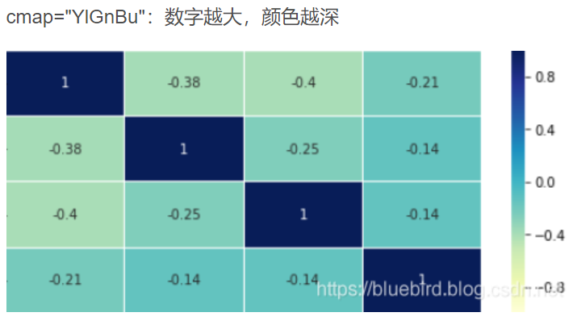
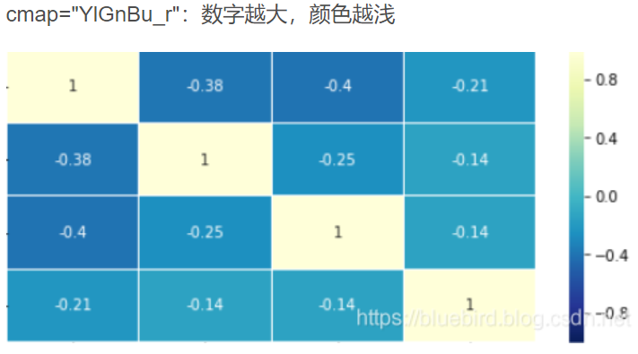
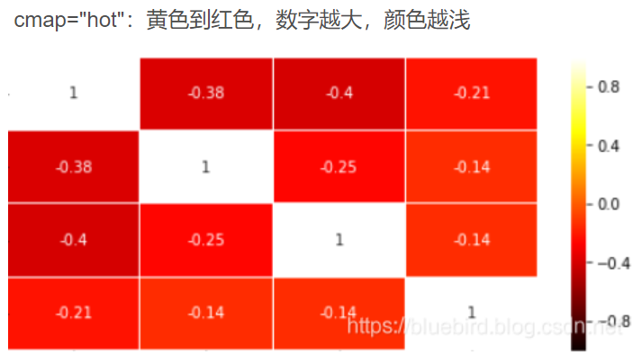
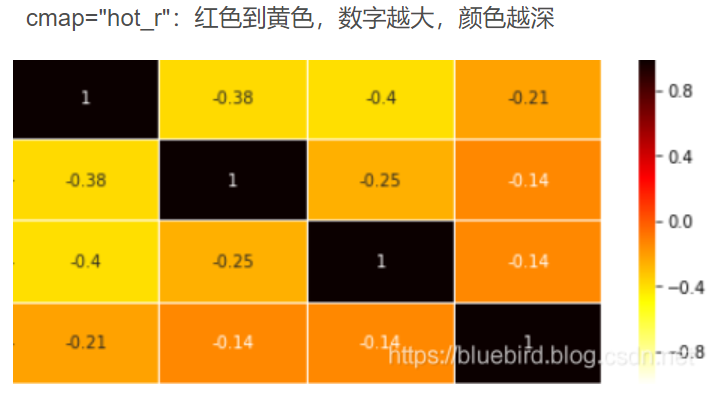
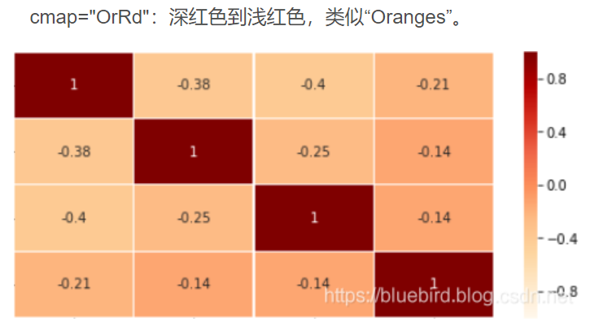
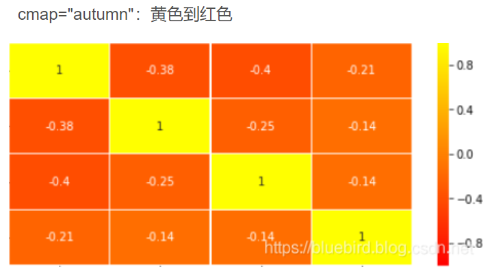
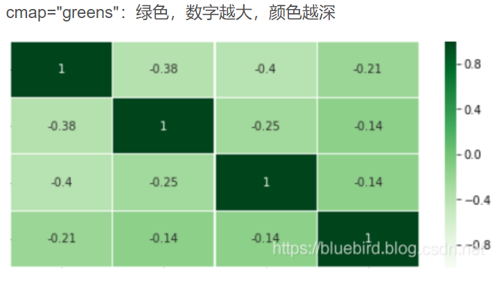
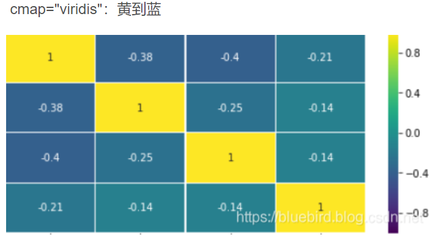
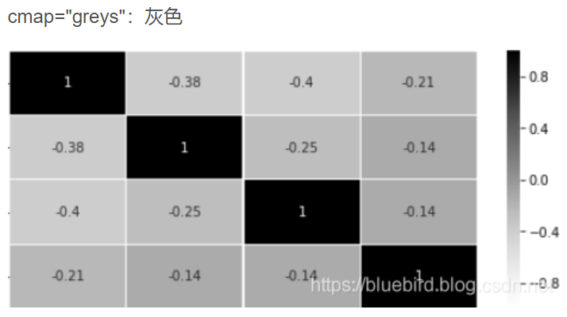

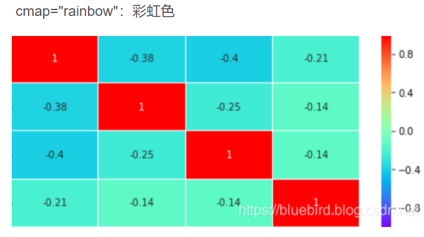
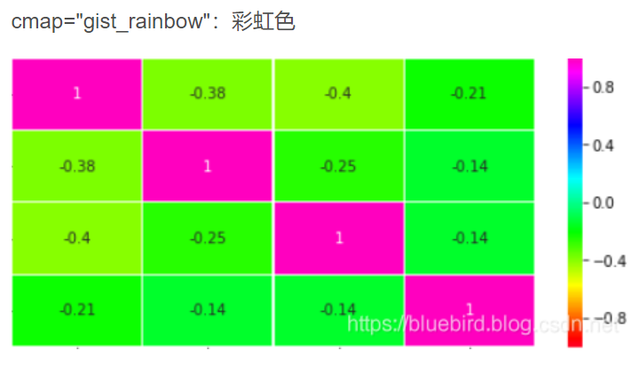

（3）参考资料
* [绘制热力图seaborn.heatmap，cmap设置颜色的参数](https://blog.csdn.net/ztf312/article/details/102474190)

### 例一
（1）输入数据格式
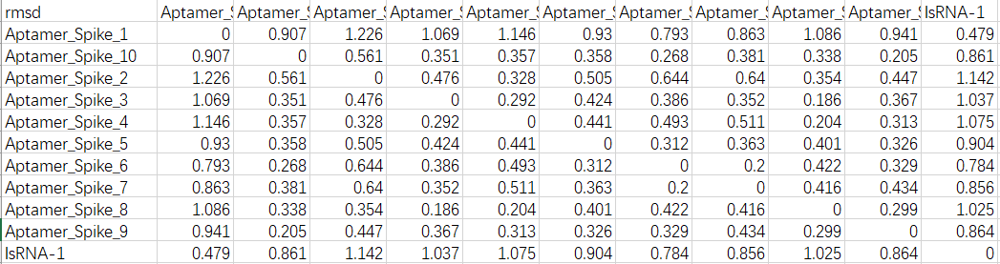
（2）绘图脚本
```python
import sys
import numpy as np
import pandas as pd
import seaborn as sns
import matplotlib.pyplot as plt
import palettable

def huitu(file_in):
    df=pd.read_csv(file_in)
    df = df[df.columns[1:]]
    df.index = df.columns.values
    # better_index = 
    plt.figure(figsize=(10, 6),dpi=100)
    plt.subplots_adjust(left=0.15, right=0.9, top=0.9, bottom=0.2)  
    sns.heatmap(data=df,
        vmin = -0.5,
        vmax = 1.5,
        cmap=palettable.cmocean.diverging.Curl_10.mpl_colors,
        # mask=np.triu(np.ones_like(df,dtype=np.bool)),
        annot=True,
        fmt=".2f",
    )
    plt.show()

def main():
    file_in = sys.argv[1]
    huitu(file_in)

if __name__ == "__main__":
    main()
```
（3）样图
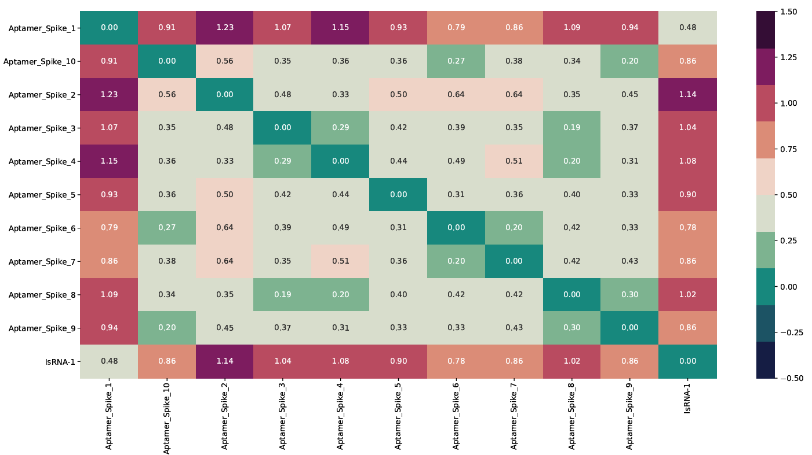

### 例二
（1）输入数据格式
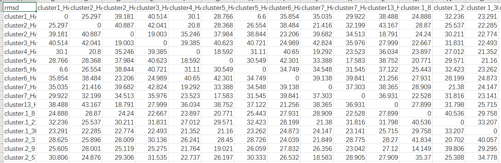
（2）绘图脚本
```python
import sys
import numpy as np
import pandas as pd
import seaborn as sns
import matplotlib.pyplot as plt
import palettable

def huitu(file_in):
    df=pd.read_csv(file_in)
    df = df[df.columns[1:]]
    df.index = df.columns.values
    # better_index = 
    plt.figure(figsize=(10, 6),dpi=100)
    plt.subplots_adjust(left=0.15, right=0.9, top=0.9, bottom=0.2)  
    sns.heatmap(data=df,
        vmin = -3,
        vmax = 60,
        cmap=palettable.cmocean.diverging.Curl_10.mpl_colors,
        mask=np.triu(np.ones_like(df,dtype=np.bool)),
        # annot=True,
        # fmt=".2f",
    )
    plt.show()

def main():
    file_in = sys.argv[1]
    huitu(file_in)

if __name__ == "__main__":
    main()
```
（3）样图
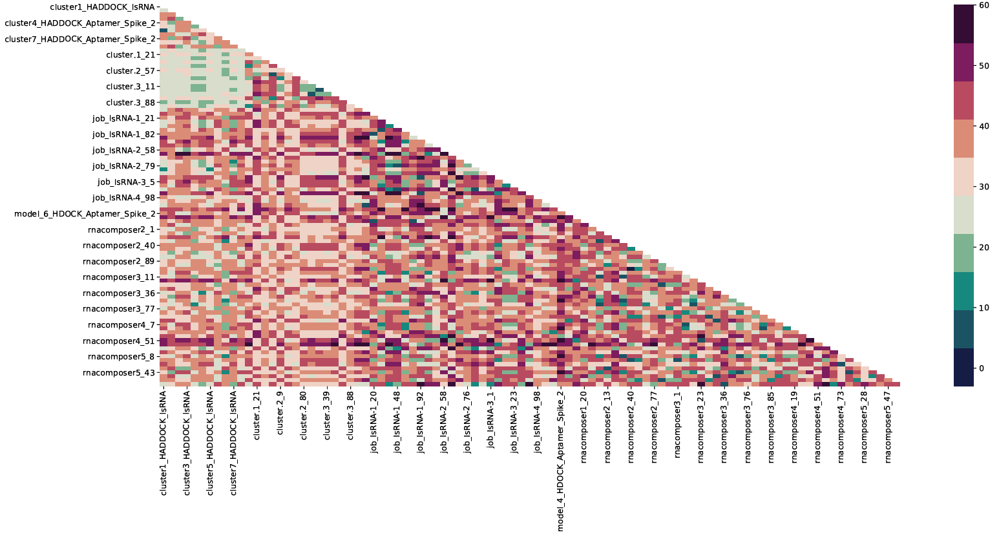

### 例三
（1）输入数据格式
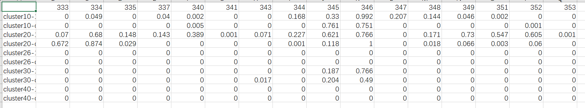
（2）绘图脚本
```python
import sys
import numpy as np
import pandas as pd
import seaborn as sns
import matplotlib.pyplot as plt
import palettable

def huitu(file_in):
    df = pd.read_csv(file_in)
    df_1 = df[df.columns[1:]]  # select all columns except the first column.
    # print(df.values[:, 0])
    df_1.index = df.values[:, 0]  # select the first columns of all rows.
    print(df_1)
    # df.index = df.values[:, 0]
    # better_index = 
    plt.figure(figsize=(10, 6),dpi=100)
    plt.subplots_adjust(left=0.15, right=0.9, top=0.9, bottom=0.2)  
    sns.heatmap(data=df_1,
        # vmin = -0.5,
        # vmax = 1.1,
        # cmap=palettable.cmocean.diverging.Curl_10.mpl_colors,
        cmap = "YlGnBu",
        # mask=np.triu(np.ones_like(df,dtype=np.bool)),
        # annot=True,
        # fmt=".2f",
        xticklabels=True,
    )
    plt.xticks(fontsize=4)
    plt.show()

def main():
    file_in = sys.argv[1]
    huitu(file_in)

if __name__ == "__main__":
    main()
```
（3）样图
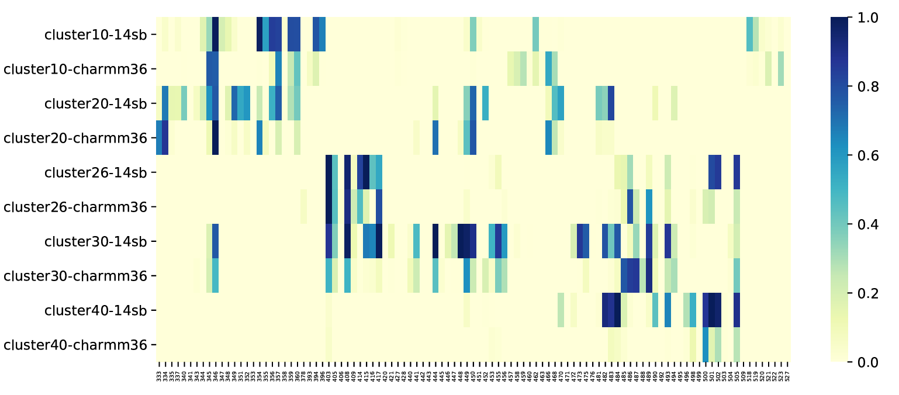
（4）知识点
* cmap颜色的选择，参考上方。
* 使用matplotlib可以调整坐标轴刻度的字体字号等。
* 若要显示所有的坐标轴标签可使用xticklabels=True。   

（5）参考资料
* [热力图 sns.heatmap 调整 图内，坐标轴，color bar 字体大小](https://blog.csdn.net/weixin_45415929/article/details/124018815)