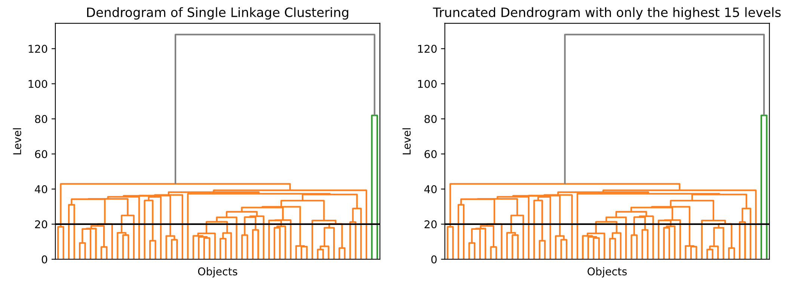

👏 Python脚本|使用sklearn对RMSD矩阵指定cutoff并进行层次聚类

---
[TOC]

---
## 输入文件
对角矩阵格式。

## 脚本
```shell
import sys
import numpy as np
from sklearn.cluster import SpectralClustering, AgglomerativeClustering
from scipy.cluster.hierarchy import dendrogram
import matplotlib.pyplot as plt

def cluster(file_in):
    with open(file_in) as f:
        f1 = f.readlines()
    matrix = []
    for i in f1:
        if i.startswith("#"):
            name_ = np.array(i.strip("#").split(), dtype=np.str_)
        else:
            matrix.append(i.split(","))
    matrix = np.matrix(matrix, dtype=np.float64)
    sl = AgglomerativeClustering(n_clusters=None, distance_threshold=20, linkage='single', compute_full_tree=True).fit(matrix)
    sl.fit(matrix)

    def plot_dendrogram(model, **kwargs):
        # Create linkage matrix and then plot the dendrogram

        # create the counts of samples under each node
        counts = np.zeros(model.children_.shape[0])
        n_samples = len(model.labels_)
        for i, merge in enumerate(model.children_):
            current_count = 0
            for child_idx in merge:
                if child_idx < n_samples:
                    current_count += 1  # leaf node
                else:
                    current_count += counts[child_idx - n_samples]
            counts[i] = current_count

        print(model.children_, model.distances_, counts)

        linkage_matrix = np.column_stack([model.children_, model.distances_,
                                          counts]).astype(float)
        print(linkage_matrix)

        # Plot the corresponding dendrogram
        dendrogram(linkage_matrix, **kwargs)


    f, axes = plt.subplots(1, 2, sharey=False, sharex=False, figsize=(12, 4))
    axes[0].set_title("Dendrogram of Single Linkage Clustering")
    axes[0].set_ylabel("Level")
    axes[0].set_xlabel("Objects")
    plot_dendrogram(sl, no_labels=True, above_threshold_color='grey', ax=axes[0])
    axes[0].axhline(y=20, c='k')

    axes[1].set_title("Truncated Dendrogram with only the highest 15 levels")
    axes[1].set_ylabel("Level")
    axes[1].set_xlabel("Objects")
    plot_dendrogram(sl, no_labels=True, above_threshold_color='grey', p=15, truncate_mode='level', ax=axes[1])
    axes[1].axhline(y=20, c='k')
    plt.show()
    f.savefig("fig.pdf")

def main():
    file_in = sys.argv[1]
    cluster(file_in)

if __name__ == '__main__':
    main()
```

## 结果示意图
