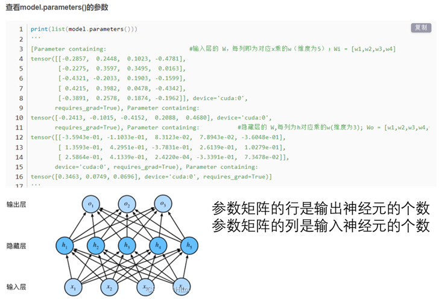

👏 Pytorch使用详解

---
[TOC]

---
## 安装
参考并仔细阅读[官网pytorch安装教程](https://pytorch.org/get-started/locally/)

## Warning
**（1）UserWarning: size_average and reduce args will be deprecated, please use reduction='sum' instead.**
**解决方案：** 问题出现在class LabelSmoothing，将 "self.criterion = nn.KLDivLoss(size_average=False)" 改为 "self.criterion = nn.KLDivLoss(reduction='sum')"

## Error

## 基本函数
### torch.tensor()
简介：根据已有的数据生成torch类型的tensor。
语法：
```python
torch.tensor(data, dtype=None, device=None, requires_grad=False)
```
示例：
例1：
```python
>>> import torch
>>> ss = [1,2]
>>> torch.tensor(ss)
tensor([1, 2])
>>> torch.tensor(ss, dtype=torch.float)
tensor([1., 2.])
```

### tensor_obj.flatten()
简介：降低tensor的维度。

**参考资料：**
1. https://zhuanlan.zhihu.com/p/587064877

### tensor_obj.unsqueeze()
简介：升高tensor的维度。

**参考资料：**
1. https://blog.csdn.net/weixin_53142585/article/details/128997156

### torch.eq()
简介：对两个Tensor进行逐元素的比较，若相同位置的两个元素相同，则返回True；若不同，返回False。
```python
>>> import torch
>>> a = torch.tensor([1,2,3,4,5,6,7])
>>> b = torch.tensor([1,2,3,5,6,7,8])
>>> torch.eq(a, b)
tensor([ True,  True,  True, False, False, False, False])
>>> torch.sum(torch.eq(a, b))
tensor(3)
```

### torch.clamp()
简介：将输入input张量每个元素的夹紧到区间 [min,max]，并返回结果到一个新张量。操作逻辑如下所示：
```txt
      | min, if x_i < min
y_i = | x_i, if min <= x_i <= max
      | max, if x_i > max
```
```python
>>> import torch
>>> a = torch.tensor([1,-2,-3,4,5,-6,-7])
>>> torch.clamp(a, 0, 1)
tensor([1, 0, 0, 1, 1, 0, 0])
```

### tensor.shape
简介：查看tensor的数据维度。
```python
>>> import torch
>>> a = torch.randn(8,4,9)
>>> a.shape
torch.Size([8, 4, 9])
```

### tensor.item()
简介：用于在只包含一个元素的tensor中提取值，注意是只包含一个元素，否则的话使用.tolist()。
```python
>>> import torch
>>> x = torch.tensor([1])
>>> x
tensor([1])
>>> print(x.item())
1
>>> y = torch.tensor([2,3,4,5])
>>> print(y.item())
Traceback (most recent call last):
  File "<stdin>", line 1, in <module>
ValueError: only one element tensors can be converted to Python scalars
```

### tensor.tolist()
简介：张量转化为列表。此时转化的列表是由非张量的数值组成的列表。
```python
>>> import torch
>>> t1 = torch.tensor([1, 2, 3, 4, 5, 6, 7, 8, 9, 10])
>>> print(t1.tolist())
[1, 2, 3, 4, 5, 6, 7, 8, 9, 10]
```

### list(tensor)
简介：张量转化为列表。此时转化的列表是由一个个零维张量构成的列表，而非张量的数值组成的列表。
```python
>>> import torch
>>> t1 = torch.tensor([1, 2, 3, 4, 5, 6, 7, 8, 9, 10])
>>> list(t1)
[tensor(1), tensor(2), tensor(3), tensor(4), tensor(5), tensor(6), tensor(7), tensor(8), tensor(9), tensor(10)]
```

### tensor拼接-torch.cat()
```python
>>> import torch
>>> input = torch.randn(2,5)
>>> input
tensor([[ 0.1736,  0.0204, -0.6572,  0.2260,  0.8728],
        [-0.7299, -1.1448, -0.1648, -1.6386,  0.6957]])
>>> input.unsqueeze_(1)
tensor([[[ 0.1736,  0.0204, -0.6572,  0.2260,  0.8728]],

        [[-0.7299, -1.1448, -0.1648, -1.6386,  0.6957]]])
>>> input
tensor([[[ 0.1736,  0.0204, -0.6572,  0.2260,  0.8728]],

        [[-0.7299, -1.1448, -0.1648, -1.6386,  0.6957]]])
>>> lt=[]
>>> for t in input:
...     lt.append(t)
...
>>> lt
[tensor([[ 0.1736,  0.0204, -0.6572,  0.2260,  0.8728]]), tensor([[-0.7299, -1.1448, -0.1648, -1.6386,  0.6957]])]
>>> torch.cat(lt, dim=0)
tensor([[ 0.1736,  0.0204, -0.6572,  0.2260,  0.8728],
        [-0.7299, -1.1448, -0.1648, -1.6386,  0.6957]])
```

## 基本运算函数
### torch.exp()
简介：e为底的指数函数。
```python
>>> import torch
>>> torch.exp(0)
Traceback (most recent call last):
  File "<stdin>", line 1, in <module>
TypeError: exp(): argument 'input' (position 1) must be Tensor, not int
>>> torch.exp(torch.tensor([0,]))
tensor([1.])
>>> torch.exp(torch.tensor([1,]))
tensor([2.7183])
>>> torch.exp(torch.tensor([2,]))
tensor([7.3891])
```

### tensor.exp()
简介：e为底的指数函数。
```python
>>> import torch
>>> x = torch.FloatTensor([1, 2, 3])
>>> x.exp()
tensor([ 2.7183,  7.3891, 20.0855])
```

### torch.randn_like()
简介：返回一个和输入大小相同的张量，由均值为0、方差为1的标准正态分布填充。

### torch.randn()
简介：生成随机数字的tensor，这些随机数字满足标准正态分布（0~1）。
```python
>>> import torch
>>> torch.randn(1, 1, 50, device="cuda:0")
tensor([[[-0.6656, -0.3174, -0.5807,  0.8547, -0.0651, -0.7386, -1.0479,
           0.5800,  1.2591, -0.8286,  0.7106,  0.0404, -0.0539, -0.5954,
           1.2302, -1.0276, -1.2646, -0.9157, -0.2282,  2.5122, -0.1437,
           0.9583,  0.1726, -0.1790,  0.6030,  0.4744,  0.4201,  1.9546,
           0.9679, -0.1128, -0.6830, -1.0865,  0.0938, -0.6147, -0.5624,
          -0.7046,  0.7411, -0.9382,  1.6949,  1.1044,  1.3029,  1.1905,
           0.9863, -0.6040, -0.8097,  0.6685, -2.1447, -0.6545,  0.0234,
          -1.1524]]], device='cuda:0')
>>> torch.randn(1, 1, 1, 50, device="cuda:0")
tensor([[[[ 1.1982,  0.9101, -1.1776,  1.5119,  0.0992,  0.2000, -0.3951,
           -0.3701, -0.4243, -0.4809, -0.1055, -1.5904, -0.4032,  0.7403,
           -0.3815,  1.1766,  1.2101,  0.3082,  1.0410,  1.2124, -0.6343,
            0.3002, -1.3906, -1.9843,  0.4277,  1.3072,  0.1649,  0.9681,
            0.7385,  0.0229, -0.0233,  0.3757,  1.6127, -0.6815,  1.2074,
            1.7308, -0.5322, -0.7606, -1.0208, -0.1202, -0.2802,  0.7776,
           -0.1678, -2.8138,  0.0833,  0.5150,  1.3218,  1.6249, -0.0213,
            1.3156]]]], device='cuda:0')
>>> torch.randn(1, 1, 1, 1, 50, device="cuda:0")
tensor([[[[[-1.7176,  2.0326, -0.3583, -1.2484,  0.0724, -0.4752,  1.5606,
            -0.0277,  1.3331,  1.0722, -1.2756,  0.0299,  0.7153, -1.8144,
             1.7690,  0.6880,  0.3205, -0.0977,  0.4175, -1.2281, -0.3711,
            -0.5029, -0.5313,  0.9933,  0.1168, -1.3517,  0.3544, -0.4375,
             0.9703,  0.9564,  0.8907,  1.1416, -0.9067,  0.0682, -0.5309,
             0.1293,  0.8388,  0.4383, -0.7352,  0.5400, -1.7906,  1.0049,
             1.4189,  0.5314,  1.0470,  0.1717,  1.6306,  1.0404, -0.6482,
             1.0678]]]]], device='cuda:0')
>>> torch.randn(1, 50, device="cuda:0")
tensor([[ 1.0000,  0.8019, -1.3283, -1.5774, -0.7373,  0.8933,  0.6255,  0.2343,
          1.3824,  2.9639, -0.7921, -0.7666,  0.3089,  0.0469,  0.5776, -0.3141,
          0.6909,  0.4588, -1.0630,  0.0577,  1.2595, -1.5326, -0.2966,  0.7798,
          1.7747, -0.6188, -0.1917, -0.2683,  1.0564, -1.2342,  1.0294,  0.0549,
          0.6450,  0.0092,  0.1396, -0.5071,  1.4961, -2.0883,  0.5575, -1.9708,
          1.2327, -1.3869,  0.2890, -0.4493,  0.3397, -0.7289, -1.1132,  0.7367,
          2.3925, -0.8641]], device='cuda:0')
>>> torch.randn(50, device="cuda:0")
tensor([ 0.6443, -0.8284, -1.1112, -0.4010,  1.0799, -0.1044, -0.5971, -1.1391,
         0.2200,  0.5723,  1.1666,  2.0415,  1.7110, -0.5594,  0.5746,  0.1688,
         0.0071,  0.1042,  0.6987,  0.7494, -0.5613, -0.4290, -0.9476, -0.3628,
        -0.0442,  0.5232,  0.0771, -1.0056,  0.0905,  1.0298, -1.5645, -0.9261,
        -1.5188,  0.1830, -0.8740,  0.1861,  1.6453,  0.8969,  1.5759, -0.6142,
         0.6832, -1.3723, -0.2708, -1.8894, -1.6328, -0.8100, -0.3694,  0.1364,
         1.2177, -0.8820], device='cuda:0')
```

### torch.abs()
简介：将参数传递到 torch.abs 后返回输入参数的绝对值作为输出，输入参数必须是一个 Tensor 数据类型的变量。
```python
>>> import torch
>>> a = torch.tensor([1, -2, -3, 4, 5, -6, -7])
>>> torch.abs(a)
tensor([1, 2, 3, 4, 5, 6, 7])
```

## 模型参数相关函数方法
### model.parameters()
简介：model.parameters()保存的是Weights和Bais参数的值。


**参考资料：**
1. https://blog.csdn.net/weixin_42843425/article/details/122518502


## 优化算法
### torch.optim.Adam()
简介：
语法：
```python
torch.optim.Adam(params, lr=0.001, betas=(0.9, 0.999), eps=1e-08, weight_decay=0)
# params (iterable) – 待优化参数的iterable或者是定义了参数组的dict
# lr (float, 可选) – 学习率（默认：1e-3）
# betas (Tuple[float, float], 可选) – 用于计算梯度以及梯度平方的运行平均值的系数（默认：0.9，0.999）
# eps (float, 可选) – 为了增加数值计算的稳定性而加到分母里的项（默认：1e-8）
# weight_decay (float, 可选) – 权重衰减（L2惩罚）（默认: 0）
```

## 梯度与反向传播
### loss.backward()
**一般用法：**
```python
optimizer.zero_grad()   # 清空过往的梯度
loss.backward()   # 反向传播，计算当前的梯度
optimizer.step()   # 根据梯度更新网络参数
```
**Loss.backward(retain_graph=True)的意义就是保留中间参数，不清空中间变量。Pytorch中有多次backward时需要retain_graph参数，Pytorch中的机制是每次调用loss.backward()时都会free掉计算图中所有缓存的buffers，当模型中可能有多次backward()时，正确的做法应该是前面的backward都应该保留中间参数使用retain_graph，最后一次要清空缓存，不使用retain_graph。**
```python
optimizer.zero_grad()   # 清空过往梯度；
loss1.backward(retain_graph=True)   # 反向传播，计算当前梯度；
loss2.backward()   # 反向传播，计算当前梯度；
optimizer.step()   # 根据梯度更新网络参数
```

### with torch.set_grad_enabled(False):与with torch.no_grad():
两个是等价的，作用是取消对计算操作的跟踪。with块下定义的所有节点的requires_grad都为False，grad_fn都为None（相当于with块中定义的所有节点都被detach了）。注意该语句不改变with块外定义的节点的requires_grad和grad_fn。

### model.eval()


### with torch.set_grad_enabled(False):/with torch.no_grad()和model.eval()的区别与联系
**model.eval()会影响各层的gradient计算行为，即gradient计算和存储与training模式一样，只是不进行反传。with torch.zero_grad()则停止autograd模块的工作，也就是停止gradient计算，以起到加速和节省显存的作用，** 从而节省了GPU算力和显存，但是并不会影响dropout和batchnorm层的行为。也就是说，如果不在意显存大小和计算时间的话，仅使用model.eval()已足够得到正确的validation的结果；而with torch.zero_grad()则是更进一步加速和节省gpu空间（因为不用计算和存储gradient），从而可以更快计算，也可以跑更大的batch来测试。