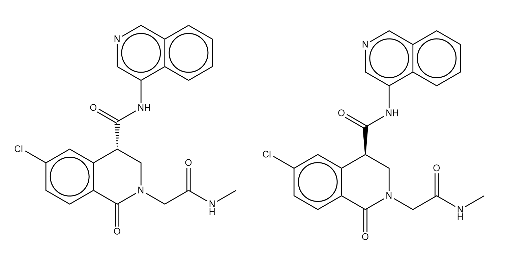
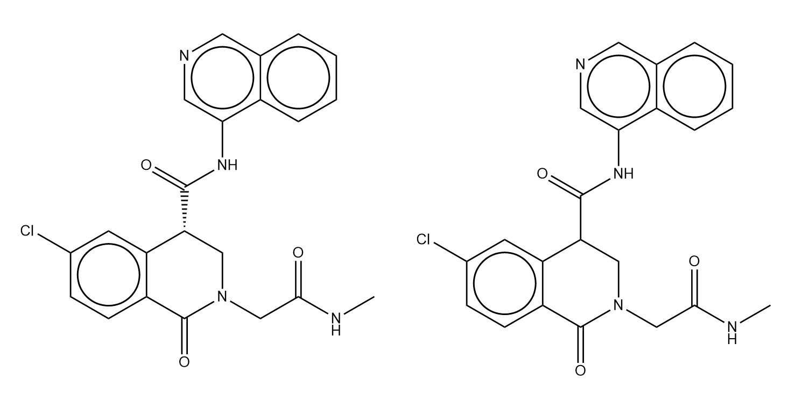

👏 RDKit

---
[TOC]

---
## 安装
```shell
conda install -c conda-forge rdkit
```
**建议：安装的时候新建环境后不要装python，直接安装rdkit，安装rdkit的过程中会装能兼容的python，从而可以解决下述问题：**
```text
ImportError: DLL load failed:
```

## 分子相似性比较
（1）2D相似性比较
**摩根指纹相似性比较**
使用方法：
```python
import rdkit
from rdkit.Chem import AllChem as Chem
from rdkit import DataStructs
 
a = Chem.MolFromSmiles("CC(=O)O[C@H]1C[C@H](OC(=O)C)C([C@@H]2[C@]1(C)[C@@H]1C[C@H]3OC(=O)C(=C3[C@@H]3[C@@]1(CC2)O3)C)(C)C")
b = Chem.MolFromSmiles("CC(=O)O[C@H]1C[C@H](OC(C)=O)[C@@]2(C)[C@@H]3Cc4oc(O)c(C)c4C4O[C@]43CC[C@@H]2C1(C)C")
fp1 = Chem.GetMorganFingerprintAsBitVect(a, 2)
fp2 = Chem.GetMorganFingerprintAsBitVect(b, 2)
DataStructs.DiceSimilarity(fp1,fp2)    # 0.7326732673267327
```
案例1：比较如下两个分子MACCS相似性。

```python
from rdkit.Chem import AllChem as Chem
from rdkit import DataStructs

>>> a = Chem.MolFromSmiles("CNC(CN1C[C@H](c2c(C1=O)ccc(Cl)c2)C(Nc(cnc3)c4c3cccc4)=O)=O")
>>> b = Chem.MolFromSmiles("CNC(CN1C[C@@H](c2c(C1=O)ccc(Cl)c2)C(Nc(cnc3)c4c3cccc4)=O)=O")
>>> fp1 = Chem.GetMorganFingerprintAsBitVect(a, 2)
>>> fp2 = Chem.GetMorganFingerprintAsBitVect(b, 2)
>>> DataStructs.DiceSimilarity(fp1,fp2)
1.0
```


**MACCS指纹相似性比较**
使用方法：
```python
import rdkit
from rdkit import Chem
from rdkit import DataStructs
from rdkit.Chem import MACCSkeys

>>> a = Chem.MolFromSmiles("CC(=O)O[C@H]1C[C@H](OC(=O)C)C([C@@H]2[C@]1(C)[C@@H]1C[C@H]3OC(=O)C(=C3[C@@H]3[C@@]1(CC2)O3)C)(C)C")
>>> b = Chem.MolFromSmiles("CC(=O)O[C@H]1C[C@H](OC(C)=O)[C@@]2(C)[C@@H]3Cc4oc(O)c(C)c4C4O[C@]43CC[C@@H]2C1(C)C")
>>> fp1 = MACCSkeys.GenMACCSKeys(a)
>>> fp2 = MACCSkeys.GenMACCSKeys(b)
>>> DataStructs.FingerprintSimilarity(fp1,fp2)
0.8163265306122449
```
案例1：比较如下两个分子MACCS相似性。

```python
import rdkit
from rdkit import Chem
from rdkit import DataStructs
from rdkit.Chem import MACCSkeys

>>> a = Chem.MolFromSmiles("CNC(CN1C[C@H](c2c(C1=O)ccc(Cl)c2)C(Nc(cnc3)c4c3cccc4)=O)=O")
>>> b = Chem.MolFromSmiles("CNC(CN1C[C@@H](c2c(C1=O)ccc(Cl)c2)C(Nc(cnc3)c4c3cccc4)=O)=O")
>>> fp1 = MACCSkeys.GenMACCSKeys(a)
>>> fp2 = MACCSkeys.GenMACCSKeys(b)
>>> DataStructs.FingerprintSimilarity(fp1,fp2)
1.0
```

案例2：比较如下两个分子MACCS相似性。

```python
import rdkit
from rdkit import Chem
from rdkit import DataStructs
from rdkit.Chem import MACCSkeys

>>> a = Chem.MolFromSmiles("CNC(CN1C[C@H](c2c(C1=O)ccc(Cl)c2)C(Nc(cnc3)c4c3cccc4)=O)=O")
>>> b = Chem.MolFromSmiles("CNC(CN1CC(c2c(C1=O)ccc(Cl)c2)C(Nc(cnc3)c4c3cccc4)=O)=O")
>>> fp1 = MACCSkeys.GenMACCSKeys(a)
>>> fp2 = MACCSkeys.GenMACCSKeys(b)
>>> DataStructs.FingerprintSimilarity(fp1,fp2)
1.0
```

## 获取化合物性质
### 重原子数
```python
from rdkit import Chem

m = Chem.MolFromSmiles('*c1ccc(*)c(S(=O)(=O)O)c1')
print(m.GetNumHeavyAtoms())
```

## 化合物拆解及组装


## 一些函数
**rdkit.Chem.rdmolfiles.MolFromSmiles((AtomPairsParameters)SMILES, (SmilesParserParams)params) → Mol  读取分子从SMILES到分子图**
```text
MolFromSmiles( (object)SMILES [, (bool)sanitize=True [, (dict)replacements={}]]) -> Mol :
        Construct a molecule from a SMILES string.

          ARGUMENTS:

            - SMILES: the smiles string

            - sanitize: (optional) toggles sanitization of the molecule.
              Defaults to True.

            - replacements: (optional) a dictionary of replacement strings (see below)
              Defaults to {}.

          RETURNS:

            a Mol object, None on failure.
```