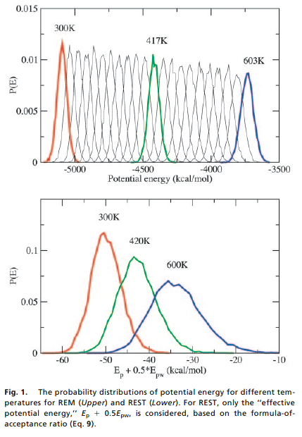
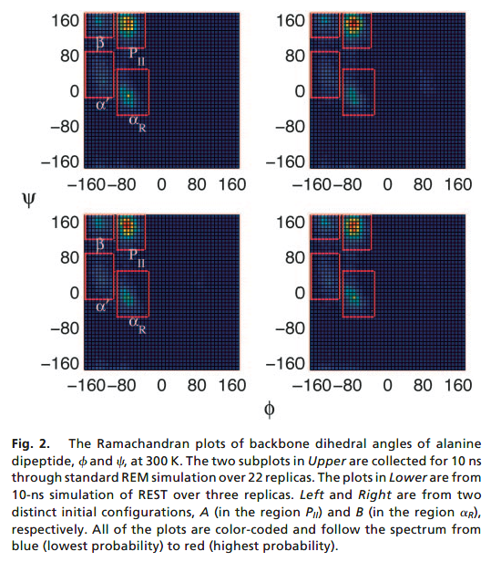
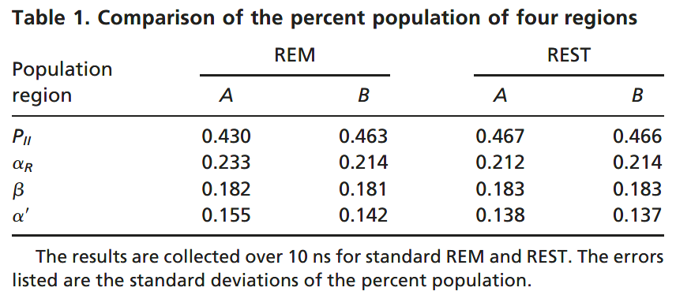
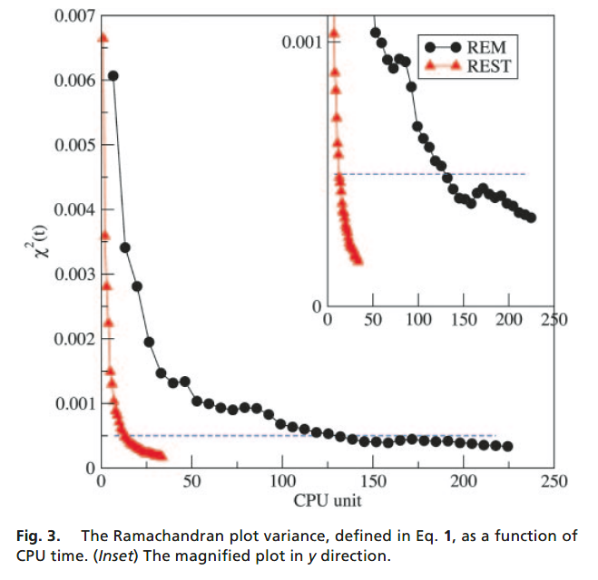
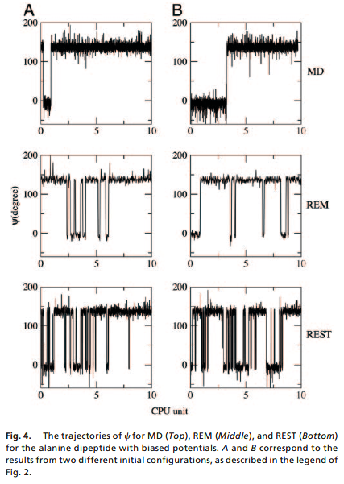
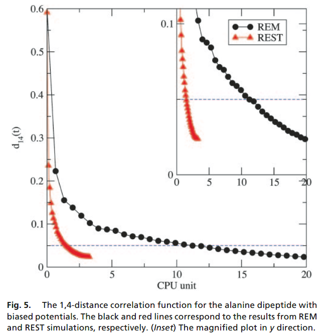

👏 REMD方法|REST

---
[TOC]

---
## 摘要
&emsp;&emsp;这篇文章提出了一种叫做REST（Replica Exchange with Solute Tempering）的蛋白水溶液高效采样方法。与其他副本交换方法相比，REST对哈密顿函数进行变形使得副本间交换律不依赖于体系中的显性水分子，从而减少副本数目，增加计算效率。 

## 研究背景
&emsp;&emsp;复杂体系的构象空间采样是结构生物学和理论化学领域中重要且困难的事情。难点在于复杂体系的构象分布自由能景图崎岖复杂，景图盆地被高势能垒隔开，导致构象容易陷入局部盆地无法越过能垒采样到其他盆地。副本交换方法通过使用高温副本越过能垒交换构象从而达到增强采样效率的目的，也是目前常用的采样方法之一。  

&emsp;&emsp;标准副本交换中副本的数目与体系总自由度的平方根成正比。随着模拟体系的增大，则需要更多的副本，需要更多的计算资源。公式推导如下所示：  
（1）模拟过程中体系总能量由两部分组成，分别是由原子坐标（x）决定的体系势能$\ E_{pot}$和由原子速度（v）决定的体系动能$\ E_{kin}$。$$E(x,v)=\ E_{pot}(x) + E_{kin}(v)$$  
（2）相邻温度副本能否发生交换需要根据Metropolis准则计算交换律（$\ P_{ab}$）。其中$\beta=\frac{1}{\ k_BT}$，$\ k_B$为玻尔兹曼常数。$$\ P_{ab}=min(1,exp(\Delta\beta\Delta\ E_{pot} + \Delta\beta\Delta\ E_{kin}))$$  
（3）为保证模拟副本的原子速度在发生交换后仍然服从Maxwell分布。如下公式所示，T-REMD对动能进行调节，其中$\ E_{kin}^{(a\rightarrow b)}$是副本a交换到副本b之后的动能，$\ E_{kin}^{(b\rightarrow a)}$是副本b交换到副本a之后的动能。$$\ E_{kin}^{(a\rightarrow b)}=\frac{\ T_b}{\ T_a}\ E_{kin}^{(a)}$$ $$\ E_{kin}^{(b\rightarrow a)}=\frac{\ T_a}{\ T_b}\ E_{kin}^{(b)}$$
（4）对动能调整之后，$\Delta\ E_{kin}$为0。所以$$\ P_{ab}=min(1,exp(\Delta\beta\Delta\ E_{pot})$$ $$\Delta\beta=\frac{1}{\ k_BT_b}-\frac{1}{\ k_BT_a}$$
（5）如（4）中公式所示，副本间交换律与模拟温差$\Delta T$和势能差$\Delta E_{pos}$密切相关。其中$\Delta E_{pos}$与体系总自由度相关，随着体系原子增多，$\Delta E_{pos}$增大。为了保证副本间交换律，则需要减小$\Delta T$，则需要更多的副本数目。

&emsp;&emsp;减少副本数目是提高计算效率的一个有效方法。综上所述，减少副本数目即增大$\Delta T$，为了保证副本间的交换律，则需要减少$\Delta E_{pos}$。$\Delta E_{pos}$与体系总自由度相关，则需要减少交换时的总自由度。模拟体系的总自由度由溶质和溶剂两部分组成，其中溶质分子是重点关注对象，溶剂分子则是为了提供常规的生理环境。溶剂分子贡献了体系大部分自由度但是并不是重点关注对象。所以本文将势能随着温度进行缩放，计算交换律时仅考虑溶质自由度，而忽略溶剂自由度，从而减少副本数目。宏观来讲，即只将溶质分子在各个副本之间进行交换，而将溶剂分子一直处于常温状态。  

## 研究方法
&emsp;&emsp;基于广义副本交换理论，REST对势能函数加了一个缩放因子使得计算副本交换律的时候仅考虑溶质分子而不考虑溶剂分子从而较少副本数目增加采样效率。  

&emsp;&emsp;第m个副本和第n个副本间的交换过程如公式（2.1）和（2.2）所示，公式（2.1）代表由副本n交换到副本m，公式（2.2）代表由副本m交换到副本n。其中$\ X_m$是坐标，$\ E_m(X_m)$是势能，$\ T_m$是温度。 
$$\ (\ X_m, E_m(X_m), T_m) \rightarrow(X_n, E_m(X_n), T_m) \tag{2.1}$$  $$\ (\ X_n, E_n(X_n), T_n) \rightarrow(X_m, E_n(X_m), T_n) \tag{2.2} $$  

每个副本状态下系统平衡概率$P_m$如公式（2.3）所示，其中$\beta_m=\frac{1}{k_BT_m}$，$Z_m$是相应的位形配分函数。$$P_m=\frac{1}{Z_m}exp(-\beta_mE_m(X_m)) \tag{2.3}$$

副本$i\rightarrow f$的交换$T(i\rightarrow f)$与副本$f\rightarrow i$的交换$T(f\rightarrow i)$满足公式（2.4）中的平衡条件。
$$P_m(X_m)P_n(X_n)T(i\rightarrow f)=P_n(X_m)P_m(X_n)T(f\rightarrow i) \tag{2.4}$$  

则副本间转换概率的比值，即交换律如公式（2.5）所示。
$$\begin{split} &\frac{T(i\rightarrow f)}{T(f\rightarrow i)}=exp(-\Delta_{nm}) \\ &\Delta_{nm}=-\beta_m[E_m(X_n)-E_m(X_m)]-\beta_n[E_n(X_m)-E_n(X_n)] \end{split} \tag{2.5}$$  

根据Metropolis准则，两个副本间交换律如公式（2.6）所示。  
$$
P_{i\leftrightarrow j}=min(1,exp(-\Delta_{nm})) \tag{2.6}
$$

&emsp;&emsp;减少副本交换时的体系自由度是减少副本数目一种方法，因此将整个模拟体系分成蛋白溶质部分和水溶剂部分。因此整个体系的势能可表示为如公式（2.7）所示，其中$E_p(X)$代表蛋白内部势能，$E_{pw}(X)$代表蛋白水分子间势能，$E_{ww}(X)$代表水分子内势能。
$$
E_0(X)=E_p(X)+E_{pw}(X)+E_{ww}(X) \tag{2.7}
$$

&emsp;&emsp;温度最低（$T_0$）的副本体系的势能如公式（2.7）所示。随着温度升高，文中对高温副本的势能添加调节因子进行缩放。如公式（2.8）所示。在常温（$T_0$）副本中，即$\beta_m=\beta_0$，此时公式（2.8）就变为公式（2.7）。
$$
E_m(X)=E_p(X)+[\frac{\beta_0}{\beta_m}]E_{ww}(X)+[\frac{\beta_0+\beta_m}{2\beta_m}]E_{pw}(X) \tag{2.8}
$$

&emsp;&emsp;将添加缩放因子的公式（2.8）带入公式（2.5）中，则可得到公式（2.9）。如公式（2.9）所示，此时交换律一方面与$\beta_n-\beta_m$相关，即与温差相关。另一方面与势能差相关，由公式可见REST中的势能差不含有水分子内部的势能。与常规副本交换相比，因为$|E_p+\frac{1}{2}E_{pw}|<<|E_p+E_{pw}+E_{ww}|$，所以势能差减小，温差可以适当增大，即可达到减少副本的目的。
$$
\Delta_{nm}=(\beta_n-\beta_m)[(E_p(X_m)+\frac{1}{2}E_{pw}(X_m))-(E_p(X_n)+\frac{1}{2}E_{pw}(X_n))] \tag{2.9}
$$

## 研究结果
&emsp;&emsp;为了测试REST的采样效果，文中分别使用常规副本交换方法和REST方法对丙氨酸二肽水溶液进行模拟并比较。如图1所示，为了满足一定的副本交换律，常规副本交换需要22个副本，REST则仅需要3个副本。  

&emsp;&emsp;为了测试REST的采样准确度，文中比较了常规副本交换和REST模拟结构的拉式图。如图2所示，两种方法模拟结果非常相近。并且如表1所示，REST方法比常规副本交换对不同初始结构有更好兼容特性。  
  
  

&emsp;&emsp;动力学模拟结果的收敛性是一个重要问题。对于一个能够遍历蛋白所有构象空间的采样程序，两条初始结构不同的独立轨迹计算出来的任何性质都应该是相等的。因此本文对于每种方法都使用初始结构显著不同的两个结构进行了两次独立的模拟。并且定义了收敛性评测指标$\chi^2(t)$，如公式（3.1）所示，其中m和n即代表将拉式图分成$n\times m$个像素格，A和B代表两条轨迹，$R_{i,j}$代表第$i,j$个像素格中构象的数量。$\chi^2(t)$越趋近于0，越接近收敛。如图3所示，REST收敛的速度更快。      
$$
\chi^2(t)=\frac{1}{mn}\sum_{i=1,j=1}^{m,n}(R_{i,j}^A-R_{i,j}^B)^2 \tag{3.1}
$$
  

&emsp;&emsp;为了进一步测试REST，文中更改了丙氨酸二肽的势能函数提高了势能垒，如公式（3.2）所示，其中第一项$\frac{1}{2}k_\phi(\phi-\phi_0)^2$将$\phi$角限制在$\phi_0$附近，第二项则是在$\varphi_i$加势能井，$A_{\varphi,i}$是井的深度，$\sigma_{\varphi,i}$是势能井的添加范围。文中对拉式图中的两个低能区域$P_Ⅱ$和$\alpha_R$添加势能井，井的深度是3.0 kcal/mol，井的传播距离是10埃。  
$$
U(\phi,\varphi)=\frac{1}{2}k_{\phi}(\phi-\phi_0)^2+\sum_{i=1}^nA_{\varphi,i}exp(-\frac{(\varphi-\varphi_i)^2}{2\sigma_{\varphi,i}^2}) \tag{3.2}
$$
填加势能井之后，再次对两种方法跑初始结构显著不同的两条独立轨迹，此次还增加了一种常规动力学模拟。结果如图4所示，REST翻越能垒的能力以及采样效率远远好于普通的副本交换以及常规动力学模拟。  
 

&emsp;&emsp;最后文章还对增加势能垒之后的收敛性进行了评测，评测指标如公式（3.3）所示，其中$N$是1,4对的数目，$r_{14}$是1,4对的平均距离。收敛性结果如图5所示。    
$$
d_{14}(t)=\frac{1}{N}\sum_{i=1}^{N}(r_{14,i}^{A}-r_{14,i}^{B})^2 \tag{3.3}
$$
  

## 讨论
（1）文中通过对高温副本下势能添加调节因子进行缩放，使得计算副本交换律时仅考虑溶质的自由度而不用考虑水分子的自由度，减少了副本数量。  
（2）REST比常规的副本交换要快$\sqrt{(f_{total}/f_{protein})}$倍。  
（3）REST只能在目标温度下有效地对相空间进行采样。  
（4）$E_m(X)=E_p(X)+a_mE_{ww}(X)+b_mE_{pw}(X)$，文中取$b_m=\frac{\beta_0+\beta_m}{2\beta_m}$。$b_m$尚有优化空间。  
（5）REST减少了副本数目，可以模拟更大的体系，但是可能出现热溶质、冷溶剂的非生理状态。  

## 参考文献  
1. Liu P, et al. Replica exchange with solute tempering: a method for sampling biological systems in explicit water. PNAS, 2005, 102: 13749-13754. doi: 10.1073/pnas.0506346102.  [文献pdf](../File/REMD方法REST/REST.pdf)