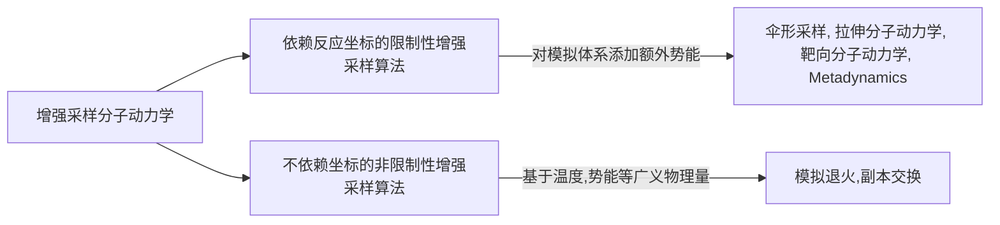

👏 REMD综述|副本交换分子动力学

---
[TOC]

---
## 简介

```mermaid
graph LR
    A[增强采样分子动力学] --> B[依赖反应坐标的限制性增强采样算法]
    A --> B1[不依赖坐标的非限制性增强采样算法]
    B --对模拟体系添加额外势能--> C[伞形采样, 拉伸分子动力学, 靶向分子动力学, Metadynamics]
    B1 --基于温度,势能等广义物理量--> C1[模拟退火,副本交换]
```

---
## 基于温度的REMD

## 参考资料
1. [副本交换分子动力学](./REMD综述副本交换分子动力学/副本交换分子动力学.pdf)