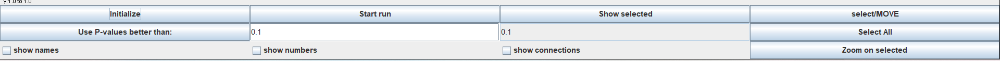
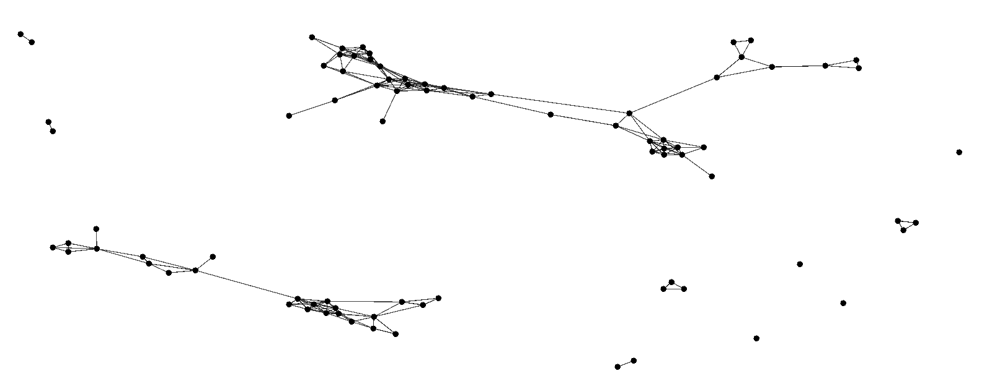

👏 RNA三维结构聚类

---
[TOC]

---
## 需要的软件
（1）rna-tools：pip安装即可。
（2）[CLANS](https://www.eb.tuebingen.mpg.de/protein-evolution/software/clans.html)：安装java之后下载安装包，运行.bat文件即可。

## 计算RMSD的matrix文件
**说明：这里由于研究内容需求，计算的是非叠合RMSD，这里可以根据问题需求更换RMSD计算方式。**
（1）切换至有rna-tools包的环境。
（2）计算RMSD的脚本是对rna-tools更改之后的脚本。如下所示：
```python
# rna_calc_rmsd_all_vs_all.py
from __future__ import print_function

from calculate_rmsd import rmsd, get_coordinates, centroid, kabsch_rmsd
from rna_tools.tools.rna_calc_rmsd.rna_calc_rmsd import calc_rmsd_pymol

import argparse
import glob
import re
import os

# print("test!!!")

def get_rna_models_from_dir(directory):
    models = []
    if not os.path.exists(directory):
        raise Exception('Dir does not exist! ', directory)
    files = glob.glob(directory + "/*.pdb")
    files_sorted = sort_nicely(files)
    for f in files_sorted:
        models.append(f)
    return models


def sort_nicely(l):
    """Sort the given list in the way that humans expect.
    http://blog.codinghorror.com/sorting-for-humans-natural-sort-order/
    """
    def convert(text): return int(text) if text.isdigit() else text

    def alphanum_key(key): return [convert(c) for c in re.split('([0-9]+)', key)]
    l.sort(key=alphanum_key)
    return l


def calc_rmsd(a, b):
    """Calc rmsd."""
    atomsP, P = get_coordinates(a, None, None, 'pdb', True)
    atomsQ, Q = get_coordinates(b, None, None, 'pdb', True)

    # change to what you want.
    # Calculate 'dumb' RMSD
    gnormal_rmsd = rmsd(P, Q)

    # Create the centroid of P and Q which is the geometric center of a
    # N-dimensional region and translate P and Q onto that center.
    # http://en.wikipedia.org/wiki/Centroid
    # Pc = centroid(P)
    # Qc = centroid(Q)
    # P -= Pc
    # Q -= Qc

    # if False:
    #    V = rotate(P, Q)
    #    V += Qc
    #    write_coordinates(atomsP, V)
    #    quit()

    # return kabsch_rmsd(P, Q)
    print("最普通的RMSD！！！")
    return gnormal_rmsd


def get_parser():
    parser = argparse.ArgumentParser(description=__doc__,
                                     formatter_class=argparse.RawTextHelpFormatter)
    parser.add_argument('-i', "--input-dir",
                        default='',
                        help="input folder with structures")

    parser.add_argument('-o', "--matrix-fn",
                        default='matrix.txt',
                        help="ouput, matrix")

    parser.add_argument('-m', "--method",
                        default='all-atom',
                        help="all-atom, pymol: align, fit")


    # parser.add_argument("-s", "--save",
    #                    action="store_true", help="")

    return parser


if __name__ == '__main__':
    parser = get_parser()
    args = parser.parse_args()

    input_dir = args.input_dir
    matrix_fn = args.matrix_fn

    models = get_rna_models_from_dir(input_dir)

    print(' # of models:', len(models))

    f = open(matrix_fn, 'w')
    t = '# '
    for r1 in models:
        # print r1,
        t += os.path.basename(r1) + ' '
    # print
    t += '\n'

    c = 1
    for r1 in models:
        for r2 in models:
            if args.method == 'align':
                rmsd_curr = calc_rmsd_pymol(r1, r2, 'align')[0] # (0.0, 0)
            elif args.method == 'fit':
                rmsd_curr = calc_rmsd_pymol(r1, r2, 'fit')[0] # (0.0, 0)                
            else:
                rmsd_curr = calc_rmsd(r1, r2)
            t += str(round(rmsd_curr, 3)) + ','
        print('...', c, r1)
        c += 1
        t = t[:-1] # remove ending ,
        t += '\n'

    f.write(t)
    f.close()

    print(t.strip())  # matrix

    if True:
        print('matrix was created! ', matrix_fn)
    else:
        print('matrix NOT was created!')
```
```python
import numpy as np
import re
from rna_tools.tools.extra_functions.select_fragment import is_in_selection

def kabsch_rmsd(P, Q):
    """
    Rotate matrix P unto Q and calculate the RMSD
    """
    P = rotate(P, Q)
    return rmsd(P, Q)


def rotate(P, Q):
    """
    Rotate matrix P unto matrix Q using Kabsch algorithm
    """
    U = kabsch(P, Q)

    # Rotate P
    P = np.dot(P, U)
    return P


def kabsch(P, Q):
    """
    The optimal rotation matrix U is calculated and then used to rotate matrix
    P unto matrix Q so the minimum root-mean-square deviation (RMSD) can be
    calculated.

    Using the Kabsch algorithm with two sets of paired point P and Q,
    centered around the center-of-mass.
    Each vector set is represented as an NxD matrix, where D is the
    the dimension of the space.

    The algorithm works in three steps:
    - a translation of P and Q
    - the computation of a covariance matrix C
    - computation of the optimal rotation matrix U

    http://en.wikipedia.org/wiki/Kabsch_algorithm

    Parameters:
    P -- (N, number of points)x(D, dimension) matrix
    Q -- (N, number of points)x(D, dimension) matrix

    Returns:
    U -- Rotation matrix

    """

    # Computation of the covariance matrix
    C = np.dot(np.transpose(P), Q)

    # Computation of the optimal rotation matrix
    # This can be done using singular value decomposition (SVD)
    # Getting the sign of the det(V)*(W) to decide
    # whether we need to correct our rotation matrix to ensure a
    # right-handed coordinate system.
    # And finally calculating the optimal rotation matrix U
    # see http://en.wikipedia.org/wiki/Kabsch_algorithm
    V, S, W = np.linalg.svd(C)
    d = (np.linalg.det(V) * np.linalg.det(W)) < 0.0

    if d:
        S[-1] = -S[-1]
        V[:, -1] = -V[:, -1]

    # Create Rotation matrix U
    U = np.dot(V, W)

    return U


def centroid(X):
    """
    Calculate the centroid from a vectorset X
    """
    C = sum(X)/len(X)
    return C


def rmsd(V, W):
    """
    Calculate Root-mean-square deviation from two sets of vectors V and W.
    """
    D = len(V[0])
    N = len(V)
    rmsd = 0.0
    for v, w in zip(V, W):
        rmsd += sum([(v[i]-w[i])**2.0 for i in range(D)])
    return np.sqrt(rmsd/N)


def get_coordinates(filename, selection, ignore_selection, fmt, ignore_hydrogens, way='all'):
    """Get coordinates from filename."""
    return get_coordinates_pdb(filename, selection, ignore_selection, ignore_hydrogens, way)


def get_coordinates_pdb(filename, selection, ignore_selection, ignore_hydrogens, way='all'):
    """
    Get coordinates from the first chain in a pdb file
    and return a vectorset with all the coordinates.

    """
    # PDB files tend to be a bit of a mess. The x, y and z coordinates
    # are supposed to be in column 31-38, 39-46 and 47-54, but this is not always the case.
    # Because of this the three first columns containing a decimal is used.
    # Since the format doesn't require a space between columns, we use the above
    # column indices as a fallback.
    x_column = None
    V = []
    # Same with atoms and atom naming. The most robust way to do this is probably
    # to assume that the atomtype is given in column 3.
    atoms = []
    resi_set = set()
    if way == "c1p":
        way_atoms = ["C1'"]
    elif way == 'backbone':
        way_atoms = "P OP1 OP2 O5' C5' C4' C3' O3'".split()
    elif way == 'po':
        way_atoms = "P OP1 OP2".split()
    elif way == 'no-backbone':
        way_atoms = "C5' C4' O4' C3' O3' C2' O2' C1' N9 C8 N7 C5 C6 O6 N1 C2 N2 N3 C4".split()
        way_atoms += "N9 C8 N7 C5 C6 N6 N1 C2 N3 C4".split()
        way_atoms += "N1 C2 O2 N3 C4 O4 C5 C6".split()
        way_atoms += "N1 C2 O2 N3 C4 N4 C5 C6".split()
    elif way == 'bases':
        way_atoms = "N9 C8 N7 C5 C6 O6 N1 C2 N2 N3 C4".split()
        way_atoms += "N9 C8 N7 C5 C6 N6 N1 C2 N3 C4".split()
        way_atoms += "N1 C2 O2 N3 C4 O4 C5 C6".split()
        way_atoms += "N1 C2 O2 N3 C4 N4 C5 C6".split()
    elif way == 'backbone+sugar':
        way_atoms = "P OP1 OP2 O5' C5' C4' O4' C3' O3' C2' O2' C1'".split()
    elif way == 'sugar':
        way_atoms = "C4' O4' C3' C2' O2' C1'".split()
    elif way == 'all':
        way_atoms = "P OP1 OP2 O5' C5' C4' O4' C3' O3' C2' O2' C1' N9 C8 N7 C5 C6 O6 N1 C2 N2 N3 C4".split()
        way_atoms += "P OP1 OP2 O5' C5' C4' O4' C3' O3' C2' O2' C1' N9 C8 N7 C5 C6 N6 N1 C2 N3 C4".split()
        way_atoms += "P OP1 OP2 O5' C5' C4' O4' C3' O3' C2' O2' C1' N1 C2 O2 N3 C4 O4 C5 C6".split()
        way_atoms += "P OP1 OP2 O5' C5' C4' O4' C3' O3' C2' O2' C1' N1 C2 O2 N3 C4 N4 C5 C6".split()

    with open(filename) as f:
        lines = f.readlines()
        for line in lines:
            # hmm...
            # of models: 490
            # Error: # of atoms is not equal target (1f27_rpr.pdb):641 vs model (struc/1f27_rnakbnm_decoy0001_amb_clx_rpr.pdb):408
            #if line.startswith("TER") or line.startswith("END"):
            #    break
            if line.startswith("ATOM"):
                curr_chain_id = line[21]
                curr_resi = int(line[22:26])
                curr_atom_name = line[12:16].strip()
                if selection:
                    if curr_chain_id in selection:
                        if curr_resi in selection[curr_chain_id]:
                            # ignore if to be ingored (!)
                            #try:
                                    resi_set.add(curr_chain_id + ':' + str(curr_resi))
                                    x = line[30:38]
                                    y = line[38:46]
                                    z = line[46:54]
                                    if ignore_selection:
                                        if not is_in_selection(ignore_selection, curr_chain_id, curr_resi, curr_atom_name):
                                            if curr_atom_name in way_atoms:
                                                V.append(np.asarray([x,y,z],dtype=float))
                                    else:
                                        if curr_atom_name in way_atoms:
                                           V.append(np.asarray([x,y,z],dtype=float))

                else:
                                    x = line[30:38]
                                    y = line[38:46]
                                    z = line[46:54]
                                    if curr_atom_name in way_atoms:
                                        V.append(np.asarray([x,y,z],dtype=float))

    V = np.asarray(V)
    #print filename, resi_set, len(resi_set)
    return len(V), V
```
（3）将需要计算的所有结构放在一个文件夹test下。运行脚本：
```shell
python rna_calc_rmsd_all_vs_all.py -i ./test/ -o matrix.txt
```
（4）计算完成后生成matrix.txt文件。

## 根据matrix.txt使用ClanstixRNA生成Clans的输入文件
（1）生成的matrix可能是不对称的，将matrix变为对称结构。
（2）脚本：
```python
import sys
import os
import numpy as np

def rmsd_com(file_input):
    matrix = np.loadtxt(file_input, delimiter=",")
    print(matrix.shape[0])
    matrix_result = np.zeros((matrix.shape[0], matrix.shape[1]), dtype=np.float64)
    for i in range(matrix.shape[0]):
        matrix_result[i][i] = 0
    for a in range(matrix.shape[0]):
        for b in range(a+1, matrix.shape[1]):
            matrix_result[a][b] = matrix_result[b][a] = matrix[a][b]

    f = open("matrix_1.txt", "w")
    f1 = open(file_input)
    f.write(f1.readline())

    for a in range(matrix_result.shape[0]):
        tmp = []
        for b in range(matrix_result.shape[1]):
            tmp.append(str(matrix_result[a][b]))
        f.write(",".join(tmp) + "\n")
    f.close

def main():
    file_input = sys.argv[1]
    rmsd_com(file_input)

if __name__ == "__main__":
    main()
```
（3）生成对称结构的matrix。
```shell
python py matrix.txt
```
（4）使用rna_clanstix.py生成Clans的输入文件。
```python
# rna_clanstix.py

from __future__ import print_function
import argparse
import rna_tools.tools.rna_prediction_significance.rna_prediction_significance as pv
import numpy as np
import math
import logging
import time

logging.basicConfig(level=logging.INFO,
                format='%(message)s',
                datefmt='%m-%d %H:%M',
                filename='rna_clanstix.log',
                filemode='w')

console = logging.StreamHandler()
console.setLevel(logging.INFO)
formatter = logging.Formatter('%(message)s')
console.setFormatter(formatter)
logging.getLogger('').addHandler(console)

log = logging.getLogger()
log.setLevel(logging.INFO)


class RNAStructClans:
    """Clans run.

    Usage::

        >>> f = open('matrix.txt')
        >>> ids = f.readline().replace('#','').split()
        >>> c = RNAStructClans(n=len(ids)) # 200?
        >>> c.add_ids(ids)
        >>> c.dist_from_matrix(f)
        >>> print(c.txt)
    """

    def __init__(self, n=10, dotsize=10):
        self.n = n
        self.comment = ''
        #cluster2d=false
        self.txt = """sequences=%i
<param>
maxmove=0.1
pval=%s
usescval=false
complexatt=true
cooling=1.0
currcool=1.0
attfactor=10.0
attvalpow=1
repfactor=10.0
repvalpow=1
dampening=1.0
minattract=1.0
cluster2d=true
blastpath=''
formatdbpath=''
showinfo=false
zoom=0.9
dotsize=%s
ovalsize=10
groupsize=4
usefoldchange=false
avgfoldchange=false
colorcutoffs=0.0;0.1;0.2;0.3;0.4;0.5;0.6;0.7;0.8;0.9;
colorarr=(230;230;230):(207;207;207):(184;184;184):(161;161;161):(138;138;138):(115;115;115):(92;92;92):(69;69;69):(46;46;46):(23;23;23):
</param>""" % (n, args.pvalue, str(dotsize))

    def add_ids(self, ids):
        t = '\n<seq>\n'
        for i in ids:
            t += '>' + i + '\n'
            t += 'X' + '\n'
        t += '</seq>\n'
        if len(ids) != self.n:
            # print 'n != ids'
            raise Exception('n != ids')
        self.txt += t

    def dist_from_matrix(self, rmsds, matrix=0, use_pv=False, use_input_values=False, dont_calc=False, debug=False):
        if dont_calc:
            print('Everything but the dists are generated. Use it to edit the original clans input file.')
            return # for some hardcore debugging ;-)
        t = '\n<hsp>\n'
        c = 0
        c2 = 0
        if debug: print(rmsds)
        for row in rmsds:
            for rmsd in row:
                if c != c2:
                    if use_input_values:
                        dist = float(str(rmsd).replace('e', 'E'))
                    elif use_pv:
                        dist = pv.get_p_value(rmsd, 1 * 38)[0]  # r.get_rmsd_to(r2), 3)
                    else:
                        # 1e-06 10-1 = 9 10-10 0
                        dist = '1.0E-' + str(int(math.floor(matrix.max()) - int(float(rmsd))))
                    t += str(c) + ' ' + str(c2) + ':' + str(dist) + '\n'
                c2 += 1
            c2 = 0
            c += 1

        t += '</hsp>\n'

        if not use_input_values:
            max = math.ceil(matrix.max())
            min = matrix[matrix>0].min()

            self.comment = '# max: %f min (non-zero): %f\n' % (max, min)
            self.comment += '# 1/4 ' + str((max - min) / 4) + ' ' + str(round((max - min) / 4, 0)) + '\n'
            self.comment += '# 1/2 ' + str((max - min) / 2) + ' ' + str(round((max - min) / 2, 0)) + '\n'
            self.comment += '# 1/3 ' + str(((max - min) / 4 ) * 3 ) + ' ' + str(round(((max - min) / 4) * 3, 0)) + '\n'
            for i in range(1,20):
                self.comment += '# connected points with RMSD lower than %iA 1.0E-%i\n' % (i, math.ceil(matrix.max()) - i)
            # 1E-11 = 0
            # 1E-10 = 1-0
            # 1E-9 = 2-1
        self.txt += t
        print(t)

    def dist_from_matrix_mp(self, output_pmatrix_fn, max, min, lines, pmat=False, use_pv=False, use_input_values=False, debug=False):
        if debug:
            print('Everything but the dists are generated. Use it to edit the original clans input file.')
            return # for some hardcore debugging ;-)
        t = '\n<hsp>\n'
        myp = ''
        c = 0
        c2 = 0
        for l in lines:
            for rmsd in l:
                if c != c2:
                    if use_input_values:
                        dist = rmsd.replace('e', 'E')
                    if use_pv:
                        dist = pv.get_p_value(rmsd, 1 * 38)[0]  # r.get_rmsd_to(r2), 3)
                    else:
                        # 1e-06 10-1 = 9 10-10 0
                        dist = '1.0E-' + str(int(math.floor(matrix.max()) - int(float(rmsd))))
                    t += str(c) + ' ' + str(c2) + ':' + str(dist) + '\n'
                    myp += ' ' + str(dist)
                else:
                    myp += ' ' + '0.0'
                c2 += 1
            myp += '\n'
            c2 = 0
            c += 1

        t += '</hsp>\n'

        if not use_input_values:
            max = math.ceil(matrix.max())
            min = matrix[matrix>0].min()

            self.comment = '# max: %f min (non-zero): %f\n' % (max, min)
            self.comment += '# 1/4 ' + str((max - min) / 4) + ' ' + str(round((max - min) / 4, 0)) + '\n'
            self.comment += '# 1/2 ' + str((max - min) / 2) + ' ' + str(round((max - min) / 2, 0)) + '\n'
            self.comment += '# 1/3 ' + str(((max - min) / 4 ) * 3 ) + ' ' + str(round(((max - min) / 4) * 3, 0)) + '\n'
            for i in range(1,20):
                self.comment += '# connected points with RMSD lower than %iA 1.0E-%i\n' % (i, math.ceil(matrix.max()) - i)
            # 1E-11 = 0
            # 1E-10 = 1-0
            # 1E-9 = 2-1

        self.txt += t

        if pmat:
            with open(output_pmatrix_fn, 'w') as f:
                f.write(myp)
        return t

def check_symmetric(a, rtol=1e-05, atol=1e-08):
    """
    https://stackoverflow.com/questions/42908334/checking-if-a-matrix-is-symmetric-in-numpy
    """
    return np.allclose(a, a.T, rtol=rtol, atol=atol)


def get_parser():
    parser = argparse.ArgumentParser(description=__doc__,
                                     formatter_class=argparse.RawDescriptionHelpFormatter)
    parser.add_argument('matrixfn', help="matrix")

    parser.add_argument('--groups-auto', help="define into how many groups make automatically", type=int)

    parser.add_argument('--color-by-homolog', help="color the same homolog in the same way", action='store_true')
    parser.add_argument('--one-target', help="color the same homolog in the same way", action='store_true')

    parser.add_argument('--shape-by-source', help="shape points based on source, SimRNA vs Rosetta (Rosetta models have 'min' in name')",
                        action='store_true')

    parser.add_argument('--debug', action='store_true')

    parser.add_argument('--groups-dot-size', type=int, default=8)

    parser.add_argument('--dont-calc', action='store_true', help="A simple and dirty trick to get "
                        "generates everything but the main distances from the matrix"
                        "useful if you want to run the script to generate different settings, such as"
                        "colors, groups etc. Run the script and then replace parts of the original "
                        "file with the matrix")

    parser.add_argument('--groups', help="groups, at the moment up to 7 groups can be handle"
                        "--groups 1:native+100:zmp+100:zaa+100:zbaa+100:zcp+100:znc"
                        "--groups 1:native+100:nats+100:hom1+100:hom2+100:hom3+100:hom4"
                        "native will light green"
                        "zmp will be forest green"
                        "(easy to be changed in the future)")

    parser.add_argument('--use-pvalue', action='store_true', help="")
    parser.add_argument('--use-input-values', action='store_true', help="")

    parser.add_argument('--pvalue', default="1.0E-15", help="set p-value for clans.input, default: 1.0E-15")


    parser.add_argument('--output', help="input file for clans, e.g., clans.input", default="clans.input")
    parser.add_argument('--output-pmatrix', action='store_true', help="p value matrix will be saved, see --output-matrix-fn to define name")
    parser.add_argument('--output-pmatrix-fn', default="pmatrix.txt", help="filename of output matrix, pmatrix.txt by default")
    parser.add_argument('--multiprocessing', action='store_true', help="run calculations in parallel way, warning: extra libraries required, see the Docs")

    return parser


#main
if __name__ == '__main__':
    parser = get_parser()
    args = parser.parse_args()
    debug = args.debug  # as a short cut later
    f = open(args.matrixfn)
    # OK, check if there is a header = the line with '#'
    headers = f.readline()
    if headers.strip().startswith('#'):
        # if yes, then split remove # and split into lists
        ids = headers.replace('#', '').split()
        for i in ids:
            print(i)
    else:
        # if no, then make a list form [0, # of items in the first line]
        ids = [str(i) for i in range(0, len(headers.split()))]
        f.seek(0)

    # get max
    logging.info(time.strftime("%Y-%m-%d %H:%M:%S"))

    # Collect rmsds into a list
    rmsds = []
    for l in f:
            #for rmsd in map(float,l.split()):  # map(float, s.split())
        rmsds.append(map(float,l.split(",")))

    # warning:
    # eh, this matrix is not really used by clanstix main engine
    # it's used to calc min and max value of a matrix
    matrix = np.loadtxt(args.matrixfn, delimiter=",")
    print(matrix)
    print(matrix.T)
    if check_symmetric(matrix):
        if args.debug: print('Matrix is symmetrical! ', matrix.shape)
    else:
        raise Exception('Matrix is not symmetrical! Check your matrix', matrix.shape)

    # keep dot quite big by default,
    # but if you use dotsize then keep this one 0
    dotsize =  8
    if args.groups_auto or args.groups:
        dotsize =  0

    c = RNAStructClans(n=len(ids), dotsize=dotsize)  # 200?
    c.add_ids(ids)
    if debug:
        print('dist_from_matrix...')

    if args.multiprocessing:
        import multiprocessing as mp
        #import dill
        #import parmap
        from pathos.multiprocessing import ProcessingPool

        matrix = np.loadtxt(args.matrixfn)
        max = int(math.floor(matrix.max()))
        min = matrix[matrix>0].min()
        clans_list_of_pvalues = ''
        pool = ProcessingPool(mp.cpu_count())
        x=pool.map(c.dist_from_matrix_mp, [args.output_pmatrix_fn], [max], [min], [rmsds], [args.output_pmatrix], )
        pool.close()
        for i in x:
            clans_list_of_pvalues = clans_list_of_pvalues.join(i)
    else:
        c.dist_from_matrix(rmsds, matrix, args.use_pvalue, args.use_input_values, args.dont_calc, args.debug)
        if debug:
            print('process the matrix...')
    #
    # DEFINE GROUPS
    #
    # 1+20+20+20+20+20
    seqgroups = ''
    #colors = ['0;255;102;255', # ligthgreen 1
    #          '0;102;0;255', # forest 2
    # A list of colors used later ....
    colors = [
              '255;102;102;255', # red 3
              '51;51;255;255', # blue 4
              '0;255;255;255', # light blue +1
              '180;38;223;255', # violet 5
              '64;64;64;255', # grey 6
              '255;128;0;255', # orange 7
              '240;230;140;255', #khaki
              '210;105;30;255', # chocolate
              '0;255;255;255',  # cyjan
              '128;0;128;255', # purple 8
              '0;128;128;255', # Teal 9
              '128;0;0;255', # maroon 10

               ]

    # This is pretty much the same list as above, but in here I have more distinguishable colors,
    # as I should be used with less number of groups
    colors_homologs = [
              '255;102;102;255', # red 3
              '51;51;255;255', # blue 4
              '64;64;64;255', # grey 6
              '128;0;128;255', # purple 8
              '128;0;0;255', # maroon 10
              '0;255;255;255',  # cyjan
              '237;41;57;255', # red
              #'210;105;30;255', # chocolate
               ]

    # OK, this is the trick
    # if args.groups_auto is on, then you built args.groups automatically,
    # and then just simply run the next if as it was args.groups in the arguments
    # pretty cool ;-)
    if args.groups_auto:
        # arsg_groups = ''
        from collections import OrderedDict
        # collect groups
        #groups = []
        groups = OrderedDict()
        for i in ids:
            #
            # collect homologs gmp_
            # simrna and farna
            print(i)
            group_name = i[:args.groups_auto]
            if group_name in groups:
                groups[group_name] += 1
            else:
                groups[group_name] = 1
        groups_str = ''
        for g in groups:
            groups_str += str(groups[g]) + ':' + g + '+'
        #
        # this is the trick, you
        args.groups = groups_str[:-1]
        print(groups_str)
        # change this to get 1:hccp+10:zmp+10:xrt

    if args.groups:
        # this is a manual way how to do it
        groups = args.groups.split('+')
        seqgroups = '<seqgroups>\n'
        curr_number = 0
        homologs_colors = {}
        if args.debug: print(args.groups)
        for index, group in enumerate(groups):
            # parse groups
            # type and size will be changed for native
            size = args.groups_dot_size
            dottype = 0
            color = '' # use for diff color selection if tar
            if ':' in group:
                nstruc, name = group.split(':')
                if name == 'native':
                    dottype = 8
                    size = 20
                    color = '0;128;128;255' # olive

                if 'solution' in name:
                    dottype = 8
                    size = 30  # solution is bigger
                    color = '0;128;128;255' # olive

                if args.one_target: # target is target, dont distinguish it
                    if 'tar' in name and 'tar_min' not in name: # SimRNA
                        dottype = 7
                        size = size # 7  # size of SimRNA reference seq points
                        color = '0;255;102;255' # ligthgreen 1

                    if 'tar_min' in name:
                        dottype = 9
                        size = size # 7 # size of Rosetta reference seq points
                        color = '0;102;0;255' # forest 2
                else:
                    if 'tar' in name: # SimRNA
                        size = size #8  # size of SimRNA reference seq points
                        dottype = 0
                        color = '0;255;102;255' # ligthgreen 1

                if args.shape_by_source:
                    # Rosetta models are diamond now
                    if 'min' in name:
                        dottype = 2

                # color by homolog
                if args.color_by_homolog:
                    # 10:gxx_6bd266+10:gxx_min.ou+10:gbaP_d2b57+10:gbaP_min.o+10:gbx_00de79+10:gbx_min.ou+10:gapP_d9d22+10:gapP_min.o+10:gmp_faa97e+10:gmp_min.ou
                    tmp = name.split('_')
                    homolog_name = tmp[0]
                    if debug: 'homolog_name', homolog_name
                    # ignore tar and solution, their colors are defined above ^
                    ## [mm] simrna5x100farna5x100$ git:(master) ✗ rna_clastix.py --groups-auto 8 --color-by-homolog --shape-by-source rp14sub_ref_mapping_refX.txt input2.clans --debug
                    ## 2019-01-09 12:23:21
                    ## 100:tar_min.+100:tar_rp14+1:solution+100:cy2_min.+100:cy2_r14a+100:aj6_min.+100:aj6_r14a
                    ## {'cy2': '210;105;30;255'}
                    ## {'cy2': '210;105;30;255'}
                    ## {'cy2': '210;105;30;255', 'aj6': '0;255;255;255'}
                    ## {'cy2': '210;105;30;255', 'aj6': '0;255;255;255'}
                    ## # max: 18.000000 min (non-zero): 0.810000
                    if homolog_name == 'tar' or homolog_name.startswith('solution'):
                        pass
                    else:
                        if homolog_name in homologs_colors:
                            color = homologs_colors[homolog_name]
                        else:
                            homologs_colors[homolog_name] = colors_homologs.pop()
                            color = homologs_colors[homolog_name]
                        if debug: print(homologs_colors)
            else:
                nstruc = group
                name = 'foo'

            # color is set in the args.color_by_homologs
            # craft seqgroups
            seqgroups += '\n'
            seqgroups += "name=%s\n" % name

            # color hack
            if color:  # this color is fixed for native right now
                seqgroups += "color=%s\n" % color
            else:
                # if beyond index, use different shape
                #try:
                #print(index, len(colors))
                if index >= len(colors):
                    index = index - len(colors) # reset color index
                    dottype = 6  # set dottype when the colors are done 
                seqgroups += "color=%s\n" % colors[index]

            seqgroups += "type=%i\n" % dottype
            # color hack
            seqgroups += "size=%i\n" % size
            seqgroups += "hide=0\n"

            if debug:
                print('name: ' + name + ' ' + colors[index])
            # get numbers - convert nstruc into numbers in Clans format 0;1; etc.
            # remember: it starts from 0
            # --groups 1:hccp+10:zmp+10:xrt
            # hccp
            # [0]
            # zmp
            # [1, 2, 3, 4, 5, 6, 7, 8, 9, 10]
            # xrt
            # [11, 12, 13, 14, 15, 16, 17, 18, 19, 20]
            numbers = range(curr_number, curr_number + int(nstruc))  # 0, 1
            curr_number = curr_number + int(nstruc)
            seqgroups += "numbers=%s;\n" % ';'.join([str(number) for number in numbers])
        seqgroups += '</seqgroups>\n'

    with open(args.output, 'w') as f:
        f.write(c.txt)
        if args.multiprocessing:
            f.write(clans_list_of_pvalues)
        f.write(seqgroups)
        f.write(c.comment)
    # if debug: print(c.txt)
    print(c.comment)

    logging.info(time.strftime("%Y-%m-%d %H:%M:%S"))
    if debug:
        print(seqgroups)
```
```shell
python rna_clanstix.py matrix_1.txt
```
（5）生成的clans.input即为CLANS的输入文件。

## CLANS进行聚类及可视化
（1）加载数据。
（2）如下所示，设置p-value（可参考clans.input文件），show connections，Initialize，Start run。

（3）Windows -> find clusters中可以生成聚类的信息。
（4）Windows -> Edit groups中可以编辑每类的颜色以及导出类别信息。
（5）最终结果如下图所示:
