👏 SLURM作业调度系统使用

---
[TOC]

---
## Some tutorials by kevin
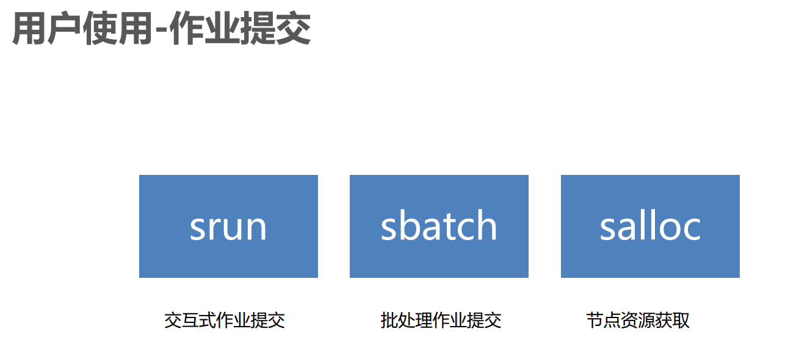  
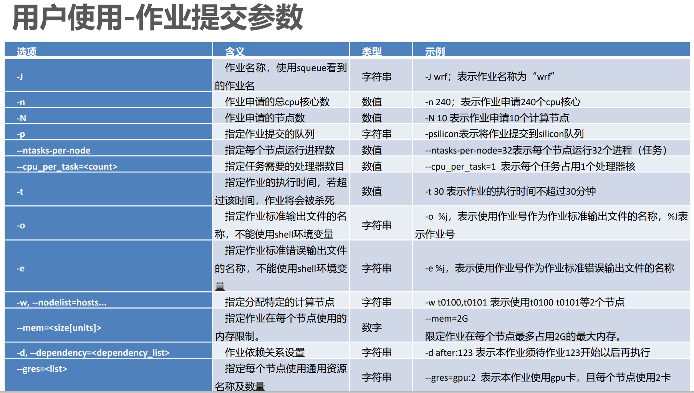  
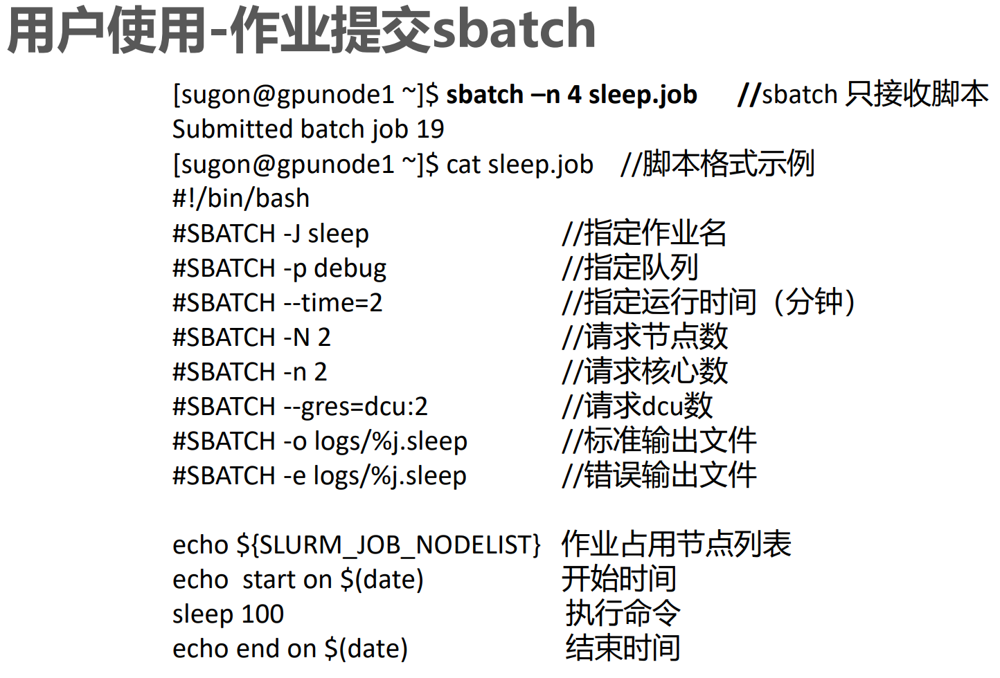  
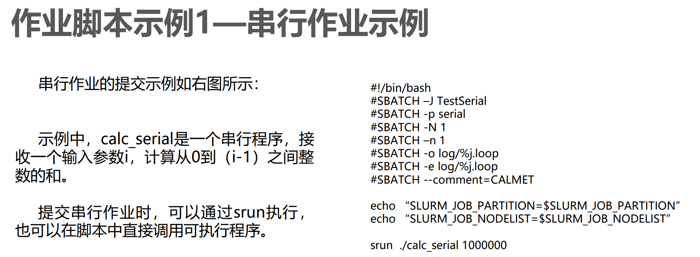  
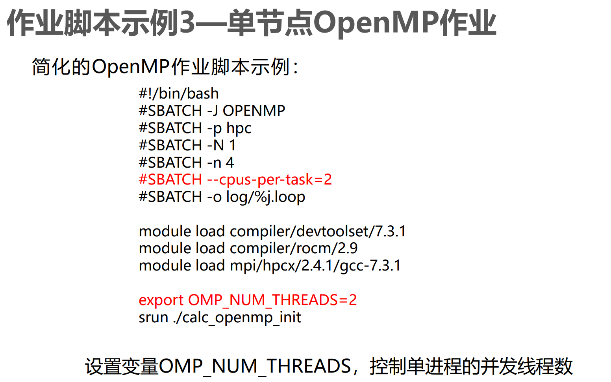  
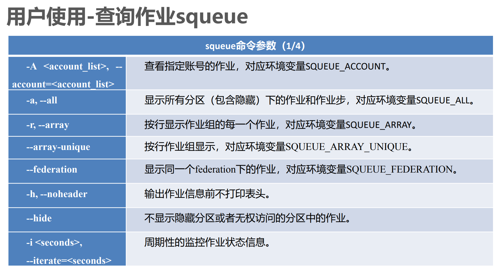  
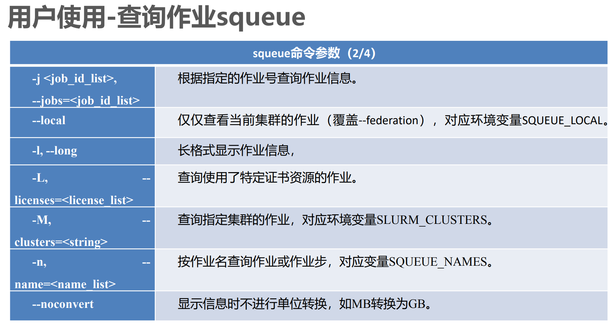  
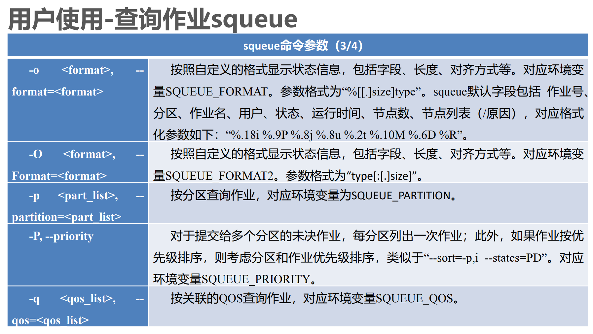  
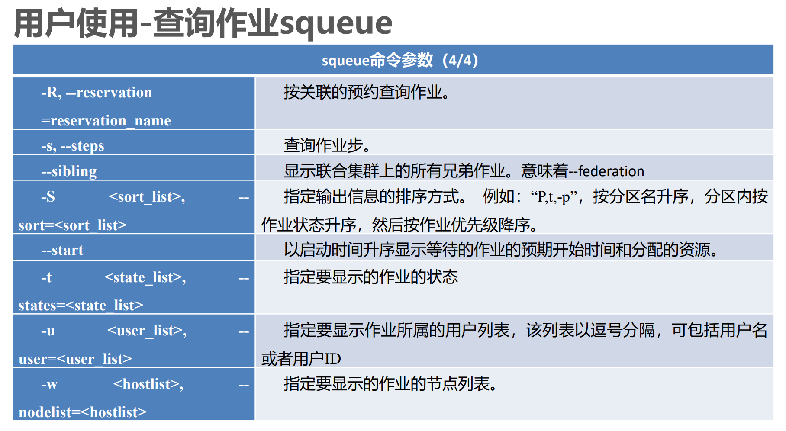  
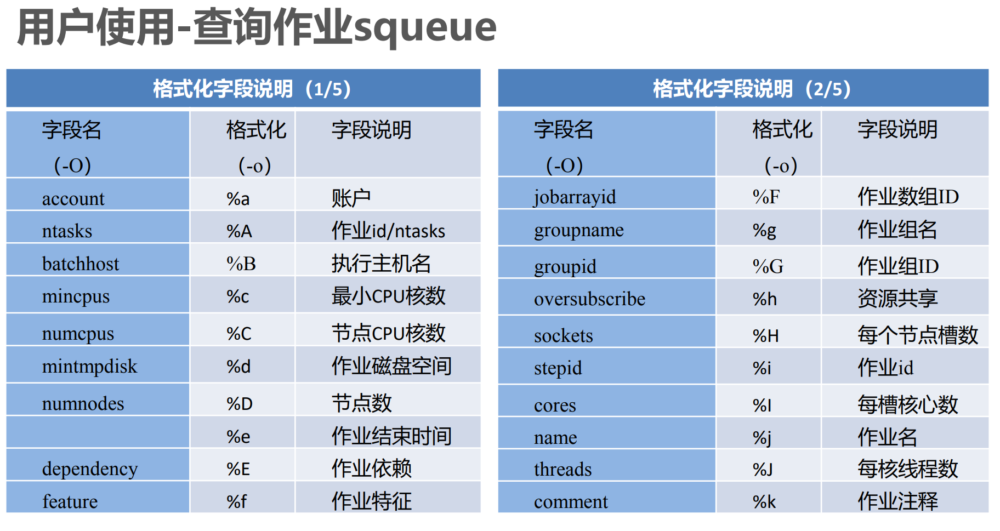  
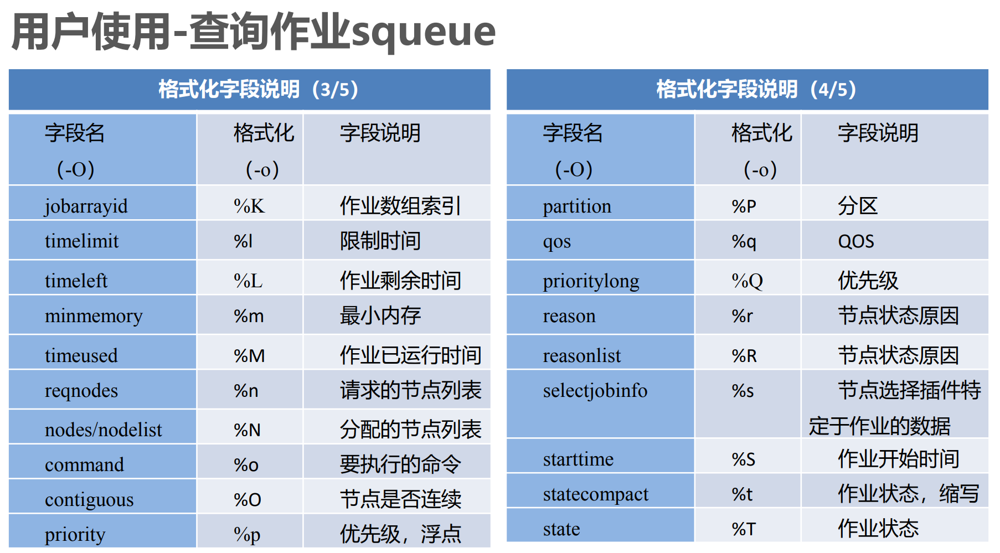  
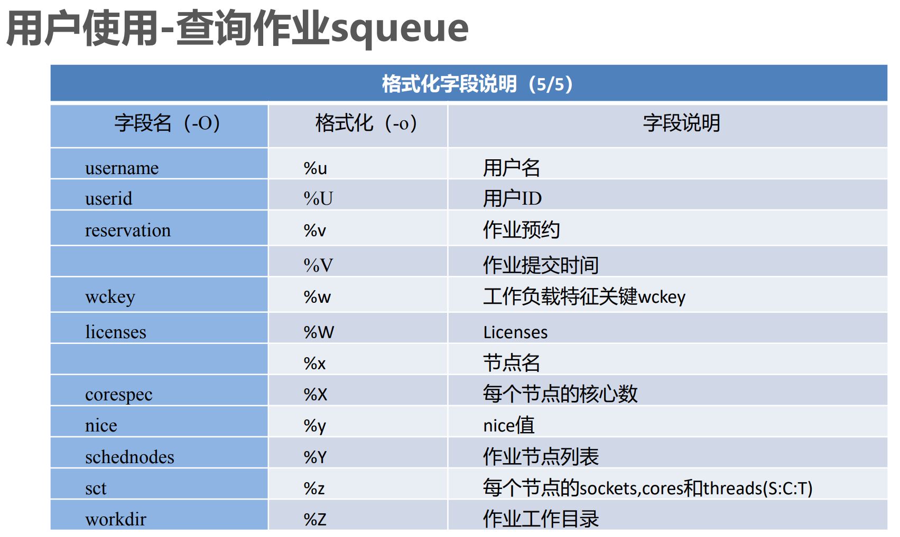  
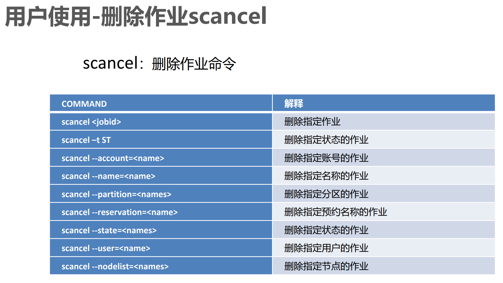   


## 脚本示例
**Gromacs:**
```shell
# md_gmx.slurm
#!/bin/bash
#SBATCH -J <job name>
#SBATCH -p multi
#SBATCH --time=72:00:00
#SBATCH --nodes=1
#SBATCH --ntasks=1
#SBATCH --cpus-per-task=11
#SBATCH --gres=gpu:1

echo "Start time: $(date)"
echo "SLURM_JOB_NODELIST: $SLURM_JOB_NODELIST"
echo "hostname: $(hostname)"
echo "CUDA_VISIBLE_DEVICES: $CUDA_VISIBLE_DEVICES"
echo "Job directory: $(pwd)"

# Decide the software version
source /public/software/profile.d/apps_gromacs-2020.6.sh

# Assign OMP threads
export OMP_NUM_THREADS=$SLURM_CPUS_PER_TASK

MDRUN="gmx mdrun -nb gpu -pme gpu -bonded gpu -update gpu -gpu_id 0"

prefix=t1
$MDRUN -v -s md.tpr -deffnm ${prefix} -nsteps -1 -maxh 72
```

**NAMD:**  
```shell
#!/bin/bash
#SBATCH -J <job name>
#SBATCH -p single
#SBATCH --time=24:00:00
#SBATCH --nodes=1
#SBATCH --ntasks=1
#SBATCH --cpus-per-task=1
#SBATCH --gres=gpu:1

echo "Start time: $(date)"
echo "SLURM_JOB_NODELIST: $SLURM_JOB_NODELIST"
echo "hostname: $(hostname)"
echo "CUDA_VISIBLE_DEVICES: $CUDA_VISIBLE_DEVICES"
echo "Job directory: $(pwd)"

# Decide the software version
source /public/software/profile.d/apps_namd-3.0alpha9.sh

NAMD="/public/software/apps/NAMD_3.0alpha9/namd3"

$NAMD +p1 +devices 0 eq/fep.eq.namd >& eq/LOG_eq

prefix=trial1
rsync -a eq/fep.tcl eq/equilibrate.coor eq/equilibrate.vel eq/equilibrate.xsc $prefix
rsync -a eq/fep.namd $prefix/fep.namd
$NAMD +p1 +devices 0 $prefix/fep.namd >& $prefix/LOG_fep
```